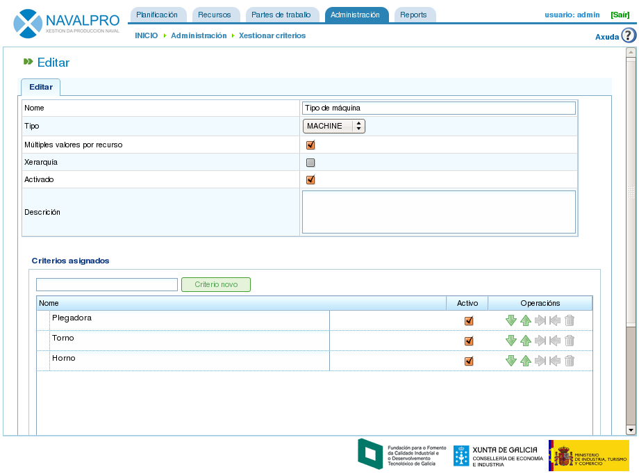

Criterios
#########

.. contents::

Os criterios son as entidades que se utilizan na aplicación para categorizar os recursos e as tarefas. As tarefas requiren criterios e os recursos satisfán criterios. Un exemplo de utilización de criterios é a seguinte secuencia: un recurso é asignado co criterio "soldador" (é dicir, satisfai o criterio "soldador") e unha tarefa require o criterio "soldador" para ser realizada, en consecuencia ante unha asignación de recursos a tarefas os traballadores con criterio "soldador" son os que se utilicen á hora de asignar xenéricamente (non aplica nas asignacións específicas).

No proxecto, existen varias operacións que se poden realizar con criterios:

* Administración de criterios
* Asignación de criterios a recursos.
* Asignación de criterios a tarefas.
* Filtrado de entidades por criterios. É posible filtrar tarefas e elementos de pedido por criterios para realizar operacións na aplicación. Asimesmo, os informes e gráficos de cargas de recursos son filtrables por criterios.

Das tres funcionalidades anteriores só se explica a primeira delas nesta sección deixando para seccións posteriores os dous tipos de asignación, a de recursos no capitulo "Xestión de recursos" e a de tarefas no capítulo "Planificación de tarefas".

Administración de criterios
===========================
A administración de criterios é accesible dende o menú de administración:

.. figure:: images/menu.png
   :scale: 50

   Pestanas de menú de primeiro nivel

A operación específica para administrar criterios é *Xestionar Criterios*. A partir de dita operación é posible listar os criterios dispoñibles no sistema.

.. figure:: images/lista-criterios.png
   :scale: 50

   Listado de criterios

Premendo no botón *Crear* poderase acceder ó formulario de creación/edición de un criterio. A edición de un criterio farase premendo na icona de edición do mesmo.

   Edición de criterios

No formulario de edición de criterios que se amosa na imaxe anterior poderanse realizar as seguintes operacións:

* Edición do nome do criterio
* Indicar se é posible asignar varios valores simultaneamente ó mesmo elemento para o tipo de criterio seleccionado. Por exemplo, un recurso que satisfai dous criterios, soldador e torneiro.
* Indicar o tipo do criterio:

  * Tipo xenérico: Criterio que pode satisfacer indistintamente unha máquina ou un traballador.
  * Tipo traballador: Criterio que pode satisfacer un traballador exclusivamente.
  * Tipo máquina: Criterio que pode satisfacer unha máquina exclusivamente.

* Indicar se o criterio é xerárquico ou non. Existen casos nos que os criterios deben ser tratados xerarquicamente, é dicir, que o feito de ser un criterio asignado a un elemento non folla faga que este criterio estea asignado automaticamente ós fillos. Un exemplo claro de xerarquización de criterios é o criterio localización, unha persoa que teña asignado Galicia como localización pertence á localización España por ser xerárquico.
* Indicar se o criterio está habilitado e deshabilitado. Esta é a forma de borrar criterios. Debido a que unha vez creado un criterio, e utilizado en datos históricos, estes non poden ser borrados, o criterio debe existir no sistema. Para evitar que este criterio saia en diferentes elementos de selección, pode ser invalidado.
* Realizar unha descrición do criterio.
* Engadir novos valores. Na segunda parte do formulario aparece unha entrada de texto con un botón *Novo Criterio*.
* Editar o nome dos criterios existentes.
* Desprazar verticalmente os criterios na lista dos existentes.
* Eliminar un valor de criterio da lista.

O formulario de administración de criterios é un formulario que responde ás características dos formularios comentados na introdución como de 3 operacións (gardar, gardar e pechar e pechar).

