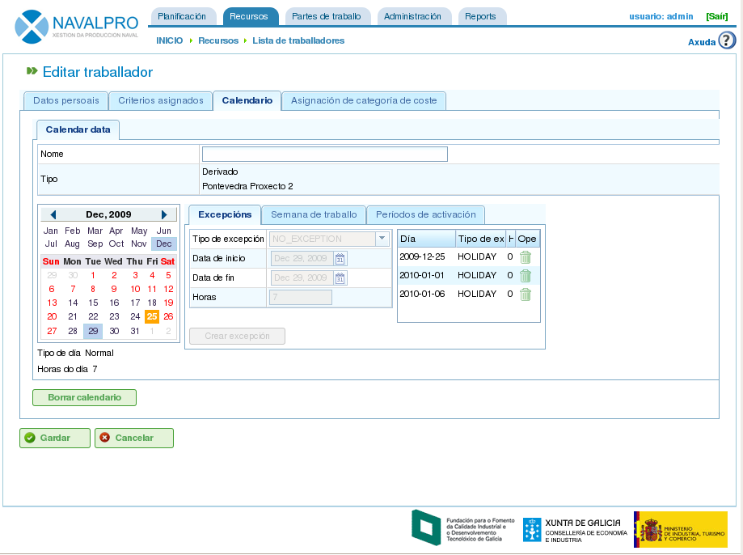

Calendarios
###########

.. contents::

Os calendarios son as entidades da aplicación que determinan as capacidade de carga dos distintos recursos. Un calendario está formado por unha serie de días anuais, onde cada día dispón de horas dispoñibles para traballar.

Por exemplo, un festivo pode ter 0 horas dispoñibles e, se as horas de traballo dentro dun día laboral son 8, é este número que se asigna como tempo dispoñible para ese día.

Existen dous modos de indicarlle ó sistema cantas horas de traballo ten un día:

* Por día da semana. Por exemplo, os luns trabállanse 8 horas xeralmente.
* Por excepcións. Por exemplo, o luns 30 de Xaneiro trabállanse 10 horas.

Administración de calendarios
=============================

O sistema de calendarios é xerárquico, de modo que se poden crear calendarios base o calendarios que herdan destes calendarios, mantendo unha estrutura arbórea. Un calendario que herda dun calendario de nivel superior da árbore, herda as adicacións diarias e as excepcións, sempre e cando non sexan modificadas explicitamente para o calendario fillo. Ademais, é necesario entender os seguintes conceptos para administrar calendarios:

* Cada día é independente entre si e cada ano ten días diferentes, é dicir, se se marca o 8 de Decembro de 2009 como festivo iso non quere dicir que o ano 2010 xa teña o día 8 de Decembro como festivo.
* Os días laborais márcanse en base a días da semana, é dicir, se se determina que o normal é traballar 8 horas os luns, quedan todos os luns de todas as semanas dos diferentes anos marcados como 8 horas dispoñibles.
* É posible marcar excepcións ou intervalos de excepción, é dicir, elixir un día concreto ou grupo de días nos que as horas dispoñibles sexan diferentes á regra xeral para ditos días da semana.

.. figure:: images/calendar-administration.png
   :scale: 50

   Administración de calendarios

A administración de calendarios es accesible dende as operacións da pestana de "Administración". Desde dito punto o usuario pode realizar as seguintes operacións:

1. Crear un novo calendario dende cero.
2. Crear un calendario derivado de outro calendario.
3. Crear un calendario como copia de outro calendario.
4. Editar un calendario existente.

Creación dun novo calendario
----------------------------

Para a creación dun novo calendario é necesario premer no botón "Crear". O sistema amosa un formulario no que o usuario pode realizar as seguintes operacións:

* Elixir a pestana na que desexa traballar:

   * Marcado de excepcións
   * Selección de horas traballadas por día.

* Se o usuario selecciona o marcado de excepcións:
   * Seleccionar un día específico do calendario.
   * Marcar o tipo de excepción. Os tipos dispoñibles son: vacacións, baixa, folga, festivo, festivo traballable.
   * Seleccionar a data de fin do intervalo de excepción (para marcar excepcións de 1 día de duración non se necesita modificar este campo).
   * Marcar o número de horas traballadas durante os días excepcionais.
   * Borrar excepcións previas.

* Se o usuario elixe a selección de horas traballadas por día:

   * Marcar as horas dispoñibles para cada día da semana (luns, martes, mércores, xoves, venres, sábados e domingos).
   * Crear novas distribucións de horas semanais aplicables no futuro.
   * Borrar distribucións de horas realizadas previamente.

Con estas operacións un usuario da aplicación ten a capacidade de personalizar os calendarios completamente ás súas necesidades. Para almacenar os cambios no formulario é necesario premer no botón "Gardar".

.. figure:: images/calendar-edition.png
   :scale: 50

   Edición de calendario

.. figure:: images/calendar-exceptions.png
   :scale: 50

   Inclusión de excepción en calendario

Creación dun calendario derivado
--------------------------------

Un calendario derivado é un calendario que se crea como fillo dun existente, é dicir, herda todas as características do orixinal e ó mesmo tempo é posible modificalo para que conteña as súas particularidades.

Un exemplo de uso de calendarios derivados é a existencia dun calendario xeral para España e a creación dun derivado para só incluir os festivos galegos engadidos sobre os que xa estaban definidos no xeral.

É importante destacar que ante calquera modificación realizada sobre o calendario orixinal o calendario derivado é directamente afectado, sempre e cando, non se definira unha actuación concreta sobre el mesmo. Por exemplo, no calendario de España inclúese un día laboral no 17 de Maio con 8 horas de traballo e no calendario galego, que se creou como derivación, o día 17 de Maio é considerado un día de 0 horas de traballo por ser festivo. Se sobre o calendario español se cambian os días da semana do 17 Maio para que as horas dispoñibles sexan 4 diarias, no galego o que sucede é que todos os días da semana do 17 de Maio ten 4 horas dispoñibles excepto o mesmo día 17 que ten 0 horas, tal e como explicitamente se establecera antes.

.. figure:: images/calendar-create-derived.png
   :scale: 50

   Creación de calendario derivado

Para crear un calendario derivado na aplicación, é necesario facer o seguinte:

* Acceder ó menú de *Administración*.
* Premer na operación de administración de calendarios.
* Elixir un dos calendarios sobre o que se desexa realizar un derivado e premer no botón "Crear".
* Unha vez realizada esta operación o sistema amosa un formulario de edición coas mesmas características que os formularios para crear calendarios dende cero, coa diferencia de que as excepcións e as horas por día da semana se propoñen en base ó calendario orixinal.

Creación dun calendario por copia
---------------------------------

Un calendario copiado é un calendario que se crea como copia exacta de outro existente, é dicir, que recibe todas as características do orixinal e ó mesmo tempo é posible modificalo para que conteña as súas particularidades.

A diferencia entre copiar e derivar un calendario radica nos cambios no orixinal. No caso de copias, se o orixinal é modificado, non afecta á copia, sen embargo, cando se deriva, si afecta ó fillo.

Un exemplo de uso de calendario por copia é o dispor de un calendario para Pontevedra e necesitar un calendario para A Coruña onde a maioría das características son as mesmas, sen embargo, non se espera que os cambios nun afecten ó outro.

Para crear un calendario copiado na aplicación, é necesario facer o seguinte:

* Acceder ó menú de *Administración*.
* Premer na operación de administración de calendarios.
* Elixir un dos calendarios sobre o que se desexa realizar un derivado e premer no botón "Crear".
* Unha vez realizada esta operación o sistema amosa un formulario de edición coas mesmas características que os formularios para crear calendarios dende cero, coa diferencia de que as excepcións e as horas por día da semana se propoñen en base ó calendario orixinal.

Calendario por defecto
----------------------
Un dos calendarios existentes no sistema pode ser dado de alta como por defecto. Este calendario é o que se asigna a calquera entidade que no sistema sexa xestionado con calendarios.

Para configurar o calendario por defecto débese realizar o seguinte:

* Acceder ó menú de *Administración*.
* Premer na operación *Configuración*.
* Onde aparece o texto *Calendario por defecto*, seleccionar o que se desexe establecer como calendario por defecto da aplicación.
* Premer en *Gardar*.

.. figure:: images/default-calendar.png
   :scale: 50

   Creación de calendario por defecto

Asignación de calendario a recursos
-----------------------------------

Os recursos só teñen activación, é dicir, horas dispoñibles para traballar, se dispoñen de un calendario asignado con un período válido de activación. Se non se lle asignou ningún calendario ós recursos, os recursos teñen asignado o calendario por defecto con un período de activación que comeza na data de alta e sen data de caducidade.

   Calendario de recursos

Sen embargo, é posible eliminar o calendario asignado previamente a un recurso e crear un calendario novo a partir de un existente. Deste xeito hai recursos que poidan ser completamente personalizados a nivel de calendario.

Para asignar un calendario a un recurso é necesario dar os seguintes pasos:

* Acceder á edición de recursos.
* Elixir un recurso e premer en editar.
* Seleccionar a pestana de "Calendario".
* A partir da pestana anterior aparece un calendario coas excepcións, as horas traballables por día e os períodos de activación.
* Para cada pestana:

   * Excepcións: É posible elixir o tipo de excepción e un período no que se aplica para poder incluír as vacacións, días festivos, laborables diferentes, etc.
   * Semana de traballo: É posible modificar as horas traballadas durante os distintos días da semana (luns, martes, etc.).
   * Períodos de activación: É posible crear novos períodos de activación que reflicte as datas de inicio e fin dos contratos asociados ó recurso. Ver a seguinte imaxe.

* Para almacenar é necesario premer en *Gardar*.
* O usuario pode premer en *Borrar* se desexa cambiar o calendario asignado ó recurso.

.. figure:: images/new-resource-calendar.png
   :scale: 50

   Asignación de novo calendario a recurso

Asignación de calendario a pedidos
----------------------------------

Os proxectos poden dispor de un calendario diferente do calendario por defecto. Para cambiar o calendario do pedido é necesario:

   * Acceder ó listado de pedidos dentro da vista global de empresa.
   * Editar o pedido en cuestión.
   * Acceder á pestana de "Datos xerais".
   * Seleccionar no despregable de selección o calendario que se desexa asignar.
   * Premer en "Gardar" ou "Gardar e Continuar".

Asignación de calendario a tarefas
----------------------------------
Do mesmo xeito que se permite asignar calendarios a recursos ou pedidos, é posible realizar a mesma operación para tarefas planificadas. Esta operación permite definir calendarios específicos para momentos concretos dun proxecto. Para realizar esta operación é necesario:

   * Acceder á planificación de un proxecto.
   * Premer no botón dereito sobre a tarefa á que se desexa asignar calendario.
   * Seleccionar a operación "Asignación de calendario".
   * Elixir o que se desexa asignar á tarefa.
   * Premer en "Aceptar".

