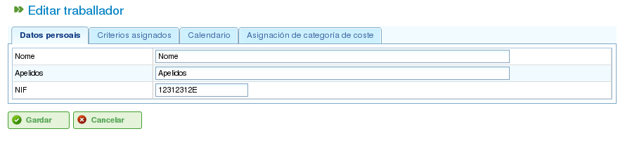
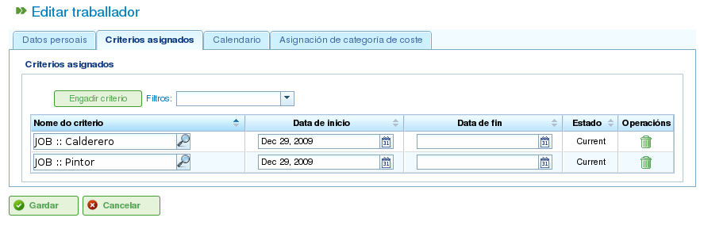
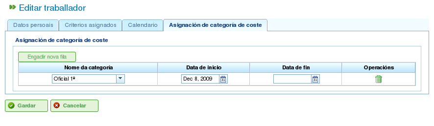

Xestión de recursos
###################

.. _recursos:
.. contents::

A aplicación xestiona dous tipos de recursos diferentes: recursos traballadores e recursos máquinas.

Os recursos traballadores representan os traballadores das empresas. As características principais son:

* Satisfarán un ou varios criterios de tipo xenérico ou tipo traballador.
* Son asignables específicamente a unha tarefa.
* Son asignables como parte da asignación xenérica a unha tarefa que requira un criterio de tipo máquina ou xenérico.
* Disporán de un calendario por defecto ou específico se así o decide o usuario.

Os recursos máquina representan as máquinas das empresas. As características principais son:

* Satisfarán un ou varios criterios de tipo xenérico ou tipo máquina.
* Son asignables específicamente a unha tarefa.
* Son asignables como parte da asignación xenérica a unha tarefa que requira un criterio de tipo máquina ou xenérico.
* Disporán de un calendario por defecto ou específico se así o decide o usuario.
* Contará con unha pantalla de configuración na que se poderá establecer un valor *alfa* que represente a relación entre máquina e traballador.

  * O *alfa* representa canto tempo dun traballador é necesario para que a máquina funcione. Por exemplo, un alfa de 0.5 indica que de cada 8 horas de máquina son necesarias 4 de un traballador.
  * É posible asignar un *alfa* de xeito específico a un traballador, é dicir, elíxese o traballador que estará ocupado esa porcentaxe do seu tempo coa máquina.
  * Ou ben, é posible facer unha asignación xenérica en base a un criterio, de xeito que se asigna unha porcentaxe do uso a todos os criterios que satisfán ese criterio e teñen tempo dispoñible. O funcionamento da asignación xenérica é a mesma que a explicada para asignacións xenéricas a tarefas.

O usuario pode crear, editar e invalidar (nunca borrar definitivamente) traballadores da empresa dende a pestana de "Recursos". Dende dita pestana existen as seguintes operacións:

* Listado de traballadores: Os traballadores amosaranse listados e paxinados, dende onde poden xestionar os seus datos.
* Listado de máquinas: As máquinas amosaranse listados e paxinados, dende onde poden xestionar os seus datos.

Xestión de traballadores
========================

A xestión de traballadores realizarase dende a pestana de "Recursos" e a operación de "Lista de traballadores". Dende a lista de recursos é posible editar cada un dos traballadores premendo na icona estándar de edición.

Unha vez na edición dun recurso, o usuario pode acceder ás seguintes pestanas:

1) Pestana de datos de traballador. Esta pestana permite editar os datos básicos de identificación do traballador.

   * Nome
   * Apelidos
   * DNI
   * Recursos limitantes (ver sección)

   Edición de datos persoais de traballador

2) Pestana de criterios. Dende este punto poderase configurar os criterios que un traballador satisfai. O usuario pode asignar calquera valor de criterio de tipo traballador ou xenérico que así considere a un traballador. É importante, para que a aplicación sexa utilizada en todo o seu valor, que os traballadores satisfagan criterios. Para asignar criterios o usuario debe:

   i. Premer no botón "Engadir criterio".

   ii. Buscar o criterio que desexa engadir e seleccionar o que encaixe coa súa procura.

   iii. Premer no botón de engadir.

   iv. Seleccionar data de inicio do criterio dende o momento que deba aplicarse.

   v. Seleccionar a data de fin de aplicación do criterio ó recurso. Dita data non é obrigatoria indicando que o criterio é indefinido.

   Asociación de criterios a traballador

3)  Pestana de calendario. Pestana dende a que se pode configurar un calendario específico para o recurso traballador. Cada traballador dispón de un calendario por defecto asignado, sen embargo, é posible asignar un calendario específico para cada un a partir dun existente.

.. figure:: images/worker-calendar.png
   :scale: 50

   Pestana de calendario para un recurso

4)  Pestana de categoría de custo. Pestana dende a que se pode configurar a categoría de custo que satisfai un recurso nun período dado. Estes datos son utilizados para posteriormente calcular os custos asociados ó traballador nun proxecto.

   Pestana de categoría de custo para recurso

A asignación de recursos explícase na sección de asignación de recursos.

Xestión de máquinas
===================

As máquinas son recursos a todos os efectos, polo cal, tal e como sucede cos traballadores, as máquinas son administrables e asignables a tarefas. A asignación de recursos tratarase na sección de asignación. Neste punto explicaranse as características específicas das máquinas.

As máquinas son administradas dende a entrada de menú "Recursos". En dita sección existe unha operación chamada "Listado de máquinas" que permite a visualización das máquinas que dispoñen nunha empresa. A partir deste listado poderase editar ou borrar unha máquina.

Na edición dunha máquina o sistema amosa unha serie de pestanas dende as cales se permite administrar diferentes datos:

1) Pestana de datos da máquina. Pestana para a edición de datos identificativos das máquinas. Os datos modificables nesta pestana son:

   i Nome.

   ii Código da máquina.

   iii Descrición da máquina.

.. figure:: images/machine-data.png
   :scale: 50

   Edición de datos de máquina

2) Pestana de criterios. Tal e como se comentou na anterior sección de recursos traballadores, esta é a pestana na que se poden engadir criterios que satisfán as diversas máquinas do sistema. Os criterios que son asignables ás máquinas son os de criterios de tipo máquina ou xenéricos. Non se poden asignar criterios de traballadores. Para asignar criterios, o usuario debe:

   i. Premer no botón "Engadir criterio".

   ii. Buscar o criterio que desexa engadir e seleccionar o que encaixe coa súa procura.

   iii. Seleccionar data de inicio do criterio dende o momento que deba aplicarse.

   iv. Seleccionar a data de fin de aplicación do criterio ó recurso. Dita data non é obrigatoria indicando que o criterio é indefinido.

   v. Premer no botón de "Gardar e Continuar".

.. figure:: images/machine-criterions.png
   :scale: 50

   Asignación de criterios a máquinas

3) Pestana de calendario. Pestana dende a que se pode configurar un calendario específico para o recurso máquina. Cada traballador dispón de un calendario por defecto asignado, sen embargo, é posible asignar un calendario específico para cada un a partir dun existente.

.. figure:: images/machine-calendar.png
   :scale: 50

   Asignación de calendario a máquina

4) Pestana de configuración de máquinas: Dende esta pestana é posible configurar a relación das máquinas cos recursos traballadores existentes. Unha máquina dispón de un alfa que indica a relación entre a máquina e os recursos implicados, tal e como xa se comentou, un alfa de 0.5 indica que se consume traballo de 0.5 persoas para cada xornada completa de máquina. O sistema, a partir dun alfa, crea automaticamente asignacións á traballadores que estean dalgún xeito relacionados coa máquina unha vez se asigna unha máquina a unha tarefa. A forma de relacionar un traballador con unha máquina pódese facer de dous xeitos:

   i Asignando especificamente un rango de datas nas que o traballador se desexa asignar a unha máquina. É unha asignación específica de modo que o sistema asigna automaticamente horas ó traballador cando se planifique a máquina.

   ii Asignando especificamente criterios que se desexa satisfagan os traballadores que sexan asignados ás máquinas. Deste xeito farase unha asignación xenérica ós traballadores que satisfán os criterios.

.. figure:: images/machine-configuration.png
   :scale: 50

   Configuración de máquina

5) Pestana de categoría de custo. Pestana dende a que se pode configurar a categoría de custo que satisfai unha máquina nun período dado. Estes datos son utilizados para posteriormente calcular os custos asociados ó traballador nun proxecto.

.. figure:: images/machine-costcategory.png
   :scale: 50

   Asignación de categoría de custo a máquina

Grupos de traballadores virtuais
================================

A aplicación permite a creación de recursos no sistema os cales non son traballadores reais, senón que son persoal simulado que permite aumentar a capacidade produtiva nun momento determinado segundo as configuracións que se definan do seu calendario.

Mediante os grupos de traballadores virtuais é posible comprobar como se vería afectada a planificación dos proxectos contratando e asignando persoal que satisfaga os criterios que se definan, axudando deste modo no proceso de toma de decisións

As pestanas das que consta o formulario de creación de grupos de traballadores virtuais son as mesmas que as que permiten configurar os traballadores, e dicir:

   * Datos xerais
   * Criterios asignados
   * Calendarios
   * Horas asociadas

A diferencia con respecto ós traballadores, é que nos grupos de traballadores virtuais especifícase un nome para o grupo e unha cantidade que se corresponde co número de persoas reais que forman este grupo. Adicionalmente existe un campo de observacións no que se pode aportar información adicional como por exemplo para que proxecto estaría prevista a contratación do equivalente do grupo de recursos virtuais, etc.

.. figure:: images/virtual-resources.png
   :scale: 50

   Recursos virtuais

Recursos limitantes
================================

Os recursos limitantes son un tipo especial de elementos productivos que só poden atoparse non asignados ou con un 100% de dedicación. Ou o que é o mesmo, non poden ter mais de unha tarefa asignada ó mesmo tempo ou atoparse sobreplanificados.

Por cada elemento limitante créase automáticamente unha cola para que as tarefas que ten planficadas poidan ser xestionadas de forma específica mediante os métidos de asignación proporcionados, realizando asignacións automáticas das tarefas ás colas que cumplan os criterios que requiren ou movendo tarefas entre colas.
