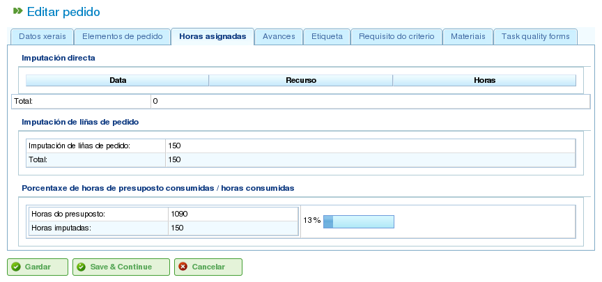
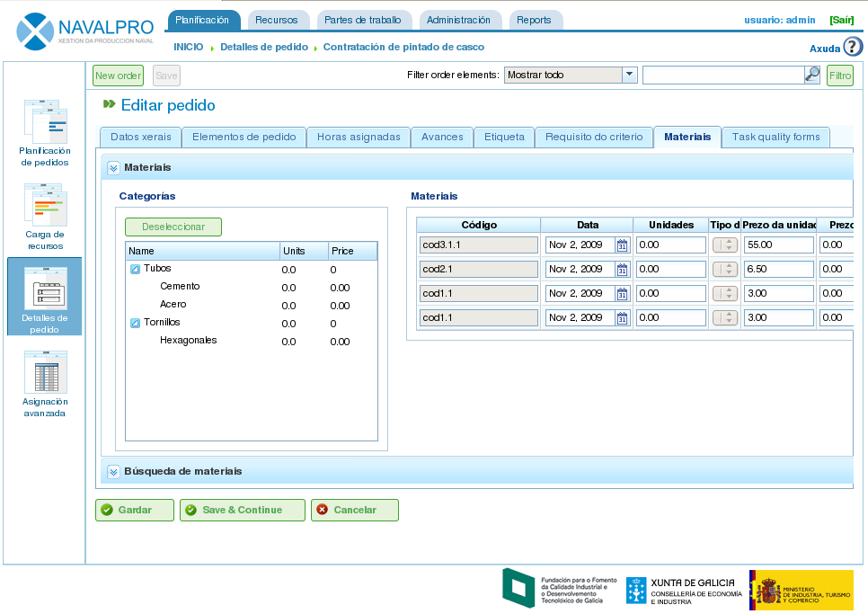
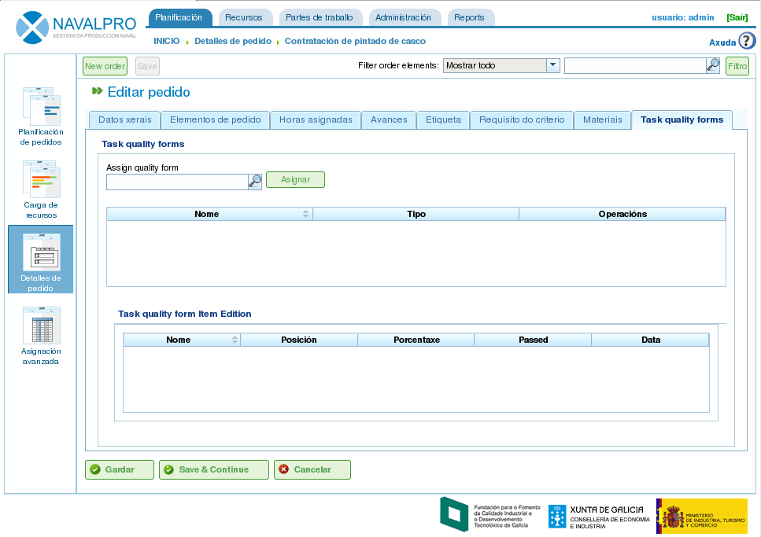
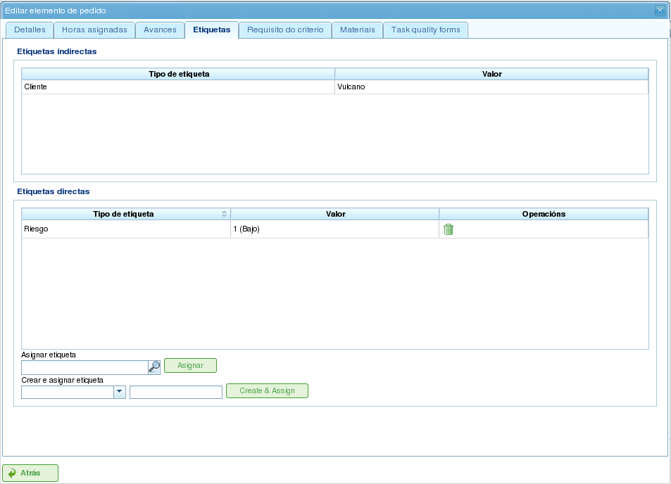

Pedidos e elementos de pedidos
##############################

.. contents::

Os pedidos son as entidades que describen os traballos a realizar por parte dos usuarios que utilicen a aplicación.
Cada pedido correspóndese cos proxectos que as empresas van a ofrecerlles ós seus clientes.

Un pedido está formado por unha ou varias liñas de pedido. Cada liña de pedido correspóndese coa estruturación que se desexe realizar sobre os traballos dentro dese pedido. As liñas de pedido organízanse de xeito xerárquico sen limitacións de profundidade. O feito de que as liñas de pedido se organicen de xeito xerárquico marca o funcionamento de diversas características herdables, tal como as etiquetas.

Nas seguintes seccións describiranse as operacións que un usuario pode realizar cos pedidos e as liñas de pedidos.

Pedido
======

Un pedido é un proxecto ou traballo que un cliente lle solicita a unha empresa. O pedido para o planificador identifica a entidade de proxecto dentro da empresa. A diferencia das aplicacións de xestión globais, "LibrePlan" só necesita utilizar certos datos dos pedidos. Estes datos son:

* Nome do pedido
* Código do pedido.
* Importe total do pedido
* Data de comezo estimada
* Data de finalización
* Responsable
* Descrición
* Calendario asignado.
* Autoxeneración de códigos. Campo para indicarlle ó sistema que autoxenere os códigos dos elementos de pedido e dos grupos de horas.
* Preferencia entre dependencias e restricións. O usuario pode elixir dependencias ou restricións como prioritarios á hora de ser aplicados cando entren en conflito.

Sen embargo, o propio pedido está relacionado con outras entidades que finalmente o dotan de unha maior riqueza:

* Horas asignadas ó pedido.
* Avances imputados ó pedido.
* Etiquetas.
* Criterios asignados ó pedido.
* Materiais
* Formularios de calidade

Para editar ou crear un pedido é posible realizalo dende varios puntos da aplicación:

* Accedendo á perspectiva de "Lista de pedidos" dentro da vista global de empresa.

   * A edición realízase premendo no botón de editar sobre o pedido elixido.
   * A creación realízase premendo en "Novo pedido".

* Accedendo a un pedido no diagrama de Gantt e cambiando de perspectiva á de detalles de pedido.

Dende a edición de pedido é posible acceder ás seguintes pestanas:

* Edición dos datos de pedidos. Dende dita pantalla é posible editar os datos básicos do pedido. Actualmente:

  * Nome
  * Código
  * Data de comezo estimada
  * Data de finalización
  * Responsable
  * Cliente
  * Descrición

.. figure:: images/order-edition.png
   :scale: 50

   Edición de pedido

* Listado de elementos de pedido. Dende o listado de elenentos de pedido é posible realizar varias operacións:

  * Crear novos elementos de pedido.
  * Subir nun mesmo nivel da xerarquía un elemento de pedido.
  * Baixar nun mesmo nivel da xerarquía un elemento de pedido.
  * Indentar un elemento de pedido, ou o que é o mesmo mover cara abaixo na xerarquía, cambiando de nivel o elemento.
  * Des-indentar un elemento de pedido, ou o que é o mesmo mover cara arriba na xerarquía, cambiando de nivel o elemento.
  * Filtrar os elementos de pedido.
  * Borrar elementos de pedido.
  * Mover arrastrando e soltando un elemento de pedido na xerarquía.

.. figure:: images/order-elements-list.png
   :scale: 40

   Listado de elementos de pedido

* Horas asignadas. Pantalla na que se amosan as horas totais imputadas ó proxecto, tratándose de unha pantalla de visualización onde se agrupan as horas imputadas ós elementos de pedido.

   Asignación de horas imputadas ó pedido polos traballadores

* Avances. Pantalla na que se permiten imputar tipos de avances e medidas de avances ó pedido. Ver sección de "Avances" para o funcionamento da mesma.

* Etiquetas. Pantalla na que se permite asignar etiquetas a un pedido e coñecer as etiquetas directas e indirectas que xa foron asignadas. Ver a seguinte sección de edición de elementos de pedido máis en profundidade para coñecer o procedemento de xestionar as etiquetas.

.. figure:: images/order-labels.png
   :scale: 35

   Etiquetas de pedido

* Criterios. Pantalla na que se poden asignar os criterios que se desexan aplicar globalmente a todas as tarefas de un pedido. Estes criterios serían aplicados de xeito automático a todos os elementos de pedido, excepto que estes fosen invalidados explicitamente. Asimesmo, pódense visualizar os grupos de horas dos elementos de pedidos agrupados por criterios, o cal permite coñecer os criterios que se esixen ó longo de un pedido.

.. figure:: images/order-criterions.png
   :scale: 50

   Criterios de pedido

* Materiais. Pantalla na que se pode asignar o material dispoñible ó pedido. O material é seleccionable de entre as categorías de material que existen na aplicación. Os materiais son xestionados do seguinte modo:

   * O usuario selecciona a pestana que se amosa na zona inferior da pantalla chamada "Procura de materiais".
   * O usuario pode introducir un texto para a procura de materiais ou seleccionar as categorías para as que se desexa amosar materiais.
   * O sistema filtra os resultados.
   * O usuario selecciona os materiais que desexa (para seleccionar máis de un material o usuario pode premer no botón "Ctrl" que permite a selección múltiple no listado.
   * O usuario preme en "Asignar".
   * O sistema amosa o listado de materiais xa asignado ó pedido.
   * O usuario selecciona as unidades e o estado que desexa asignarlle ó pedido.
   * O usuario preme en "Gardar" ou "Gardar e Continuar".
   * Se o usuario desexa xestionar a recepción de material, o sistema permite premer en "Dividir" para cambiar o estado dunha cantidade parcial de materiais.

   Material asociado a un pedido

* Calidade. É posible asignar un formulario de calidade ó pedido co obxectivo de ser cumprimentado para asegurar a realización de certas actividades asociadas ó pedido. Ver a seguinte sección de edición de elementos de pedido máis en profundidade para coñecer o procedemento de xestionar o formulario de calidade.

   Formulario de calidade asociado ó pedido

Edición de elementos de pedido
===============================

A edición de elementos de pedido realizase dende a pestana de listado de elementos de pedido a partir da icona de edición. Se o usuario preme na icona de edición, o sistema amosa unha nova pantalla dende a que o usuario pode realizar o seguinte:

* Editar a información do elemento de pedido.
* Visualización de horas imputadas a elemento de pedido.
* Xestionar os avances dos elementos de pedido.
* Xestionar as etiquetas do pedido.
* Xestionar os criterios esixidos polo elemento de pedido.
* Xestionar os materiais.
* Xestionar os formularios de calidade.

As seguintes subseccións tratan cada un das operacións en profundidade.

Edición da información do elemento de pedido
--------------------------------------------

A edición de información de elemento de pedido inclúe a edición dos seguintes datos:

* Nome do elemento de pedido.
* Código do elemento de pedido.
* Data de inicio do elemento de pedido.
* Data estimada de fin do elemento de pedido.
* Horas totais do elemento de pedido. Estas horas poden ser calculadas a partir dos grupos de horas engadidas ou introducidas directamente neste punto que se repartiran entre os grupos de horas, creando algún novo se as porcentaxes non coinciden coas porcentaxes iniciais.
* **Grupos de horas**: É posible engadir un ou varios grupos de horas ó elemento de pedido. **O significado destes grupos de horas** é o establecemento dos requirimentos que se lle esixen ós recursos que vaian a ser asignados para realizalas.
* Criterios: É posible engadir criterios que se deben satisfacer para poder se asignado xenericamente para realizar dito elemento de pedido.

.. figure:: images/order-element-edition.png
   :scale: 50

   Edición de elemento de pedido

Visualización de horas imputadas a elementos de pedido
------------------------------------------------------

A pestana de "Horas asignadas" permite visualizar os partes de traballo asociados a un elemento de pedido e ó mesmo tempo permite visualizar cantas horas das presupostadas están xa realizadas.

.. figure:: images/order-element-hours.png
   :scale: 50

   Horas asignadas a elementos de pedido

A pantalla está dividida en dúas partes:

* Listado de partes de traballo: O usuario ve o listado de partes de traballo que están asociados ó elemento de pedido podendo comprobar a data e hora, recurso e número de horas adicadas á tarefa.
* Uso das horas presupostadas: O sistema calcula o total de horas adicadas á tarefa e as contrasta coas que estaban presupostadas.

Xestión de avances dos elementos de pedido
------------------------------------------

A introdución de tipos de avances e xestión dos avances dos elementos de pedido foi descrita no capítulo de "Avances".

Xestión de etiquetas do pedido
------------------------------

As etiquetas, tal e como se describen no capítulo adicado ás mesmas, son entidades que permiten categorizar os elementos de pedido. Deste xeito, o usuario pode agrupar información de planificación ou pedidos en base a elas.

Un usuario pode asignar etiquetas directamente a un elemento de pedido ou ben a un antecesor na xerarquía dese elemento de pedido. A partir do momento no que se asigna unha etiqueta dun dos dous xeitos anteriores, tanto o elemento de pedido como a tarefa de planificación asociada estan asociadas a dita etiqueta, sendo utilizadas para posteriores filtrados.

   Asignación de etiquetas para elementos de pedido

Tal e como se pode ver na imaxe, dende a pestana de **etiquetas**, o usuario pode realizar as seguintes operacións:

* Visualización das etiquetas que un elemento do pedido ten asociadas por herdanza dun elemento de pedido superior na xerarquía á que lle foi asignada directamente. A tarefa de planificación asociada a cada elemento de pedido ten as mesmas etiquetas asociadas.
* Visualización das etiquetas que un elemento do pedido ten asociadas directamente a través do seguinte formulario de asignación de etiquetas inferior.
* Asignar etiquetas existentes: Un usuario pode asignar etiquetas a partir da procura dunha entre as existentes no formulario inferior ó listado de etiquetas directas. Para buscar unha etiqueta chega con premer na icona coa lupa ou escribir o inicio da etiqueta na entrada de texto para que o sistema amose as opcións dispoñibles.
* Crear e asignar etiquetas novas: Un usuario pode crear novas etiquetas asociadas a un tipo de etiquetas existente dende dito formulario. Para realizar a operación é necesario que seleccione un tipo de etiqueta á que se asocia e se introduza o valor da etiqueta para o tipo seleccionado. Premendo en "Crear e asignar" o sistema xa a crea automáticamente e a asigna ó elemento de pedido.

Xestionar os criterios esixidos polo elemento de pedido e os grupos de horas
----------------------------------------------------------------------------

Tanto un pedido como un elemento de pedido poden ter asignados os criterios que se esixen para ser realizados. Os criterios poden afectar de xeito directo ou de xeito indirecto:

* Criterios directos: Son os que se asignan directamente ó elemento de pedido. Son os criterios que se van a esixir ós grupos de horas que forman parte do elemento de pedido.
* Criterios indirectos: Son os criterios que se asignan en elementos de pedido superiores na xerarquía e son herdados polo elemento en edición.

A maiores do criterio esixido, é posible definir un ou varios grupos de horas que forman parte do elemento de pedido. Dependendo de se o elemento de pedido contén outros elementos de pedido como fillos ou é un nodo folla. No primeiro dos casos os datos de horas e grupos de horas son solo visualizables e no caso de nodos folla son editables. O funcionamento neste segundo caso é o seguinte:

* Por defecto, o sistema crea un grupo de horas asociado ó elemento de pedido. Os datos modificables para un grupo de horas son:

   * Código do grupo de horas, se non é autoxenerado.
   * Tipo de criterio. O usuario pode elixir se desexa asignar un criterio de tipo máquina ou traballador.
   * Número de horas do grupo de horas.
   * Lista de criterios que se aplican ó grupo de horas. Para engadir novos criterios o usuario debe premer en "Engadir criterio" e seleccionar un no buscador que aparece tras premer no botón.

* O usuario pode engadir novos grupos de horas con características diferentes que os grupos de horas anteriores. Exemplo disto sería que un elemento de pedido debe ser feito por un soldador (30h) e por un pintor (40h).

.. figure:: images/order-element-criterion.png
   :scale: 50

   Asignación de criterios a elementos de pedidos

Xestionar os materiais
----------------------

Os materiais son xestionados nos proxectos como un listado asociado a cada liña de pedido ou a un pedido globalmente. O listado de materiais está formado polos seguintes campos:

* Código
* Data
* Unidades: Unidades necesarias.
* Tipo de unidade: Tipo de unidade no que se mide o material.
* Prezo da unidade: Prezo unitario.
* Prezo total: Prezo resultante de multiplicar o prezo unitario polas unidades.
* Categoría: Categoría de material á que pertence.
* Estado: Recibido, Solicitado, Pendente, Procesando, Cancelado.

O modo de traballar cos materiais é o seguinte:

* O usuario selecciona a pestana de "Materiais" dun elemento de pedido.
* O sistema amosa dúas subpestanas: "Materiais" e "Procura de materiais".
* Se o elemento de pedido non tiña materiais asignados, a primeira pestana amosa un listado baleiro.
* O usuario preme en "Procura de materiais" na zona inferior esquerda da ventana.
* O sistema amosa o listado de categorías dispoñibles e os materiais asociados.

.. figure:: images/order-element-material-search.png
   :scale: 50

   Procura de material

* O usuario selecciona categorías nas que buscar para afinar a procura de materiais.
* O sistema amosa os materiais pertencentes ás categorías seleccionadas.
* O usuario selecciona no listado de materiais aqueles que desexa asignar ó elemento de pedido.
* O usuario preme en "Asignar".
* O sistema amosa o listado seleccionado de materiais na pestana de "Materiais" con novos campos por cubrir.

.. figure:: images/order-element-material-assign.png
   :scale: 50

   Asignación de material a elemento de pedido

* O usuario selecciona as unidades, estado e data dos materiais asignados.

Para control posterior dos materiais é posible cambiar o estado dun grupo de unidades do material recibido. Esta operación realízase do seguinte modo:

* O usuario preme no botón "Dividir" que se amosa no listado de materiais á dereita de cada fila.
* O usuario selecciona o número de unidades para os que desexa dividir a fila.
* A aplicación amosa dúas filas co material dividido.
* O usuario cambia o estado da fila de material que desexa.

A utilidade desta operación de división é a de poder recibir entregas parciais de material sin necesidade de esperar a recibilo todo para marcalo como recibido.

Xestionar os formularios de calidade
------------------------------------

Existen elementos de pedido que deben certificar que certas tarefas foron realizados para poder ser marcadas como completadas. É por iso que xurden os formularios de calidade, os cales están formados por unha lista de preguntas que poden ter asignado un peso segundo sexa contestada positivamente.

É importante destacar que un formulario de calidade debe ser creado previamente para poder ser asignado ó elemento de pedido.

Para xestionar os formulario de calidade:

* O usuario accede á pestana de "Formularios de calidade".

.. figure:: images/order-element-quality.png
   :scale: 50

   Asignación de formulario de calidade a elemento de pedido

* A aplicación amosa un buscador de formularios de calidade. Existen dous tipos de formularios de calidade: por elementos ou porcentaxe.

   * Por elementos: Cada elemento é independente.
   * Por porcentaxe: Cada pregunta incrementa o avance no elemento de pedido en un porcentaxe. As porcentaxes deben ser incrementales ata o 100%.

* O usuario selecciona un dos formularios dados de alta dende a interface de administración e preme en "Asignar".
* A aplicación asigna o formulario elixido no listado de formularios asignados ó elemento de pedido.
* O usuario preme no botón "Editar" do elemento de pedido.
* A aplicación desprega as preguntas do formulario de calidade no listado inferior.
* O usuario marca como acadadas as preguntas que son realizadas.
   * Se o tipo de formulario de calidade é por porcentaxe, as preguntas son contestadas por orde.
   * Se o tipo de formulario de calidade é por elementos, as preguntas son contestadas en calquera orde.
