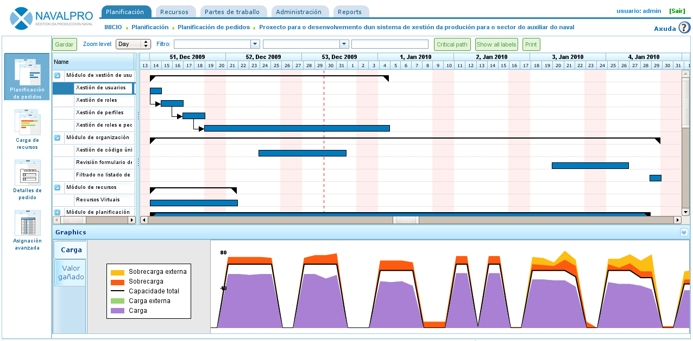

Planificación de tarefas
########################

.. _planificacion:
.. contents::

Planificación de tarefas
========================

A planificación en "LibrePlan" é un proceso que se describe ó longo de todos os capítulos do documento de usuario, entre os cales destacan os capítulos de pedidos e asignación de recursos. Neste capítulo trátanse as operacións básicas de planificación, unha vez o pedido está correctamente configurado e á interacción cos diagramas de Gantt.

   Vista de planificación de un traballo

Tal e como sucede coa vista global de empresa, a vista de planificación dun proxecto divídese en varias perspectivas que se amosan en base á información que se está analizando do mesmo. As perspectivas dun proxecto concreto son:

* Vista de planificación
* Vista de carga de recursos
* Vista de listado de pedidos
* Vista de asignación avanzada

Vista de planificación
----------------------
A perspectiva de planificación combina tres vistas diferentes:

* Planificación do proxecto. A planificación do proxecto visualizase na zona superior dereita da aplicación. Representase a planificación en diagramación de Gantt. E a vista na que se permite mover temporalmente as tarefas, asignar dependencias entre elas, definir fitos ou establecer restricións.
* Vista de carga de recursos. A vista de carga de recursos é o gráfico inferior dereito no que se amosa a dispoñibilidade de recursos segundo as asignacións que se realizaron, contrastada coas asignacións realizadas a tarefas. A información que se amosa no gráfico é:

   * Zona lila: Indica a carga de recursos por debaixo do 100% da súa capacidade.
   * Zona verde: Indica a carga de recursos por debaixo do 100% derivado de que o recurso está planificado en outro proxecto.
   * Zona laranxa: Indica a carga de recursos por enriba do seu 100% debido a o proxecto actual.
   * Zona amarela: Indica a carga de recursos por enriba do seu 100% debido a outros proxectos.

* Vista de gráfico e indicadores do valor gañado. Visible dende a pestana de "Valor Gañado". Gráfico que se xera en base á técnica do valor gañado e os indicadores calculados cada un dos días de traballo do proxecto. Os indicadores calculados son:

   * BCWS: función acumulativa no tempo do número de horas planificadas ata unha data. No inicio planificado da tarefa é 0 e o final é o total de horas planificadas. Coma toda gráfica acumulativa, esta sempre é crecente. A función para unha tarefa é a suma das asignacións de día ata o día de cálculo. Esta función ten valores para tódolos momentos no tempo sempre que teñamos asignación de recursos.
   * ACWP: función acumulativa no tempo das horas imputadas nos parte de traballo ata unha data. Esta función so terá valores iguais a 0 antes da data do primeiro parte de traballo da tarefa e irá incrementado o seu valor a medida que avanza o tempo e se incorporan horas de partes de traballo. Non terá valor despois da data do último parte de traballo.
   * BCWP: función acumulativa no tempo que incorpora o valor resultante de multiplicar o avance das tarefas pola cantidade de traballo que se estimaba que levaría a tarefa. Esta función ten valores incrementales a medida que se incrementa o tempo e temos valores de avance que se van incrementando. O avance se multiplica polo total de horas estimadas de cada unha das tarefas. E o valor de BCWP é a suma destes valores para as tarefas que es está a calcular. Un avance se suma no instante de tempo no que se configurou.
   * CV: Variación en custo CV = BCWP - ACWP
   * SV: Desviación en planificación SV = BCWP - BCWS
   * BAC: Total custo planificado BAC = max (BCWS)
   * EAC: Estimación de custo total actual EAC = (ACWP/ BCWP) * BAC
   * VAC: Desviación ó custo final VAC = BAC - EAC
   * ETC: Estimado do custo pendente ETC = EAC - ACWP
   * CPI: Índice de eficiencia de custo CPI = BCWP / ACWP
   * SPI: Índice de eficiencia da planificación SPI = BCWP / BCWS

Dentro da planificación do proxecto o usuario pode realizar as seguintes operacións:

   * Asignar dependencias. Para realizar dita operación é necesario premer co botón dereito e elixir "Engadir dependencia", arrastrar o punteiro do rato para a tarefa destinataria da dependencia.

      * Para cambiar o tipo de dependencia, premer co botón dereito sobre a dependencia e elixir o tipo que se desexa asignar.

   * Crear novo fito. Premer sobre a tarefa anterior ó fito que se desexa engadir e seleccionar a operación "Engadir fito". Os fitos poden ser movidos seleccionando co punteiro sobre a tarefa e arrastrando co rato o fito á posición desexada.
   * Mover tarefas sen violar dependencias. Premer co rato sobre o corpo da tarefa e sen soltar o rato, arrastrar a tarefa cara a posición na que se desexa colocar. Se non se violan restricións ou dependencias o sistema actualiza as asignacións á tarefa e coloca a tarefa na data seleccionada.
   * Asignar restricións. Premer sobre a tarefa en cuestión e seleccionar a operación "Propiedades da tarefa". Aparecerá un pop-up con un campo modificable que é "Restricións". As restricións poden entrar en conflito coas dependencias, polo que será en cada pedido onde se indique se as dependencias teñen prioridade ou non sobre as restricións. As que se poden establecer son:

      * *Tan pronto como sexa posible*: Indica que a tarefa debe comezar tan pronto como sexa posible.
      * *Non antes de*. Indica que a tarefa non debe comezar antes de unha data.
      * *Comezar en data fixa*. Indica que a tarefa debe comezar en data fixa.

A maiores, dentro da perspectiva de planificación ofrécense varias operacións, que finalmente actuarán como opcións de visualización:

* Nivel de zoom: É posible seleccionar o nivel de zoom que lle interese ó usuario. Existen varios niveis de zoom: por ano, cuadrimestres, mensuais, semanais e diarios.
* Filtros de procura: É posible filtrar tarefas en base a etiquetas ou criterios.
* Camiño crítico. Utilizando o algoritmo de *Dijkstra* para cálculo de camiños en grafos implementouse o camiño crítico que se visualiza se se preme no botón "Camiño crítico" das opcións de visualización.
* Amosar etiquetas: Permite amosar as etiquetas asignadas ás tarefas do proxecto en visualización e impresión.
* Amosar recursos: Permite amosar os recursos asignados ás tarefas do proxecto en visualización e impresión.
* Imprimir: Permite imprimir o diagrama de Gantt que se está visualizando no momento.

Vista de carga de recursos
--------------------------
A vista de carga de recursos ofrece unha lista de recursos que contén unha lista de tarefas ou criterios que lle xeran carga de traballo. Cada tarefa ou criterio é amosado en modo diagrama de Gantt para dar visibilidade á data de comezo e final de dita carga. Segundo un recurso ten unha carga superior ou inferior ó 100% é amosada unha cor:

* Cor verde: carga inferior ó 100%
* Cor laranxa: carga do 100%
* Cor vermella: carga superior ó 100%

.. figure:: images/resource-load.png
   :scale: 35

   Vista de carga de recursos para un pedido concreto

Se se coloca o rato sobre unha zona do diagrama de Gantt dun recurso amosarase o porcentaxe de carga do traballador nese momento dado.

Vista de listado de pedidos
---------------------------
A vista de listado de pedidos permite acceder á edición e borrado de pedidos. Ver o capítulo de "Pedidos".

Vista de asignación avanzada
----------------------------
A vista de asignación avanzada explícase en profundidade no capítulo de "Asignación de recursos".

