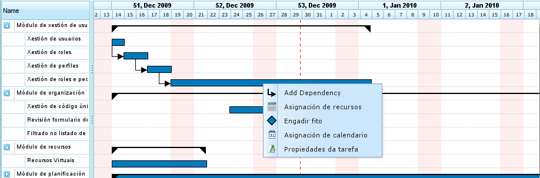
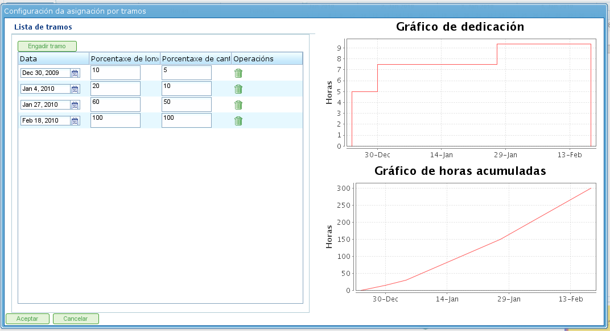

Asignación de recursos
######################

.. asigacion_
.. contents::

A asignación de recursos é unha das partes máis importantes da aplicación. A asignación de recursos pode realizarse de dous xeitos diferentes:

* Asignacións específicas.
* Asignacións xenéricas.

Cada unha das asignacións é explicada nas seguintes seccións.

Para realizar calquera das dúas asignacións de recursos é necesario dar os seguintes pasos:

* Acceder á planificación dun pedido.
* Premer co botón dereito sobre a tarefa que se desexa planificar.

   Menú de asignación de recursos

* A aplicación amosa unha pantalla na que se pode visualizar a seguinte información.

   * Listado de criterios que deben ser satisfeitos. Por cada grupo de horas, amósase un listado de grupos de horas e cada grupo de horas esixe o seu listado de criterios.
   * Información da tarefa: data de inicio e data de fin da tarefa.
   * Tipo de cálculo: O sistema permite elixir a estratexia que se desexa levar a cabo para calcular as asignacións:

      * Calcular número de horas: Calcula o número de horas que faría falla que adicasen os recursos asignados dados unha data de fin e un número de recursos por día.
      * Calcular data fin: Calcula a data de fin da tarefa a partir dos número de recursos da tarefa e das horas totais adicar para rematar a tarefa.
      * Calcular número de recursos: Calcula o número de recursos necesarios para rematar a tarefa en unha data específica e adicando unha serie de horas coñecidas.

   * Asignación recomendada: Opción que lle permite á aplicación recoller os criterios que deben ser satisfeitos e as horas totais de cada grupo de horas e fai unha proposta de asignación xenérica recomendada. Se había unha asignación previa, o sistema elimina dita asignación substituíndoa pola nova.
   * Asignacións: Listado de asignacións realizadas. Neste listado poderanse ver as asignacións xenéricas (o nome sería a lista de criterios satisfeita, horas e número de recursos por día). Cada asignación realizada pode ser borrada explicitamente premendo no botón de borrar.

.. figure:: images/resource-assignment.png
   :scale: 50

   Asignación de recursos

* O usuario selecciona "Procura de recursos".
* A aplicación amosa unha nova pantalla formada por unha árbore de criterios e un listado á dereita dos traballadores que cumpren os criterios seleccionados:

.. figure:: images/resource-assignment-search.png
   :scale: 50

   Procura de asignación de recursos

* O usuario pode seleccionar:

   * Asignación específica. Ver sección "Asignación específica" para coñecer que significa elixir esta opción.
   * Asignación xenérica. Ver sección "Asignación xenérica para coñecer que significa elixir esta opción.

* O usuario selecciona unha lista de criterios (xenérica) ou unha lista de traballadores (específica). A elección múltiple realízase premendo no botón "Crtl" á hora de pulsar en cada traballador ou criterio.

* O usuario preme no botón "Seleccionar". É importante ter en conta que, se non se marca asignación xenérica, é necesario escoller un traballador ou máquina para poder realizar unha asignación, en caso contrario chega con elixir un ou varios criterios.

* A aplicación amosa no listado de asignacións da pantalla orixinal de asignación de recursos a lista de criterios ou recursos seleccionados.

* O usuario debe encher as horas ou os recursos por día dependendo da estratexia de asignación que lle solicitou levar a cabo á aplicación.

Asignación específica
=====================

A asignación específica é aquela asignación de un recurso de xeito concreto e específico a unha tarefa de un proxecto, é dicir, o usuario da aplicación está decidindo que "nome e apelidos" ou qué "máquina" concreta debe ser asignada a unha tarefa.

A asignación específica é realizable dende a pantalla que se pode ver na imaxe:

.. figure:: images/asignacion-especifica.png
   :scale: 50

   Asignación específica de recursos

A aplicación, cando un recurso é asignado específicamente, crea asignacións diarias en relación á porcentaxe de recurso diario que se elixiu para asignación, contrastando previamente co calendario dispoñible do recurso. Exemplo: unha asignación de 0.5 recursos para unha tarefa de 32 horas fai que se asignen ó recurso específico (supoñendo un calendario laboral de 8 horas diarias) 4 horas diarias para realizar a tarefa.

Asignación específica de máquinas
---------------------------------

A asignación específica de máquinas actúa do mesmo xeito que a de traballadores, é dicir, cando se asigna unha máquina a unha tarefa, o sistema almacena unha asignación de horas específica á máquina elixida. A diferencia principal é que no momento de asignar unha máquina, o sistema busca o listado de traballadores ou criterios asignados á máquina:

* Se a máquina tiña un listado de traballadores asignados, elixe entre o número deles que requira a máquina para o calendario asignado. Por exemplo, se o calendario da máquina é de 16 horas diarias e dos recursos de 8, asigna dous recursos da lista de recursos dispoñibles.
* Se a máquina tiña un criterio ou varios asignados, realiza asignacións xenéricas entre os recursos que satisfán os criterios asignados á máquina.

Asignación xenérica
===================

A asignación xenérica é aquela asignación onde o usuario non elixe os recursos concretamente, deixando a decisión á aplicación de como reparte as cargas entre os recursos dispoñibles da empresa.

.. figure:: images/asignacion-xenerica.png
   :scale: 50

   Asignación xenérica de recursos

O sistema de asignación utiliza como base os seguintes supostos:

* As tarefas contan con criterios requeridos ós recursos.
* Os recursos están configurados para que satisfagan os criterios.

Sen embargo, o sistema non falla naqueles casos nos que non se asignen criterios senón que todos os recursos satisfán o non requirimento de criterios.

O algoritmo de asignación xenérica actúa do seguinte xeito:

* Cada recurso e día é tratado como un contedor onde caben asignacións diarias de horas, baseándose a capacidade máxima de asignación no calendario da tarefa.
* O sistema busca os recursos que satisfán o criterio.
* O sistema analiza qué asignacións teñen actualmente os diferentes recursos que cumpren os criterios.
* De entre os que satisfán os criterios escóllense os recursos que teñen dispoñibilidade suficiente.
* Se os recursos máis libres van sendo ocupados, séguense realizando asignacións nos recursos que tiñan menor dispoñibilidade.
* Só cando todos os recursos que satisfán os criterios correspondentes están asignados ó 100% se comeza coa sobreasignación de recursos ata completar o total necesario para realizar a tarefa.

Asignación xenérica de máquinas
-------------------------------

A asignación xenérica de máquinas actúa do mesmo xeito que a de traballadores, é dicir, cando se asigna unha máquina a unha tarefa, o sistema almacena unha asignación de horas xenérica a cada unha das máquinas que satisfán os criterios, tal e como se describiu xenericamente para os recursos en xeral. Sen embargo, tratándose de máquinas o sistema realiza a seguinte operación a maiores:

* Para cada máquina elixida para a asignación xenérica:

  * Recolle a información de configuración da máquina, é dicir, alfa, traballadores e criterios asignados.
  * Se a máquina tiña un listado de traballadores asignados, elixe entre o número deles que requira a máquina dependendo do calendario asignado. Por exemplo, se o calendario da máquina é de 16 horas diarias e dos recursos de 8, asigna dous recursos da lista de recursos dispoñibles.
  * Se a máquina tiña un criterio ou varios asignados, realiza asignacións xenéricas entre os recursos que satisfán os criterios asignados á máquina.

Asignación avanzada
===================

A asignación avanzada permite deseñar as asignacións que se realizan automaticamente pola aplicación de xeito máis personalizado. Esta operación permite elixir manualmente as horas diarias que adican os recursos ás tarefas que están asignadas ou definir unha función que se lle aplica a ditas asignacións.

Para xestionar a asignación avanzada os pasos a dar son os seguintes:

* Acceder á ventá de asignación avanzada. Existen dous modos de acceder á asignación avanzada:

   * Accedendo a un pedido concreto e cambiar de perspectiva para asignación avanzada. Neste caso amosaranse todas as tarefas do pedido e os recursos asignados (tanto específicos como xenéricos).
   * Accedendo á asignación de recursos e premendo no botón "Asignación avanzada". Neste caso amosaranse as asignacións da tarefa para a que se está asignando recursos (amósanse tanto as xenéricas como as específicas).

.. figure:: images/advance-assignment.png
   :scale: 45

   Asignación avanzada de recursos

* O usuario pode acceder ó zoom que desexe:

   * Se o zoom elixido é un zoom superior a día. Se o usuario modifica o valor de horas asignado á semana, mes, cuadrimestre ou semestre, o sistema reparte as horas de xeito lineal durante todos os días do período elixido.
   * Se o zoom elixido é un zoom de día. Se o usuario modifica o valor de horas asignado ó día, estas horas só aplican ó día. Deste xeito o usuario pode decidir cantas horas se asignan diariamente ós recursos da tarefa.

* O usuario pode elixir deseñar unha función de asignación avanzada. Para realizalo:

   * Elixir a función na lista de selección que aparece ó lado de cada recurso e premer en "Configurar".
   * O sistema amosa unha nova ventá se a función elixida require de configuración específica. As funcións soportadas son e a por Tramos. Esta función permite definir tramos nos que se aplica unha función polinómica. A función por tramos configúrase do seguinte xeito:

      * Data. Data na que finaliza o tramo. Se se establece o seguinte valor (lonxitude) a data é calculada, en caso contrario, calcúlase a lonxitude.
      * Definición da lonxitude de cada tramo. Indica que porcentaxe de duración da tarefa compre ese tramo.
      * Definición da cantidade de traballo. Indica que porcentaxe de carga de traballo se espera ter feito nese tramo. A cantidade de traballo debe ser incremental, de xeito que se hai un tramo de 10% o seguinte tramo debe ser superior (por exemplo, 20%).
      * Gráficas de tramos e carga acumulada.

   * O usuario preme en "Aceptar".
   * A aplicación almacena a función e aplícaa nas asignacións diarias do recurso.

   Configuración de función por tramos

