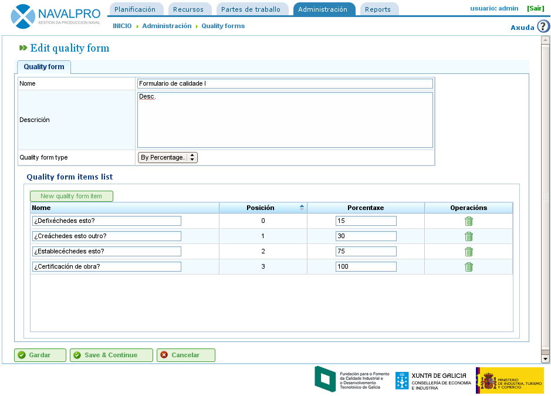

Formularios de calidade
#######################

.. _calidade:
.. contents::

Administración de formularios de calidade
=========================================

Os formularios de calidade son unha lista de preguntas ou frases que indican tarefas ou procesos que deben estar completados para que unha tarefa se poida dar por completada por parte da empresa usuaria. Estes formularios están formados polos seguintes campos:

* Nome
* Descrición
* Tipo de formulario de calidade. O tipo pode tomar dous valores:

   * Por porcentaxe: Indica que as preguntas deben levar unha orde lóxica e que a contestación positiva das preguntas indica un avance respecto da tarefa. Por exemplo, que un proceso básico para unha tarefa implica que a tarefa está ó 15%. É necesario contestar unha pregunta previa para poder pasar á seguinte.
   * Por item: Indica que as preguntas non teñen por que levar unha orde lóxica e en consecuencia poden ser contestadas segundo se desexe.

Para administrar estes formularios de calidade é necesario realizar os seguintes pasos:

* Acceder no menú de "Administración" á operación "Formularios de calidade".
* Premer en editar un existente ou no botón de "Crear".
* A aplicación amosa un formulario con nome, descrición e tipo.
* Seleccionar o tipo.
* A aplicación amosa os campos permitidos para cada tipo:

   * Por porcentaxe: pregunta e porcentaxe.
   * Por item: pregunta.

* Premer en "Gardar" ou "Gardar e Continuar".

   Pantalla de administración de materiais

