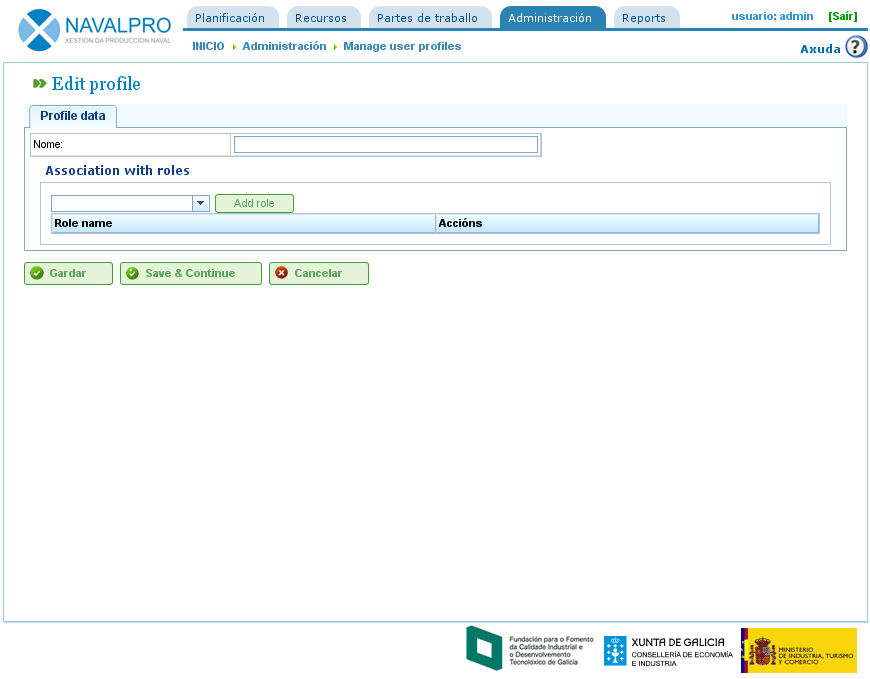

Usuarios
########

.. _usuarios:
.. contents::

Administración de usuarios
==========================

O sistema de usuarios de "LibrePlan" permite xestionar perfiles, permisos e usuarios. Un usuario pertence a un perfil de usuario e por outro lado os perfiles poden ter unha serie de roles predefinidos para o acceso á aplicación. Os roles son os permisos definidos sobre "LibrePlan". Exemplos de roles:

* Administración: Rol que os usuarios administradores deben ter asignados para poder realizar operacións de administración.
* Lector de servizos web: Rol que os usuarios necesitan para poder consultar servizos web da aplicación.
* Escritor de servizos web: Rol que os usuarios necesitan para poder escribir utilizando os servizos web da aplicación.

Os roles están predefinidos no sistema. Un perfil de usuario está composto por un ou varios roles, de modo que se comproban roles ós que pertencen os usuarios para realizar certas operacións.

Os usuarios pertencen a un ou varios perfiles ou directamente a un ou varios roles, de modo que se pode asignar permisos específicos ou un grupo de permisos xenérico.

Para administrar usuarios é necesario realizar os seguintes pasos:

* Acceder á operación de "Xestionar usuarios" do menú de "Administración".
* A aplicación amosa un formulario co listado de usuarios.
* Premer o botón de edición do usuario elixido ou premer no botón "Crear".
* Amosase un formulario cos seguintes campos:

   * Nome de usuario.
   * Contrasinal
   * Habilitado/Deshabilitado.
   * E-mail
   * Lista de roles asociados. Para engadir un novo rol é necesario buscar un dos roles amosados na lista de selección e premer en "Asignar".
   * Lista de perfiles asociados. Para engadir un novo perfil é necesario buscar un dos perfiles amosados na lista de selección e premer en "Asignar".

.. figure:: images/manage-user.png
   :scale: 50

   Administración de usuarios

* Premer en "Gardar" ou "Gardar e Continuar".

Administración de perfiles
--------------------------

Para administrar os perfiles da aplicación é necesario dar os seguintes pasos:

* Acceder á operación de "Xestionar perfiles de usuario" do menú de "Administración".
* A aplicación amosa un listado de perfiles.
* Premer o botón de edición do perfil elixido ou premer no botón "Crear".
* A aplicación amosa un formulario cos seguintes campos:

   * Nome
   * Lista de roles (permisos) asociados ó perfil. Para engadir un rol asociado ó perfil deberase seleccionar un da lista de roles e premer en "Engadir".

   Xestión de perfiles de usuarios

* Premer en "Gardar" ou "Gardar e Continuar" e o sistema almacena o perfil creado ou modificado.

