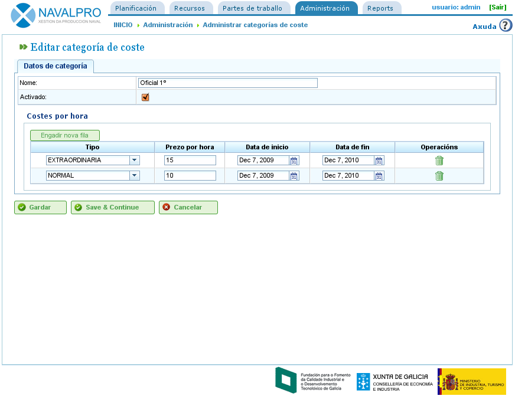

Xestión de custos
#################

.. _custos:
.. contents::

Custos
======

A xestión de custos está prantexada para poder realizar unha previsión estimativa dos custos dos recursos de un proxecto. Para a xestión de custos determinouse a existencia das seguintes entidades:

* Tipos de horas traballadas: Indican os tipos de horas de traballo dos recursos. É posible incluír como tipos tanto os tipos de horas para máquinas como para traballadores. Exemplos de tipos de horas serían: Extraordinarias pagadas a 20 euros de xeito xenérico. Os campos que se poden incluír nos tipos de horas traballadas:

   * Código: Código externo do tipo de horas.
   * Nome: Nome do tipo de hora. Por exemplo, extraordinaria.
   * Prezo por defecto: Prezo base por defecto para o tipo de horas.
   * Activado: Indica se o tipo de hora está activado.

* Categorías de custo. As categorías de custo indican categorías que se utilizan para definir custos dependendo dos tipos de horas durante uns períodos (estes períodos poden ser indefinidos). Por exemplo, o custo das horas extraordinarias dos oficiais de 1ª durante o seguinte ano é de 24 euros hora. As categorías de custo están formadas por:

   * Nome: Nome da categoría de custo.
   * Activado: Indica se a categoría está activada ou non.
   * Listado de tipos de hora asignados á categoría de custo. Indican diversos períodos e prezos para os tipos de hora. Por exemplo, cada ano con cambio de prezos incluese como un período de tipo de hora neste listado. Por outro lado, para cada tipo de horas mantense un prezo por hora (que pode ser diferente do prezo por hora por defecto que se incluiu para o tipo de hora).

Administración de tipos de  horas traballadas
---------------------------------------------

Para dar de alta tipos de horas traballadas é necesario dar os seguintes pasos:

* Seleccionar a operación "Administrar tipos de hora de traballo" no menú de "Administración".
* A aplicación amosa o listado de tipos de hora existentes.

.. figure:: images/hour-type-list.png
   :scale: 35

   Lista de tipos de horas

* O usuario preme na icona de "Editar" ou preme no botón "Crear".
* A aplicación amosa un formulario de edición do tipo de hora.

.. figure:: images/hour-type-edit.png
   :scale: 50

   Edición de tipos de horas

* O usuario introduce ou modifica:

   * O nome do tipo de hora.
   * O código do tipo de hora.
   * O prezo por defecto.
   * Activación/Desactivación do tipo de hora.

* O usuario preme en "Gardar" ou "Gardar e Continuar".

Categorías de custo
-------------------

Para dar de alta categorías de custo é necesario dar os seguintes pasos:

* Seleccionar a operación "Administrar categorías de custo" no menú de "Administración".
* A aplicación amosa o listado de categorías existentes.

.. figure:: images/category-cost-list.png
   :scale: 50

   Lista de categorías de custo

* O usuario preme na icona de "Editar" ou preme no botón "Crear".
* A aplicación amosa un formulario de edición da categoría de custo.

   Edición de categorías de custo

* O usuario introduce ou modifica:

   * O nome da categoría de custo.
   * Activación/Desactivación do tipo de hora.
   * Listado de tipos de hora que forman parte da categoría. Para cada tipo de hora:

      * Tipo de hora: Elixir un dos tipos de hora existentes no sistema. Se non existen ningún é necesario crealo (explícase na subsección anterior).
      * Data de inicio e data fin (opcional esta segunda) do período no que afecta a categoría de custo.
      * Prezo por hora para esta categoría especificamente.

* O usuario preme en "Gardar" ou "Gardar e Continuar".

A asignación de categorías de custo a recursos pode verse no capítulo de recursos. Acceder á sección de "Recursos".
