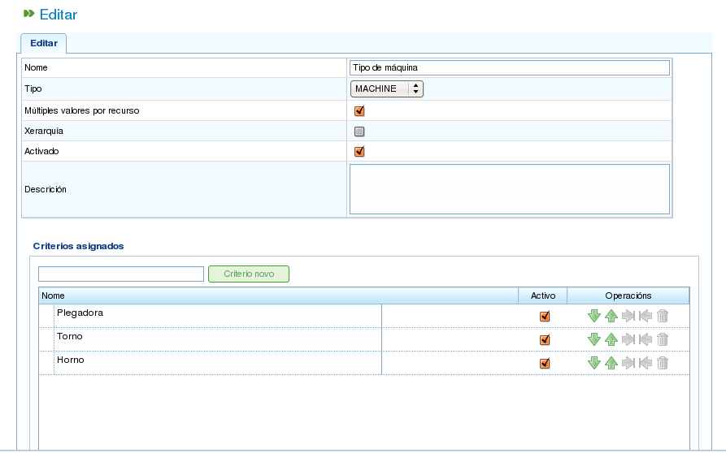

Criteri
#######

.. contents::

I criteri sono elementi utilizzati all'interno del programma per categorizzare sia le risorse che le attività. Le attività richiedono criteri specifici e le risorse devono soddisfare tali criteri.

Ecco un esempio di come vengono utilizzati i criteri: a una risorsa viene assegnato il criterio "saldatore" (il che significa che la risorsa soddisfa la categoria "saldatore"), e un'attività richiede che il criterio "saldatore" venga soddisfatto. Di conseguenza, quando le risorse vengono allocate alle attività tramite assegnazione generica (al contrario dell'assegnazione specifica), verranno considerati i lavoratori con il criterio "saldatore". Per ulteriori informazioni sui diversi tipi di allocazione, fare riferimento al capitolo sull'allocazione delle risorse.

Il programma consente diverse operazioni che coinvolgono i criteri:

*   Amministrazione dei criteri
*   Assegnazione di criteri alle risorse
*   Assegnazione di criteri alle attività
*   Filtraggio delle entità in base ai criteri. Le attività e gli elementi del progetto possono essere filtrati per criteri per eseguire varie operazioni all'interno del programma.

Questa sezione spiegherà solo la prima funzione, l'amministrazione dei criteri. I due tipi di allocazione saranno trattati in seguito: l'allocazione delle risorse nel capitolo "Gestione delle Risorse" e il filtraggio nel capitolo "Pianificazione delle Attività".

Amministrazione dei Criteri
============================

L'amministrazione dei criteri è accessibile tramite il menu di amministrazione:

.. figure:: images/menu.png
   :scale: 50

   Schede del Menu di Primo Livello

L'operazione specifica per la gestione dei criteri è *Gestisci criteri*. Questa operazione consente di elencare i criteri disponibili nel sistema.

.. figure:: images/lista-criterios.png
   :scale: 50

   Elenco dei Criteri

È possibile accedere al modulo di creazione/modifica del criterio facendo clic sul pulsante *Crea*. Per modificare un criterio esistente, fare clic sull'icona di modifica.

   Modifica dei Criteri

Il modulo di modifica dei criteri, come mostrato nell'immagine precedente, consente di eseguire le seguenti operazioni:

*   **Modificare il nome del criterio.**
*   **Specificare se è possibile assegnare più valori contemporaneamente o un solo valore per il tipo di criterio selezionato.** Ad esempio, una risorsa potrebbe soddisfare due criteri: "saldatore" e "tornitore".
*   **Specificare il tipo di criterio:**

    *   **Generico:** Un criterio che può essere utilizzato sia per le macchine che per i lavoratori.
    *   **Lavoratore:** Un criterio che può essere utilizzato solo per i lavoratori.
    *   **Macchina:** Un criterio che può essere utilizzato solo per le macchine.

*   **Indicare se il criterio è gerarchico.** A volte, i criteri devono essere trattati gerarchicamente. Ad esempio, l'assegnazione di un criterio a un elemento non lo assegna automaticamente agli elementi derivati da esso. Un chiaro esempio di criterio gerarchico è la "posizione". Ad esempio, una persona designata con la posizione "Galicia" apparterrà anche alla "Spagna".
*   **Indicare se il criterio è autorizzato.** Questo è il modo in cui gli utenti disattivano i criteri. Una volta che un criterio è stato creato e utilizzato nei dati storici, non può essere modificato. Può invece essere disattivato per impedire che appaia negli elenchi di selezione.
*   **Descrivere il criterio.**
*   **Aggiungere nuovi valori.** Un campo di inserimento testo con il pulsante *Nuovo criterio* si trova nella seconda parte del modulo.
*   **Modificare i nomi dei valori dei criteri esistenti.**
*   **Spostare i valori dei criteri su o giù nell'elenco dei valori dei criteri correnti.**
*   **Rimuovere un valore del criterio dall'elenco.**

Il modulo di amministrazione dei criteri segue il comportamento del modulo descritto nell'introduzione, offrendo tre azioni: *Salva*, *Salva e Chiudi* e *Chiudi*.
