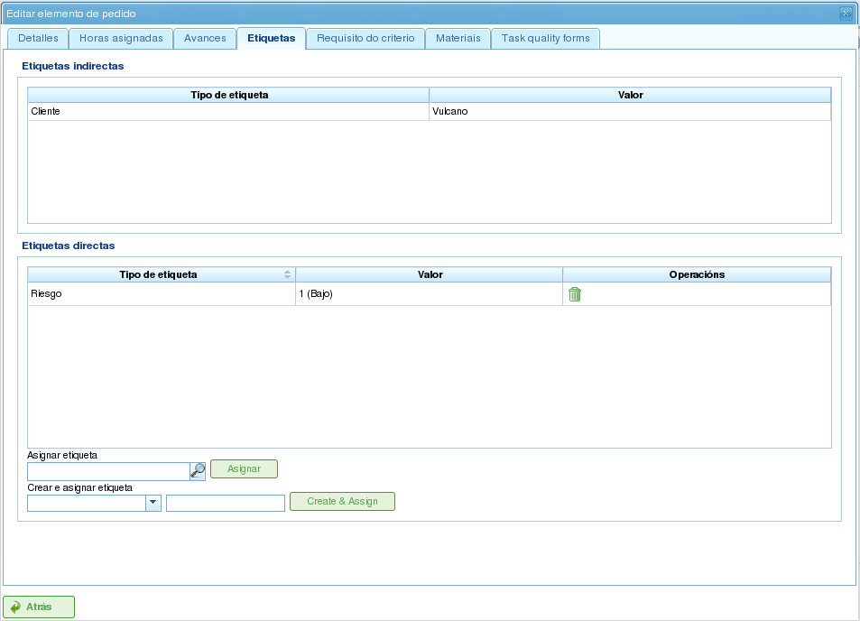

Progetti ed Elementi del Progetto
#################################

.. contents::

I progetti rappresentano il lavoro da eseguire dagli utenti del programma. Ogni progetto corrisponde a un progetto che l'azienda offrirà ai suoi clienti.

Un progetto è composto da uno o più elementi del progetto. Ogni elemento del progetto rappresenta una parte specifica del lavoro da svolgere e definisce come il lavoro sul progetto deve essere pianificato ed eseguito. Gli elementi del progetto sono organizzati gerarchicamente, senza limitazioni sulla profondità della gerarchia. Questa struttura gerarchica consente l'ereditarietà di determinate caratteristiche, come le etichette.

Le sezioni seguenti descrivono le operazioni che gli utenti possono eseguire con i progetti e gli elementi del progetto.

Progetti
========

Un progetto rappresenta un progetto o lavoro richiesto da un cliente all'azienda. Il progetto identifica il progetto all'interno della pianificazione aziendale. A differenza dei programmi di gestione completi, LibrePlan richiede solo alcuni dettagli chiave per un progetto. Questi dettagli sono:

*   **Nome del Progetto:** Il nome del progetto.
*   **Codice del Progetto:** Un codice univoco per il progetto.
*   **Importo Totale del Progetto:** Il valore finanziario totale del progetto.
*   **Data di Inizio Stimata:** La data di inizio pianificata per il progetto.
*   **Data di Fine:** La data di completamento pianificata per il progetto.
*   **Responsabile:** L'individuo responsabile del progetto.
*   **Descrizione:** Una descrizione del progetto.
*   **Calendario Assegnato:** Il calendario associato al progetto.
*   **Generazione Automatica dei Codici:** Un'impostazione per istruire il sistema a generare automaticamente i codici per gli elementi del progetto e i gruppi di ore.
*   **Preferenza tra Dipendenze e Restrizioni:** Gli utenti possono scegliere se le dipendenze o le restrizioni hanno la priorità in caso di conflitti.

Tuttavia, un progetto completo include anche altre entità associate:

*   **Ore Assegnate al Progetto:** Il totale delle ore allocate al progetto.
*   **Avanzamento Attribuito al Progetto:** Il progresso effettuato sul progetto.
*   **Etichette:** Etichette assegnate al progetto.
*   **Criteri Assegnati al Progetto:** Criteri associati al progetto.
*   **Materiali:** Materiali richiesti per il progetto.
*   **Moduli di Qualità:** Moduli di qualità associati al progetto.

La creazione o la modifica di un progetto può essere effettuata da diverse posizioni all'interno del programma:

*   **Dall'"Elenco Progetti" nella Panoramica Aziendale:**

    *   **Modifica:** Fare clic sul pulsante di modifica sul progetto desiderato.
    *   **Creazione:** Fare clic su "Nuovo progetto".

*   **Da un Progetto nel Diagramma di Gantt:** Passare alla vista dei dettagli del progetto.

Gli utenti possono accedere alle seguenti schede quando modificano un progetto:

*   **Modifica dei Dettagli del Progetto:** Questa schermata consente agli utenti di modificare i dettagli di base del progetto:

    *   Nome
    *   Codice
    *   Data di Inizio Stimata
    *   Data di Fine
    *   Responsabile
    *   Cliente
    *   Descrizione

    .. figure:: images/order-edition.png
       :scale: 50

       Modifica dei Progetti

*   **Elenco degli Elementi del Progetto:** Questa schermata consente agli utenti di eseguire diverse operazioni sugli elementi del progetto:

    *   Creazione di nuovi elementi del progetto.
    *   Promozione di un elemento del progetto di un livello nella gerarchia.
    *   Retrocessione di un elemento del progetto di un livello nella gerarchia.
    *   Indentazione di un elemento del progetto (spostamento verso il basso nella gerarchia).
    *   Disindentazione di un elemento del progetto (spostamento verso l'alto nella gerarchia).
    *   Filtraggio degli elementi del progetto.
    *   Eliminazione degli elementi del progetto.
    *   Spostamento di un elemento all'interno della gerarchia tramite trascinamento.

    .. figure:: images/order-elements-list.png
       :scale: 40

       Elenco degli Elementi del Progetto

*   **Ore Assegnate:** Questa schermata visualizza il totale delle ore attribuite al progetto, raggruppando le ore inserite negli elementi del progetto.

    .. figure:: images/order-assigned-hours.png
       :scale: 50

       Assegnazione delle Ore Attribuite al Progetto dai Lavoratori

*   **Avanzamento:** Questa schermata consente agli utenti di assegnare tipi di avanzamento e inserire misurazioni di avanzamento per il progetto. Consultare la sezione "Avanzamento" per ulteriori dettagli.

*   **Etichette:** Questa schermata consente agli utenti di assegnare etichette a un progetto e visualizzare le etichette dirette e indirette precedentemente assegnate. Consultare la sezione seguente sulla modifica degli elementi del progetto per una descrizione dettagliata della gestione delle etichette.

    .. figure:: images/order-labels.png
       :scale: 35

       Etichette del Progetto

*   **Criteri:** Questa schermata consente agli utenti di assegnare criteri che si applicheranno a tutte le attività all'interno del progetto. Questi criteri verranno applicati automaticamente a tutti gli elementi del progetto, ad eccezione di quelli che sono stati esplicitamente invalidati. È anche possibile visualizzare i gruppi di ore degli elementi del progetto, raggruppati per criteri, consentendo agli utenti di identificare i criteri richiesti per un progetto.

    .. figure:: images/order-criterions.png
       :scale: 50

       Criteri del Progetto

*   **Materiali:** Questa schermata consente agli utenti di assegnare materiali ai progetti. I materiali possono essere selezionati dalle categorie di materiali disponibili nel programma. I materiali vengono gestiti come segue:

    *   Selezionare la scheda "Cerca materiali" nella parte inferiore della schermata.
    *   Inserire del testo per cercare materiali o selezionare le categorie per cui si desidera trovare materiali.
    *   Il sistema filtra i risultati.
    *   Selezionare i materiali desiderati (è possibile selezionare più materiali tenendo premuto il tasto "Ctrl").
    *   Fare clic su "Assegna".
    *   Il sistema visualizza l'elenco dei materiali già assegnati al progetto.
    *   Selezionare le unità e lo stato da assegnare al progetto.
    *   Fare clic su "Salva" o "Salva e continua".
    *   Per gestire la ricezione dei materiali, fare clic su "Dividi" per modificare lo stato di una quantità parziale di materiale.

    .. figure:: images/order-material.png
       :scale: 50

       Materiali Associati a un Progetto

*   **Qualità:** Gli utenti possono assegnare un modulo di qualità al progetto. Questo modulo viene poi completato per garantire che determinate attività associate al progetto vengano eseguite. Consultare la sezione seguente sulla modifica degli elementi del progetto per i dettagli sulla gestione dei moduli di qualità.

    .. figure:: images/order-quality.png
       :scale: 50

       Modulo di Qualità Associato al Progetto

Modifica degli Elementi del Progetto
=====================================

Gli elementi del progetto vengono modificati dalla scheda "Elenco degli elementi del progetto" facendo clic sull'icona di modifica. Si apre una nuova schermata in cui gli utenti possono:

*   Modificare le informazioni sull'elemento del progetto.
*   Visualizzare le ore attribuite agli elementi del progetto.
*   Gestire l'avanzamento degli elementi del progetto.
*   Gestire le etichette dei progetti.
*   Gestire i criteri richiesti dall'elemento del progetto.
*   Gestire i materiali.
*   Gestire i moduli di qualità.

Le sottosezioni seguenti descrivono in dettaglio ciascuna di queste operazioni.

Modifica delle Informazioni sull'Elemento del Progetto
-------------------------------------------------------

La modifica delle informazioni sull'elemento del progetto include la modifica dei seguenti dettagli:

*   **Nome dell'Elemento del Progetto:** Il nome dell'elemento del progetto.
*   **Codice dell'Elemento del Progetto:** Un codice univoco per l'elemento del progetto.
*   **Data di Inizio:** La data di inizio pianificata dell'elemento del progetto.
*   **Data di Fine Stimata:** La data di completamento pianificata dell'elemento del progetto.
*   **Ore Totali:** Il totale delle ore allocate all'elemento del progetto. Queste ore possono essere calcolate dai gruppi di ore aggiunti o inserite direttamente. Se inserite direttamente, le ore devono essere distribuite tra i gruppi di ore e deve essere creato un nuovo gruppo di ore se le percentuali non corrispondono alle percentuali iniziali.
*   **Gruppi di Ore:** È possibile aggiungere uno o più gruppi di ore all'elemento del progetto. **Lo scopo di questi gruppi di ore** è definire i requisiti per le risorse che verranno assegnate per svolgere il lavoro.
*   **Criteri:** È possibile aggiungere criteri che devono essere soddisfatti per consentire l'assegnazione generica per l'elemento del progetto.

.. figure:: images/order-element-edition.png
   :scale: 50

   Modifica degli Elementi del Progetto

Visualizzazione delle Ore Attribuite agli Elementi del Progetto
----------------------------------------------------------------

La scheda "Ore assegnate" consente agli utenti di visualizzare i rapporti di lavoro associati a un elemento del progetto e vedere quante delle ore stimate sono già state completate.

.. figure:: images/order-element-hours.png
   :scale: 50

   Ore Assegnate agli Elementi del Progetto

La schermata è divisa in due parti:

*   **Elenco dei Rapporti di Lavoro:** Gli utenti possono visualizzare l'elenco dei rapporti di lavoro associati all'elemento del progetto, incluse la data e l'ora, la risorsa e il numero di ore dedicate all'attività.
*   **Utilizzo delle Ore Stimate:** Il sistema calcola il numero totale di ore dedicate all'attività e le confronta con le ore stimate.

Gestione dell'Avanzamento degli Elementi del Progetto
------------------------------------------------------

L'inserimento dei tipi di avanzamento e la gestione dell'avanzamento degli elementi del progetto sono descritti nel capitolo "Avanzamento".

Gestione delle Etichette dei Progetti
--------------------------------------

Le etichette, come descritto nel capitolo sulle etichette, consentono agli utenti di categorizzare gli elementi del progetto. Questo consente agli utenti di raggruppare le informazioni di pianificazione o dei progetti in base a queste etichette.

Gli utenti possono assegnare etichette direttamente a un elemento del progetto o a un elemento del progetto di livello superiore nella gerarchia. Una volta che un'etichetta è assegnata con uno dei due metodi, l'elemento del progetto e l'attività di pianificazione correlata vengono associati all'etichetta e possono essere utilizzati per il filtraggio successivo.

   Assegnazione delle Etichette agli Elementi del Progetto

Come mostrato nell'immagine, gli utenti possono eseguire le seguenti azioni dalla scheda **Etichette**:

*   **Visualizzare le Etichette Ereditate:** Visualizzare le etichette associate all'elemento del progetto che sono state ereditate da un elemento del progetto di livello superiore. L'attività di pianificazione associata a ciascun elemento del progetto ha le stesse etichette associate.
*   **Visualizzare le Etichette Assegnate Direttamente:** Visualizzare le etichette direttamente associate all'elemento del progetto utilizzando il modulo di assegnazione per le etichette di livello inferiore.
*   **Assegnare Etichette Esistenti:** Assegnare etichette cercandole tra le etichette disponibili nel modulo sottostante all'elenco delle etichette dirette. Per cercare un'etichetta, fare clic sull'icona della lente d'ingrandimento o inserire le prime lettere dell'etichetta nella casella di testo per visualizzare le opzioni disponibili.
*   **Creare e Assegnare Nuove Etichette:** Creare nuove etichette associate a un tipo di etichetta esistente da questo modulo. Per fare ciò, selezionare un tipo di etichetta e inserire il valore dell'etichetta per il tipo selezionato. Il sistema crea automaticamente l'etichetta e la assegna all'elemento del progetto quando si fa clic su "Crea e assegna".

Gestione dei Criteri Richiesti dall'Elemento del Progetto e dei Gruppi di Ore
------------------------------------------------------------------------------

Sia un progetto che un elemento del progetto possono avere criteri assegnati che devono essere soddisfatti affinché il lavoro venga eseguito. I criteri possono essere diretti o indiretti:

*   **Criteri Diretti:** Questi vengono assegnati direttamente all'elemento del progetto. Sono criteri richiesti dai gruppi di ore sull'elemento del progetto.
*   **Criteri Indiretti:** Questi vengono assegnati a elementi del progetto di livello superiore nella gerarchia e sono ereditati dall'elemento in fase di modifica.

Oltre ai criteri richiesti, è possibile definire uno o più gruppi di ore che fanno parte dell'elemento del progetto. Ciò dipende dal fatto che l'elemento del progetto contenga altri elementi del progetto come nodi figlio o se sia un nodo foglia. Nel primo caso, le informazioni sulle ore e sui gruppi di ore possono essere solo visualizzate. Tuttavia, i nodi foglia possono essere modificati. I nodi foglia funzionano come segue:

*   Il sistema crea un gruppo di ore predefinito associato all'elemento del progetto. I dettagli che possono essere modificati per un gruppo di ore sono:

    *   **Codice:** Il codice per il gruppo di ore (se non generato automaticamente).
    *   **Tipo di Criterio:** Gli utenti possono scegliere di assegnare un criterio macchina o lavoratore.
    *   **Numero di Ore:** Il numero di ore nel gruppo di ore.
    *   **Elenco dei Criteri:** I criteri da applicare al gruppo di ore. Per aggiungere nuovi criteri, fare clic su "Aggiungi criterio" e selezionarne uno dal motore di ricerca che appare dopo aver fatto clic sul pulsante.

*   Gli utenti possono aggiungere nuovi gruppi di ore con caratteristiche diverse dai gruppi di ore precedenti. Ad esempio, un elemento del progetto potrebbe richiedere un saldatore (30 ore) e un pittore (40 ore).

.. figure:: images/order-element-criterion.png
   :scale: 50

   Assegnazione dei Criteri agli Elementi del Progetto

Gestione dei Materiali
-----------------------

I materiali vengono gestiti nei progetti come un elenco associato a ciascun elemento del progetto o a un progetto in generale. L'elenco dei materiali include i seguenti campi:

*   **Codice:** Il codice del materiale.
*   **Data:** La data associata al materiale.
*   **Unità:** Il numero richiesto di unità.
*   **Tipo di Unità:** Il tipo di unità utilizzato per misurare il materiale.
*   **Prezzo Unitario:** Il prezzo per unità.
*   **Prezzo Totale:** Il prezzo totale (calcolato moltiplicando il prezzo unitario per il numero di unità).
*   **Categoria:** La categoria a cui appartiene il materiale.
*   **Stato:** Lo stato del materiale (ad es. Ricevuto, Richiesto, In Attesa, In Elaborazione, Annullato).

Il lavoro con i materiali viene eseguito come segue:

*   Selezionare la scheda "Materiali" su un elemento del progetto.
*   Il sistema visualizza due sottoschedate: "Materiali" e "Cerca materiali".
*   Se all'elemento del progetto non sono stati assegnati materiali, la prima scheda sarà vuota.
*   Fare clic su "Cerca materiali" nella parte in basso a sinistra della finestra.
*   Il sistema visualizza l'elenco delle categorie disponibili e i materiali associati.

.. figure:: images/order-element-material-search.png
   :scale: 50

   Ricerca di Materiali

*   Selezionare le categorie per affinare la ricerca dei materiali.
*   Il sistema visualizza i materiali che appartengono alle categorie selezionate.
*   Dall'elenco dei materiali, selezionare i materiali da assegnare all'elemento del progetto.
*   Fare clic su "Assegna".
*   Il sistema visualizza l'elenco selezionato di materiali nella scheda "Materiali" con nuovi campi da completare.

.. figure:: images/order-element-material-assign.png
   :scale: 50

   Assegnazione dei Materiali agli Elementi del Progetto

*   Selezionare le unità, lo stato e la data per i materiali assegnati.

Per il successivo monitoraggio dei materiali, è possibile modificare lo stato di un gruppo di unità del materiale ricevuto. Questo viene fatto come segue:

*   Fare clic sul pulsante "Dividi" nell'elenco dei materiali a destra di ciascuna riga.
*   Selezionare il numero di unità in cui dividere la riga.
*   Il programma visualizza due righe con il materiale diviso.
*   Modificare lo stato della riga contenente il materiale.

Il vantaggio dell'utilizzo di questo strumento di divisione è la possibilità di ricevere consegne parziali di materiale senza dover attendere l'intera consegna per contrassegnarla come ricevuta.

Gestione dei Moduli di Qualità
--------------------------------

Alcuni elementi del progetto richiedono la certificazione che determinate attività siano state completate prima di poterli contrassegnare come completi. Ecco perché il programma dispone di moduli di qualità, che consistono in un elenco di domande considerate importanti se risposte positivamente.

È importante notare che un modulo di qualità deve essere creato in anticipo per essere assegnato a un elemento del progetto.

Per gestire i moduli di qualità:

*   Andare alla scheda "Moduli di qualità".

    .. figure:: images/order-element-quality.png
       :scale: 50

       Assegnazione dei Moduli di Qualità agli Elementi del Progetto

*   Il programma ha un motore di ricerca per i moduli di qualità. Esistono due tipi di moduli di qualità: per elemento o per percentuale.

    *   **Elemento:** Ogni elemento è indipendente.
    *   **Percentuale:** Ogni domanda aumenta l'avanzamento dell'elemento del progetto di una percentuale. Le percentuali devono potersi sommare al 100%.

*   Selezionare uno dei moduli creati nell'interfaccia di amministrazione e fare clic su "Assegna".
*   Il programma assegna il modulo scelto dall'elenco dei moduli assegnati all'elemento del progetto.
*   Fare clic sul pulsante "Modifica" sull'elemento del progetto.
*   Il programma visualizza le domande del modulo di qualità nell'elenco inferiore.
*   Contrassegnare come raggiunte le domande che sono state completate.

    *   Se il modulo di qualità è basato sulle percentuali, le domande vengono risposte in ordine.
    *   Se il modulo di qualità è basato sugli elementi, le domande possono essere risposte in qualsiasi ordine.
