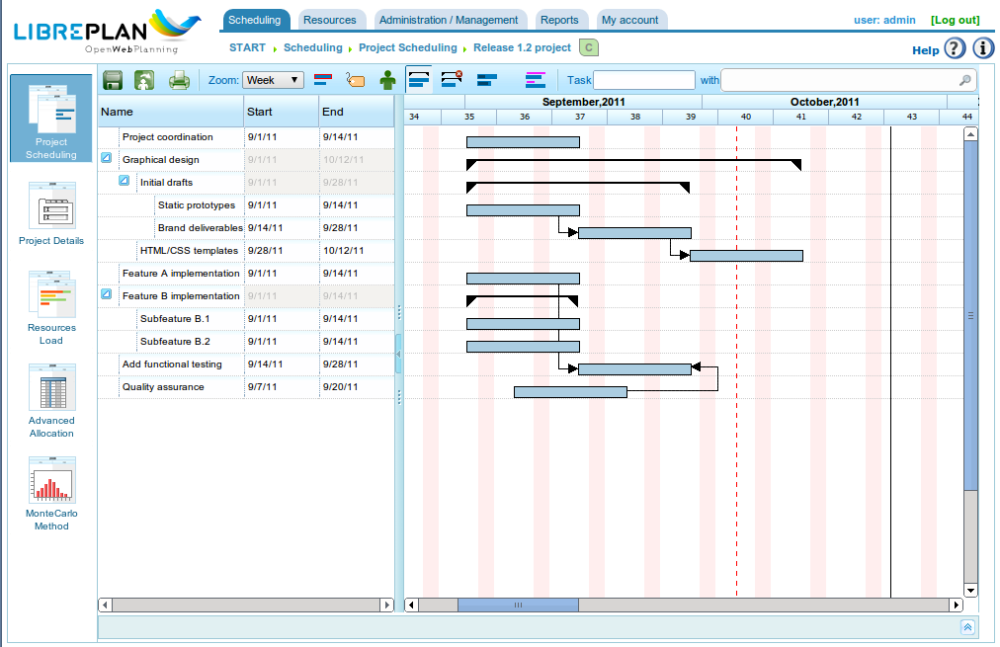

Pianificazione delle Attività
#############################

.. _planificacion:
.. contents::

Pianificazione delle Attività
==============================

La pianificazione in LibrePlan è un processo che è stato descritto in tutta la guida utente, con i capitoli sui progetti e l'assegnazione delle risorse particolarmente importanti. Questo capitolo descrive le procedure di pianificazione di base dopo che il progetto e i diagrammi di Gantt sono stati correttamente configurati.

   Vista di Pianificazione del Lavoro

Come per la panoramica aziendale, la vista di pianificazione del progetto è divisa in diverse viste in base alle informazioni analizzate. Le viste disponibili per un progetto specifico sono:

*   Vista Pianificazione
*   Vista Carico Risorse
*   Vista Elenco Progetti
*   Vista Assegnazione Avanzata

Vista Pianificazione
---------------------

La Vista Pianificazione combina tre diverse prospettive:

*   **Pianificazione del Progetto:** La pianificazione del progetto viene visualizzata nella parte in alto a destra del programma come un diagramma di Gantt. Questa vista consente agli utenti di spostare temporaneamente le attività, assegnare dipendenze tra di esse, definire pietre miliari e stabilire restrizioni.
*   **Carico Risorse:** La vista Carico Risorse, situata nella parte in basso a destra della schermata, mostra la disponibilità delle risorse in base alle assegnazioni, al contrario delle assegnazioni effettuate alle attività. Le informazioni visualizzate in questa vista sono le seguenti:

    *   **Area Viola:** Indica un carico di risorse inferiore al 100% della sua capacità.
    *   **Area Verde:** Indica un carico di risorse inferiore al 100%, risultante dalla pianificazione della risorsa per un altro progetto.
    *   **Area Arancione:** Indica un carico di risorse superiore al 100% a causa del progetto corrente.
    *   **Area Gialla:** Indica un carico di risorse superiore al 100% a causa di altri progetti.

*   **Vista Grafico e Indicatori del Valore Guadagnato:** Questi possono essere visualizzati dalla scheda "Valore Guadagnato". Il grafico generato si basa sulla tecnica del valore guadagnato, e gli indicatori vengono calcolati per ogni giorno lavorativo del progetto. Gli indicatori calcolati sono:

    *   **BCWS (Costo Preventivato del Lavoro Pianificato):** La funzione cumulativa nel tempo per il numero di ore pianificate fino a una certa data. Sarà 0 all'inizio pianificato dell'attività e uguale al numero totale di ore pianificate alla fine. Come con tutti i grafici cumulativi, aumenterà sempre. La funzione per un'attività sarà la somma delle assegnazioni giornaliere fino alla data di calcolo. Questa funzione ha valori per tutti i periodi, a condizione che le risorse siano state assegnate.
    *   **ACWP (Costo Effettivo del Lavoro Eseguito):** La funzione cumulativa nel tempo per le ore riportate nei rapporti di lavoro fino a una certa data. Questa funzione avrà solo un valore di 0 prima della data del primo rapporto di lavoro dell'attività, e il suo valore continuerà ad aumentare con il passare del tempo e l'aggiunta di ore dai rapporti di lavoro. Non avrà alcun valore dopo la data dell'ultimo rapporto di lavoro.
    *   **BCWP (Costo Preventivato del Lavoro Eseguito):** La funzione cumulativa nel tempo che include il valore risultante dalla moltiplicazione dell'avanzamento dell'attività per la quantità di lavoro che si stimava necessaria per il completamento dell'attività. I valori di questa funzione aumentano con il passare del tempo, come i valori di avanzamento. L'avanzamento viene moltiplicato per il numero totale di ore stimate per tutte le attività. Il valore BCWP è la somma dei valori per le attività calcolate. L'avanzamento viene totalizzato quando è configurato.
    *   **CV (Varianza dei Costi):** CV = BCWP - ACWP
    *   **SV (Varianza della Pianificazione):** SV = BCWP - BCWS
    *   **BAC (Budget al Completamento):** BAC = max (BCWS)
    *   **EAC (Stima al Completamento):** EAC = (ACWP / BCWP) * BAC
    *   **VAC (Varianza al Completamento):** VAC = BAC - EAC
    *   **ETC (Stima per il Completamento):** ETC = EAC - ACWP
    *   **CPI (Indice di Prestazione dei Costi):** CPI = BCWP / ACWP
    *   **SPI (Indice di Prestazione della Pianificazione):** SPI = BCWP / BCWS

Nella vista di pianificazione del progetto, gli utenti possono eseguire le seguenti azioni:

*   **Assegnazione delle Dipendenze:** Fare clic con il pulsante destro del mouse su un'attività, scegliere "Aggiungi dipendenza" e trascinare il puntatore del mouse sull'attività a cui deve essere assegnata la dipendenza.

    *   Per modificare il tipo di dipendenza, fare clic con il pulsante destro del mouse sulla dipendenza e scegliere il tipo desiderato.

*   **Creazione di una Nuova Pietra Miliare:** Fare clic sull'attività prima della quale la pietra miliare deve essere aggiunta e selezionare l'opzione "Aggiungi pietra miliare". Le pietre miliari possono essere spostate selezionando la pietra miliare con il puntatore del mouse e trascinandola nella posizione desiderata.
*   **Spostamento delle Attività senza Disturbare le Dipendenze:** Fare clic con il pulsante destro del mouse sul corpo dell'attività e trascinarla nella posizione desiderata. Se non vengono violate restrizioni o dipendenze, il sistema aggiornerà l'assegnazione giornaliera delle risorse all'attività e la posizionerà sulla data selezionata.
*   **Assegnazione delle Restrizioni:** Fare clic sull'attività in questione e selezionare l'opzione "Proprietà dell'attività". Apparirà una finestra pop-up con un campo "Restrizioni" che può essere modificato. Le restrizioni possono essere in conflitto con le dipendenze, motivo per cui ogni progetto specifica se le dipendenze hanno la priorità sulle restrizioni. Le restrizioni che possono essere stabilite sono:

    *   **Prima Possibile:** Indica che l'attività deve iniziare prima possibile.
    *   **Non Prima Di:** Indica che l'attività non deve iniziare prima di una certa data.
    *   **Inizio in una Data Specifica:** Indica che l'attività deve iniziare in una data specifica.

La vista di pianificazione offre anche diverse procedure che funzionano come opzioni di visualizzazione:

*   **Livello di Zoom:** Gli utenti possono scegliere il livello di zoom desiderato. Ci sono diversi livelli di zoom: annuale, quadrimestrale, mensile, settimanale e giornaliero.
*   **Filtri di Ricerca:** Gli utenti possono filtrare le attività in base a etichette o criteri.
*   **Percorso Critico:** Come risultato dell'utilizzo dell'algoritmo *Dijkstra* per calcolare i percorsi sui grafici, è stato implementato il percorso critico. Può essere visualizzato facendo clic sul pulsante "Percorso critico" nelle opzioni di visualizzazione.
*   **Mostra Etichette:** Consente agli utenti di visualizzare le etichette assegnate alle attività in un progetto, che possono essere visualizzate sullo schermo o stampate.
*   **Mostra Risorse:** Consente agli utenti di visualizzare le risorse assegnate alle attività in un progetto, che possono essere visualizzate sullo schermo o stampate.
*   **Stampa:** Consente agli utenti di stampare il diagramma di Gantt visualizzato.

Vista Carico Risorse
---------------------

La Vista Carico Risorse fornisce un elenco di risorse che contiene un elenco di attività o criteri che generano carichi di lavoro. Ogni attività o criterio viene mostrato come un diagramma di Gantt in modo che sia possibile vedere le date di inizio e fine del carico. Viene mostrato un colore diverso a seconda che la risorsa abbia un carico superiore o inferiore al 100%:

*   **Verde:** Carico inferiore al 100%
*   **Arancione:** Carico al 100%
*   **Rosso:** Carico superiore al 100%

.. figure:: images/resource-load.png
   :scale: 35

   Vista Carico Risorse per un Progetto Specifico

Se il puntatore del mouse viene posizionato sul diagramma di Gantt della risorsa, verrà mostrata la percentuale di carico per il lavoratore.

Vista Elenco Progetti
---------------------

La Vista Elenco Progetti consente agli utenti di accedere alle opzioni di modifica ed eliminazione dei progetti. Per ulteriori informazioni, consultare il capitolo "Progetti".

Vista Assegnazione Avanzata
----------------------------

La Vista Assegnazione Avanzata è spiegata in modo approfondito nel capitolo "Assegnazione delle Risorse".
