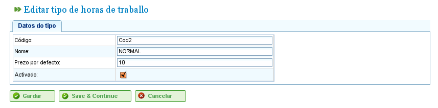
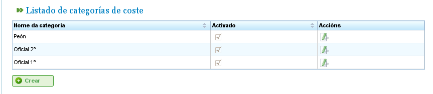

Gestione dei Costi
##################

.. _costes:
.. contents::

Costi
=====

La gestione dei costi consente agli utenti di stimare i costi delle risorse utilizzate in un progetto. Per gestire i costi, è necessario definire le seguenti entità:

*   **Tipi di Ore:** Indicano i tipi di ore lavorate da una risorsa. Gli utenti possono definire tipi di ore sia per le macchine che per i lavoratori. Esempi di tipi di ore includono: "Ore aggiuntive pagate a €20 all'ora." Per i tipi di ore è possibile definire i seguenti campi:

    *   **Codice:** Codice esterno per il tipo di ora.
    *   **Nome:** Nome del tipo di ora. Ad esempio, "Aggiuntivo".
    *   **Tariffa Predefinita:** Tariffa predefinita di base per il tipo di ora.
    *   **Attivazione:** Indica se il tipo di ora è attivo o meno.

*   **Categorie di Costo:** Le categorie di costo definiscono i costi associati a diversi tipi di ore durante periodi specifici (che possono essere indefiniti). Ad esempio, il costo delle ore aggiuntive per i lavoratori qualificati di primo grado nell'anno successivo è di €24 all'ora. Le categorie di costo includono:

    *   **Nome:** Nome della categoria di costo.
    *   **Attivazione:** Indica se la categoria è attiva o meno.
    *   **Elenco dei Tipi di Ore:** Questo elenco definisce i tipi di ore inclusi nella categoria di costo. Specifica i periodi e le tariffe per ogni tipo di ora. Ad esempio, man mano che le tariffe cambiano, ogni anno può essere incluso in questo elenco come periodo di tipo di ora, con una tariffa oraria specifica per ogni tipo di ora (che può differire dalla tariffa oraria predefinita per quel tipo di ora).

Gestione dei Tipi di Ore
-------------------------

Gli utenti devono seguire questi passaggi per registrare i tipi di ore:

*   Selezionare "Gestisci tipi di ore lavorate" nel menu "Amministrazione".
*   Il programma visualizza un elenco dei tipi di ore esistenti.

.. figure:: images/hour-type-list.png
   :scale: 35

   Elenco dei Tipi di Ore

*   Fare clic su "Modifica" o "Crea".
*   Il programma visualizza un modulo di modifica del tipo di ora.

   Modifica dei Tipi di Ore

*   Gli utenti possono inserire o modificare:

    *   Il nome del tipo di ora.
    *   Il codice del tipo di ora.
    *   La tariffa predefinita.
    *   Attivazione/disattivazione del tipo di ora.

*   Fare clic su "Salva" o "Salva e continua".

Categorie di Costo
------------------

Gli utenti devono seguire questi passaggi per registrare le categorie di costo:

*   Selezionare "Gestisci categorie di costo" nel menu "Amministrazione".
*   Il programma visualizza un elenco delle categorie esistenti.

   Elenco delle Categorie di Costo

*   Fare clic sul pulsante "Modifica" o "Crea".
*   Il programma visualizza un modulo di modifica della categoria di costo.

.. figure:: images/category-cost-edit.png
   :scale: 50

   Modifica delle Categorie di Costo

*   Gli utenti inseriscono o modificano:

    *   Il nome della categoria di costo.
    *   L'attivazione/disattivazione della categoria di costo.
    *   L'elenco dei tipi di ore inclusi nella categoria. Tutti i tipi di ore hanno i seguenti campi:

        *   **Tipo di Ora:** Scegliere uno dei tipi di ore esistenti nel sistema. Se non ne esistono, è necessario creare un tipo di ora (questo processo è spiegato nella sottosezione precedente).
        *   **Data di Inizio e Fine:** Le date di inizio e fine (quest'ultima è facoltativa) per il periodo che si applica alla categoria di costo.
        *   **Tariffa Oraria:** La tariffa oraria per questa categoria specifica.

*   Fare clic su "Salva" o "Salva e continua".

L'assegnazione delle categorie di costo alle risorse è descritta nel capitolo sulle risorse. Andare alla sezione "Risorse".
