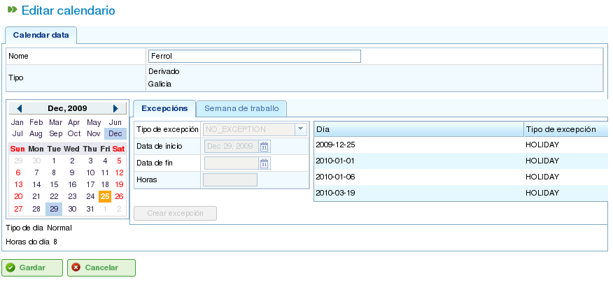

Kalendere
#########

.. contents::

Kalendere er enheter i programmet som definerer ressursenes arbeidskapasitet. En kalender består av en serie dager gjennom året, der hver dag er delt inn i tilgjengelige arbeidstimer.

For eksempel kan en helligdag ha 0 tilgjengelige arbeidstimer. En typisk arbeidsdag kan derimot ha 8 timer avsatt som tilgjengelig arbeidstid.

Det er to primære måter å definere antall arbeidstimer på en dag:

*   **Etter ukedag:** Denne metoden angir et standardantall arbeidstimer for hver dag i uken. For eksempel kan mandager normalt ha 8 arbeidstimer.
*   **Etter unntak:** Denne metoden gir mulighet for spesifikke avvik fra standard ukesplan. For eksempel kan mandag 30. januar ha 10 arbeidstimer, noe som overstyrer den vanlige mandagsplanen.

Kalenderadministrasjon
=======================

Kalendersystemet er hierarkisk, noe som lar deg opprette basiskalendere og deretter avlede nye kalendere fra dem, og danner en trestruktur. En kalender avledet fra en kalender på høyere nivå vil arve dens daglige planer og unntak med mindre de eksplisitt endres. For å administrere kalendere effektivt er det viktig å forstå følgende konsepter:

*   **Dagsuavhengighet:** Hver dag behandles uavhengig, og hvert år har sitt eget sett med dager. For eksempel, hvis 8. desember 2009 er en helligdag, betyr ikke dette automatisk at 8. desember 2010 også er en helligdag.
*   **Arbeidsdager basert på ukedag:** Standard arbeidsdager er basert på ukedager. For eksempel, hvis mandager normalt har 8 arbeidstimer, vil alle mandager i alle uker i alle år ha 8 tilgjengelige timer med mindre et unntak er definert.
*   **Unntak og unntaksperioder:** Du kan definere unntak eller unntaksperioder for å avvike fra standard ukesplan. For eksempel kan du angi en enkelt dag eller et datointerval med et annet antall tilgjengelige arbeidstimer enn den generelle regelen for disse ukedagene.

.. figure:: images/calendar-administration.png
   :scale: 50

   Kalenderadministrasjon

Kalenderadministrasjon er tilgjengelig via "Administrasjon"-menyen. Derfra kan brukere utføre følgende handlinger:

1.  Opprette en ny kalender fra bunnen av.
2.  Opprette en kalender avledet fra en eksisterende.
3.  Opprette en kalender som en kopi av en eksisterende.
4.  Redigere en eksisterende kalender.

Opprette en ny kalender
------------------------

For å opprette en ny kalender, klikk på "Opprett"-knappen. Systemet vil vise et skjema der du kan konfigurere følgende:

*   **Velg fane:** Velg fanen du vil jobbe på:

    *   **Merking av unntak:** Definer unntak fra standard plan.
    *   **Arbeidstimer per dag:** Definer standard arbeidstimer for hver ukedag.

*   **Merking av unntak:** Hvis du velger alternativet "Merking av unntak", kan du:

    *   Velge en bestemt dag i kalenderen.
    *   Velge typen unntak. De tilgjengelige typene er: ferie, sykdom, streik, offentlig helligdag og arbeidende helligdag.
    *   Velge sluttdatoen for unntaksperioden. (Dette feltet trenger ikke å endres for enkeltdagsunntak.)
    *   Definere antall arbeidstimer i dagene i unntaksperioden.
    *   Slette tidligere definerte unntak.

*   **Arbeidstimer per dag:** Hvis du velger alternativet "Arbeidstimer per dag", kan du:

    *   Definere de tilgjengelige arbeidstimene for hver ukedag (mandag, tirsdag, onsdag, torsdag, fredag, lørdag og søndag).
    *   Definere ulike ukentlige timefordelinger for fremtidige perioder.
    *   Slette tidligere definerte timefordelinger.

Disse alternativene lar brukere tilpasse kalendere fullt ut etter deres spesifikke behov. Klikk på "Lagre"-knappen for å lagre eventuelle endringer i skjemaet.

.. figure:: images/calendar-edition.png
   :scale: 50

   Redigering av kalendere

.. figure:: images/calendar-exceptions.png
   :scale: 50

   Legge til et unntak i en kalender

Opprette avledede kalendere
----------------------------

En avledet kalender opprettes basert på en eksisterende kalender. Den arver alle egenskapene til den opprinnelige kalenderen, men du kan endre den for å inkludere ulike alternativer.

Et vanlig brukstilfelle for avledede kalendere er når du har en generell kalender for et land, for eksempel Spania, og du trenger å opprette en avledet kalender for å inkludere ytterligere offentlige helligdager som er spesifikke for en region, for eksempel Galicia.

Det er viktig å merke seg at eventuelle endringer som gjøres i den opprinnelige kalenderen, automatisk vil forplante seg til den avledede kalenderen, med mindre et spesifikt unntak er definert i den avledede kalenderen. For eksempel kan den spanske kalenderen ha en 8-timers arbeidsdag 17. mai. Den galisiske kalenderen (en avledet kalender) kan imidlertid ikke ha arbeidstimer samme dag fordi det er en regional helligdag. Hvis den spanske kalenderen senere endres til å ha 4 tilgjengelige arbeidstimer per dag for uken 17. mai, vil den galisiske kalenderen også endres til å ha 4 tilgjengelige arbeidstimer for hver dag den uken, bortsett fra 17. mai, som forblir en fridag på grunn av det definerte unntaket.

   Opprette en avledet kalender

For å opprette en avledet kalender:

*   Gå til *Administrasjon*-menyen.
*   Klikk på *Kalenderadministrasjon*-alternativet.
*   Velg kalenderen du vil bruke som grunnlag for den avledede kalenderen, og klikk på "Opprett"-knappen.
*   Systemet vil vise et redigeringsskjema med de samme egenskapene som skjemaet som brukes til å opprette en kalender fra bunnen av, bortsett fra at de foreslåtte unntakene og arbeidstimene per ukedag vil være basert på den opprinnelige kalenderen.

Opprette en kalender ved kopiering
------------------------------------

En kopiert kalender er et eksakt duplikat av en eksisterende kalender. Den arver alle egenskapene til den opprinnelige kalenderen, men du kan endre den uavhengig.

Den viktigste forskjellen mellom en kopiert kalender og en avledet kalender er hvordan de påvirkes av endringer i originalen. Hvis den opprinnelige kalenderen endres, forblir den kopierte kalenderen uendret. Avledede kalendere påvirkes imidlertid av endringer gjort i originalen, med mindre et unntak er definert.

Et vanlig brukstilfelle for kopierte kalendere er når du har en kalender for ett sted, for eksempel "Pontevedra", og du trenger en lignende kalender for et annet sted, for eksempel "A Coruña", der de fleste egenskapene er de samme. Endringer i én kalender bør imidlertid ikke påvirke den andre.

For å opprette en kopiert kalender:

*   Gå til *Administrasjon*-menyen.
*   Klikk på *Kalenderadministrasjon*-alternativet.
*   Velg kalenderen du vil kopiere, og klikk på "Opprett"-knappen.
*   Systemet vil vise et redigeringsskjema med de samme egenskapene som skjemaet som brukes til å opprette en kalender fra bunnen av, bortsett fra at de foreslåtte unntakene og arbeidstimene per ukedag vil være basert på den opprinnelige kalenderen.

Standardkalender
-----------------

En av de eksisterende kalenderne kan utpekes som standardkalender. Denne kalenderen vil automatisk bli tildelt enhver enhet i systemet som administreres med kalendere, med mindre en annen kalender er spesifisert.

For å sette opp en standardkalender:

*   Gå til *Administrasjon*-menyen.
*   Klikk på *Konfigurasjon*-alternativet.
*   I feltet *Standardkalender* velger du kalenderen du vil bruke som programmets standardkalender.
*   Klikk på *Lagre*.

.. figure:: images/default-calendar.png
   :scale: 50

   Angi en standardkalender

Tildele en kalender til ressurser
-----------------------------------

Ressurser kan bare aktiveres (dvs. ha tilgjengelige arbeidstimer) hvis de har en tildelt kalender med en gyldig aktiveringsperiode. Hvis ingen kalender er tildelt en ressurs, tildeles standardkalenderen automatisk, med en aktiveringsperiode som begynner på startdatoen og ikke har noen utløpsdato.

.. figure:: images/resource-calendar.png
   :scale: 50

   Ressurskalender

Du kan imidlertid slette kalenderen som tidligere er tildelt en ressurs og opprette en ny kalender basert på en eksisterende. Dette gir mulighet for fullstendig tilpasning av kalendere for individuelle ressurser.

For å tildele en kalender til en ressurs:

*   Gå til alternativet *Rediger ressurser*.
*   Velg en ressurs og klikk på *Rediger*.
*   Velg fanen "Kalender".
*   Kalenderen, sammen med dens unntak, arbeidstimer per dag og aktiveringsperioder, vil bli vist.
*   Hver fane vil ha følgende alternativer:

    *   **Unntak:** Definer unntak og perioden de gjelder for, for eksempel ferier, offentlige helligdager eller ulike arbeidsdager.
    *   **Arbeidsuke:** Endre arbeidstimene for hver ukedag (mandag, tirsdag osv.).
    *   **Aktiveringsperioder:** Opprett nye aktiveringsperioder for å gjenspeile start- og sluttdatoene for kontrakter tilknyttet ressursen. Se bildet nedenfor.

*   Klikk på *Lagre* for å lagre informasjonen.
*   Klikk på *Slett* hvis du vil endre kalenderen som er tildelt en ressurs.

.. figure:: images/new-resource-calendar.png
   :scale: 50

   Tildele en ny kalender til en ressurs

Tildele kalendere til prosjekter
----------------------------------

Prosjekter kan ha en annen kalender enn standardkalenderen. For å endre kalenderen for et prosjekt:

*   Gå til prosjektlisten i bedriftsoversikten.
*   Rediger det aktuelle prosjektet.
*   Gå til fanen "Generell informasjon".
*   Velg kalenderen som skal tildeles fra rullegardinmenyen.
*   Klikk på "Lagre" eller "Lagre og fortsett".

Tildele kalendere til oppgaver
--------------------------------

I likhet med ressurser og prosjekter kan du tildele spesifikke kalendere til individuelle oppgaver. Dette lar deg definere ulike kalendere for spesifikke faser i et prosjekt. For å tildele en kalender til en oppgave:

*   Åpne planleggingsvisningen for et prosjekt.
*   Høyreklikk på oppgaven du vil tildele en kalender.
*   Velg alternativet "Tildel kalender".
*   Velg kalenderen som skal tildeles oppgaven.
*   Klikk på *Godta*.
