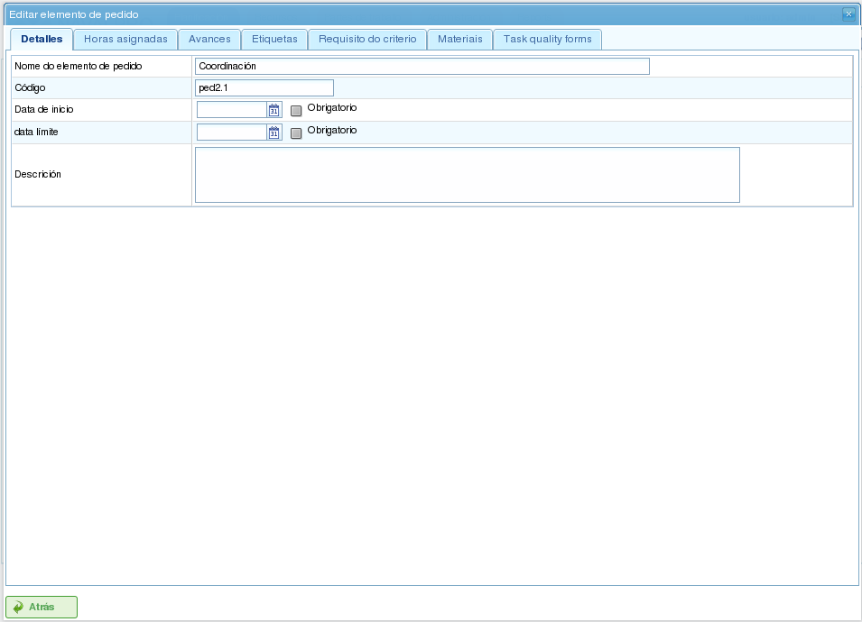

Prosjekter og prosjektelementer
################################

.. contents::

Prosjekter representerer arbeidet som skal utføres av brukerne av programmet. Hvert prosjekt tilsvarer et prosjekt som bedriften vil tilby til sine klienter.

Et prosjekt består av ett eller flere prosjektelementer. Hvert prosjektelement representerer en spesifikk del av arbeidet som skal gjøres, og definerer hvordan arbeidet på prosjektet skal planlegges og utføres. Prosjektelementer er organisert hierarkisk, uten begrensninger på hierarkiets dybde. Denne hierarkiske strukturen tillater arv av visse egenskaper, for eksempel etiketter.

De følgende avsnittene beskriver operasjonene som brukere kan utføre med prosjekter og prosjektelementer.

Prosjekter
==========

Et prosjekt representerer et prosjekt eller arbeid bestilt av en klient fra bedriften. Prosjektet identifiserer prosjektet i bedriftens planlegging. I motsetning til omfattende administrasjonsprogrammer krever LibrePlan bare visse nøkkeldetaljer for et prosjekt. Disse detaljene er:

*   **Prosjektnavn:** Navnet på prosjektet.
*   **Prosjektkode:** En unik kode for prosjektet.
*   **Totalt prosjektbeløp:** Den totale finansielle verdien av prosjektet.
*   **Estimert startdato:** Den planlagte startdatoen for prosjektet.
*   **Sluttdato:** Den planlagte fullføringsdatoen for prosjektet.
*   **Ansvarlig person:** Den personen som er ansvarlig for prosjektet.
*   **Beskrivelse:** En beskrivelse av prosjektet.
*   **Tildelt kalender:** Kalenderen som er tilknyttet prosjektet.
*   **Automatisk generering av koder:** En innstilling for å instruere systemet til automatisk å generere koder for prosjektelementer og timegrupper.
*   **Preferanse mellom avhengigheter og restriksjoner:** Brukere kan velge om avhengigheter eller restriksjoner har prioritet i tilfelle konflikter.

Et komplett prosjekt inkluderer imidlertid også andre tilknyttede enheter:

*   **Timer tildelt prosjektet:** De totale timene som er allokert til prosjektet.
*   **Fremdrift tilskrevet prosjektet:** Fremdriften som er gjort på prosjektet.
*   **Etiketter:** Etiketter tildelt prosjektet.
*   **Kriterier tildelt prosjektet:** Kriterier tilknyttet prosjektet.
*   **Materialer:** Materialer som kreves for prosjektet.
*   **Kvalitetsskjemaer:** Kvalitetsskjemaer tilknyttet prosjektet.

Oppretting eller redigering av et prosjekt kan gjøres fra flere steder i programmet:

*   **Fra "Prosjektlisten" i bedriftsoversikten:**

    *   **Redigering:** Klikk på redigeringsknappen på ønsket prosjekt.
    *   **Oppretting:** Klikk på "Nytt prosjekt".

*   **Fra et prosjekt i Gantt-diagrammet:** Bytt til prosjektdetaljvisningen.

Brukere kan åpne følgende faner når de redigerer et prosjekt:

*   **Redigering av prosjektdetaljer:** Denne skjermen lar brukere redigere grunnleggende prosjektdetaljer:

    *   Navn
    *   Kode
    *   Estimert startdato
    *   Sluttdato
    *   Ansvarlig person
    *   Klient
    *   Beskrivelse

    .. figure:: images/order-edition.png
       :scale: 50

       Redigering av prosjekter

*   **Prosjektelementliste:** Denne skjermen lar brukere utføre flere operasjoner på prosjektelementer:

    *   Opprette nye prosjektelementer.
    *   Forfremme et prosjektelement ett nivå opp i hierarkiet.
    *   Degradere et prosjektelement ett nivå ned i hierarkiet.
    *   Rykke inn et prosjektelement (flytte det ned i hierarkiet).
    *   Rykke ut et prosjektelement (flytte det opp i hierarkiet).
    *   Filtrere prosjektelementer.
    *   Slette prosjektelementer.
    *   Flytte et element innenfor hierarkiet ved å dra og slippe.

    .. figure:: images/order-elements-list.png
       :scale: 40

       Prosjektelementliste

*   **Tildelte timer:** Denne skjermen viser de totale timene som er tilskrevet prosjektet, og grupperer timene som er lagt inn i prosjektelementene.

    .. figure:: images/order-assigned-hours.png
       :scale: 50

       Tildele timer tilskrevet prosjektet av arbeidere

*   **Fremdrift:** Denne skjermen lar brukere tildele fremdriftstyper og legge inn fremdriftsmålinger for prosjektet. Se avsnittet "Fremdrift" for mer informasjon.

*   **Etiketter:** Denne skjermen lar brukere tildele etiketter til et prosjekt og se tidligere tildelte direkte og indirekte etiketter. Se følgende avsnitt om redigering av prosjektelementer for en detaljert beskrivelse av etikettadministrasjon.

    .. figure:: images/order-labels.png
       :scale: 35

       Prosjektetiketter

*   **Kriterier:** Denne skjermen lar brukere tildele kriterier som vil gjelde for alle oppgaver i prosjektet. Disse kriteriene vil automatisk bli anvendt på alle prosjektelementer, bortsett fra de som eksplisitt er ugyldiggjort. Timegruppene til prosjektelementene, som er gruppert etter kriterier, kan også vises, slik at brukere kan identifisere kriteriene som kreves for et prosjekt.

    .. figure:: images/order-criterions.png
       :scale: 50

       Prosjektkriterier

*   **Materialer:** Denne skjermen lar brukere tildele materialer til prosjekter. Materialer kan velges fra de tilgjengelige materialkategoriene i programmet. Materialer administreres som følger:

    *   Velg fanen "Søk etter materialer" nederst på skjermen.
    *   Skriv inn tekst for å søke etter materialer eller velg kategoriene du vil finne materialer for.
    *   Systemet filtrerer resultatene.
    *   Velg ønskede materialer (flere materialer kan velges ved å holde nede "Ctrl"-tasten).
    *   Klikk på "Tildel".
    *   Systemet viser listen over materialer som allerede er tildelt prosjektet.
    *   Velg enhetene og statusen som skal tildeles prosjektet.
    *   Klikk på "Lagre" eller "Lagre og fortsett".
    *   For å administrere mottak av materialer, klikk på "Del" for å endre statusen til en delvis mengde materiale.

    .. figure:: images/order-material.png
       :scale: 50

       Materialer tilknyttet et prosjekt

*   **Kvalitet:** Brukere kan tildele et kvalitetsskjema til prosjektet. Dette skjemaet fylles deretter ut for å sikre at visse aktiviteter tilknyttet prosjektet utføres. Se følgende avsnitt om redigering av prosjektelementer for detaljer om administrasjon av kvalitetsskjemaer.

    .. figure:: images/order-quality.png
       :scale: 50

       Kvalitetsskjema tilknyttet prosjektet

Redigering av prosjektelementer
================================

Prosjektelementer redigeres fra fanen "Prosjektelementliste" ved å klikke på redigeringsikonet. Dette åpner en ny skjerm der brukere kan:

*   Redigere informasjon om prosjektelementet.
*   Se timer tilskrevet prosjektelementer.
*   Administrere fremdrift for prosjektelementer.
*   Administrere prosjektetiketter.
*   Administrere kriterier som kreves av prosjektelementet.
*   Administrere materialer.
*   Administrere kvalitetsskjemaer.

De følgende underavsnittene beskriver hver av disse operasjonene i detalj.

Redigere informasjon om prosjektelementet
------------------------------------------

Redigering av informasjon om prosjektelementet inkluderer endring av følgende detaljer:

*   **Navn på prosjektelementet:** Navnet på prosjektelementet.
*   **Kode for prosjektelementet:** En unik kode for prosjektelementet.
*   **Startdato:** Den planlagte startdatoen for prosjektelementet.
*   **Estimert sluttdato:** Den planlagte fullføringsdatoen for prosjektelementet.
*   **Totale timer:** De totale timene som er allokert til prosjektelementet. Disse timene kan beregnes fra de tillagte timegrupper eller legges inn direkte. Hvis de legges inn direkte, må timene fordeles mellom timegrupper, og en ny timegruppe opprettes hvis prosentene ikke samsvarer med de første prosentene.
*   **Timegrupper:** En eller flere timegrupper kan legges til prosjektelementet. **Formålet med disse timegruppene** er å definere kravene til ressursene som vil bli tildelt for å utføre arbeidet.
*   **Kriterier:** Kriterier kan legges til som må oppfylles for å aktivere generisk tildeling for prosjektelementet.

   Redigering av prosjektelementer

Se timer tilskrevet prosjektelementer
---------------------------------------

Fanen "Tildelte timer" lar brukere se arbeidsrapportene som er tilknyttet et prosjektelement og se hvor mange av de estimerte timene som allerede er fullført.

.. figure:: images/order-element-hours.png
   :scale: 50

   Timer tildelt prosjektelementer

Skjermen er delt inn i to deler:

*   **Arbeidsrapportliste:** Brukere kan se listen over arbeidsrapporter tilknyttet prosjektelementet, inkludert dato og tid, ressurs og antall timer brukt på oppgaven.
*   **Bruk av estimerte timer:** Systemet beregner det totale antallet timer brukt på oppgaven og sammenligner dem med de estimerte timene.

Administrere fremdrift for prosjektelementer
---------------------------------------------

Registrering av fremdriftstyper og administrering av prosjektelementfremdrift er beskrevet i kapitlet "Fremdrift".

Administrere prosjektetiketter
--------------------------------

Etiketter, som beskrevet i kapitlet om etiketter, lar brukere kategorisere prosjektelementer. Dette gjør det mulig for brukere å gruppere planleggings- eller prosjektinformasjon basert på disse etikettene.

Brukere kan tildele etiketter direkte til et prosjektelement eller til et overordnet prosjektelement i hierarkiet. Når en etikett er tildelt med begge metoder, knyttes prosjektelementet og den relaterte planleggingsoppgaven til etiketten og kan brukes til etterfølgende filtrering.

.. figure:: images/order-element-tags.png
   :scale: 50

   Tildele etiketter for prosjektelementer

Som vist i bildet kan brukere utføre følgende handlinger fra fanen **Etiketter**:

*   **Se arvede etiketter:** Se etiketter tilknyttet prosjektelementet som ble arvet fra et overordnet prosjektelement. Planleggingsoppgaven tilknyttet hvert prosjektelement har de samme tilknyttede etikettene.
*   **Se direkte tildelte etiketter:** Se etiketter direkte tilknyttet prosjektelementet ved hjelp av tildelingsskjemaet for etiketter på lavere nivå.
*   **Tildele eksisterende etiketter:** Tildele etiketter ved å søke etter dem blant de tilgjengelige etikettene i skjemaet under listen over direkte etiketter. For å søke etter en etikett, klikk på forstørrelsesglass-ikonet eller skriv inn de første bokstavene i etiketten i tekstboksen for å vise de tilgjengelige alternativene.
*   **Opprette og tildele nye etiketter:** Opprette nye etiketter tilknyttet en eksisterende etiketttype fra dette skjemaet. For å gjøre dette, velg en etiketttype og skriv inn etikettverdien for den valgte typen. Systemet oppretter automatisk etiketten og tildeler den til prosjektelementet når "Opprett og tildel" klikkes.

Administrere kriterier som kreves av prosjektelementet og timegrupper
----------------------------------------------------------------------

Både et prosjekt og et prosjektelement kan ha kriterier tildelt som må oppfylles for at arbeidet skal utføres. Kriterier kan være direkte eller indirekte:

*   **Direkte kriterier:** Disse tildeles direkte til prosjektelementet. De er kriterier som kreves av timegruppene på prosjektelementet.
*   **Indirekte kriterier:** Disse tildeles til overordnede prosjektelementer i hierarkiet og arves av elementet som redigeres.

I tillegg til de nødvendige kriteriene kan én eller flere timegrupper som er en del av prosjektelementet, defineres. Dette avhenger av om prosjektelementet inneholder andre prosjektelementer som underordnede noder, eller om det er en bladnode. I det første tilfellet kan informasjon om timer og timegrupper bare vises. Bladnoder kan imidlertid redigeres. Bladnoder fungerer som følger:

*   Systemet oppretter en standard timegruppe tilknyttet prosjektelementet. Detaljene som kan endres for en timegruppe er:

    *   **Kode:** Koden for timegruppen (hvis ikke automatisk generert).
    *   **Kriteriumtype:** Brukere kan velge å tildele et maskin- eller arbeiderkriterium.
    *   **Antall timer:** Antall timer i timegruppen.
    *   **Liste over kriterier:** Kriteriene som skal anvendes på timegruppen. For å legge til nye kriterier, klikk på "Legg til kriterium" og velg ett fra søkemotoren som vises etter å ha klikket på knappen.

*   Brukere kan legge til nye timegrupper med ulike egenskaper enn tidligere timegrupper. For eksempel kan et prosjektelement kreve en sveiser (30 timer) og en maler (40 timer).

.. figure:: images/order-element-criterion.png
   :scale: 50

   Tildele kriterier til prosjektelementer

Administrere materialer
-------------------------

Materialer administreres i prosjekter som en liste tilknyttet hvert prosjektelement eller et prosjekt generelt. Listen over materialer inkluderer følgende felt:

*   **Kode:** Materialkoden.
*   **Dato:** Datoen tilknyttet materialet.
*   **Enheter:** Det nødvendige antallet enheter.
*   **Enhetstype:** Typen enhet som brukes til å måle materialet.
*   **Enhetspris:** Prisen per enhet.
*   **Totalpris:** Totalprisen (beregnet ved å multiplisere enhetsprisen med antall enheter).
*   **Kategori:** Kategorien materialet tilhører.
*   **Status:** Statusen til materialet (f.eks. Mottatt, Bestilt, Venter, Under behandling, Kansellert).

Arbeid med materialer gjøres som følger:

*   Velg fanen "Materialer" på et prosjektelement.
*   Systemet viser to underfaner: "Materialer" og "Søk etter materialer".
*   Hvis prosjektelementet ikke har tildelte materialer, vil den første fanen være tom.
*   Klikk på "Søk etter materialer" i nedre venstre del av vinduet.
*   Systemet viser listen over tilgjengelige kategorier og tilknyttede materialer.

.. figure:: images/order-element-material-search.png
   :scale: 50

   Søke etter materialer

*   Velg kategorier for å avgrense materialsøket.
*   Systemet viser materialene som tilhører de valgte kategoriene.
*   Fra materiallisten velger du materialene som skal tildeles prosjektelementet.
*   Klikk på "Tildel".
*   Systemet viser den valgte listen over materialer i fanen "Materialer" med nye felt som skal fylles ut.

.. figure:: images/order-element-material-assign.png
   :scale: 50

   Tildele materialer til prosjektelementer

*   Velg enhetene, statusen og datoen for de tildelte materialene.

For etterfølgende overvåking av materialer er det mulig å endre statusen til en gruppe enheter av det mottatte materialet. Dette gjøres som følger:

*   Klikk på "Del"-knappen i listen over materialer til høyre for hver rad.
*   Velg antall enheter du vil dele raden i.
*   Programmet viser to rader med materialet delt.
*   Endre statusen til raden som inneholder materialet.

Fordelen med å bruke dette deleverktøyet er muligheten til å motta delleveranser av materiale uten å måtte vente på hele leveransen for å merke det som mottatt.

Administrere kvalitetsskjemaer
--------------------------------

Noen prosjektelementer krever sertifisering av at visse oppgaver er fullført før de kan merkes som fullstendige. Det er derfor programmet har kvalitetsskjemaer, som består av en liste med spørsmål som anses som viktige hvis de besvares positivt.

Det er viktig å merke seg at et kvalitetsskjema må opprettes på forhånd for å bli tildelt et prosjektelement.

For å administrere kvalitetsskjemaer:

*   Gå til fanen "Kvalitetsskjemaer".

    .. figure:: images/order-element-quality.png
       :scale: 50

       Tildele kvalitetsskjemaer til prosjektelementer

*   Programmet har en søkemotor for kvalitetsskjemaer. Det finnes to typer kvalitetsskjemaer: etter element eller etter prosentandel.

    *   **Element:** Hvert element er uavhengig.
    *   **Prosentandel:** Hvert spørsmål øker fremdriften til prosjektelementet med en prosentandel. Prosentandelene må kunne summeres til 100 %.

*   Velg ett av skjemaene som er opprettet i administrasjonsgrensesnittet, og klikk på "Tildel".
*   Programmet tildeler det valgte skjemaet fra listen over skjemaer tildelt prosjektelementet.
*   Klikk på "Rediger"-knappen på prosjektelementet.
*   Programmet viser spørsmålene fra kvalitetsskjemaet i den nedre listen.
*   Merk spørsmålene som er fullført som oppnådd.

    *   Hvis kvalitetsskjemaet er basert på prosentandeler, besvares spørsmålene i rekkefølge.
    *   Hvis kvalitetsskjemaet er basert på elementer, kan spørsmålene besvares i hvilken som helst rekkefølge.
