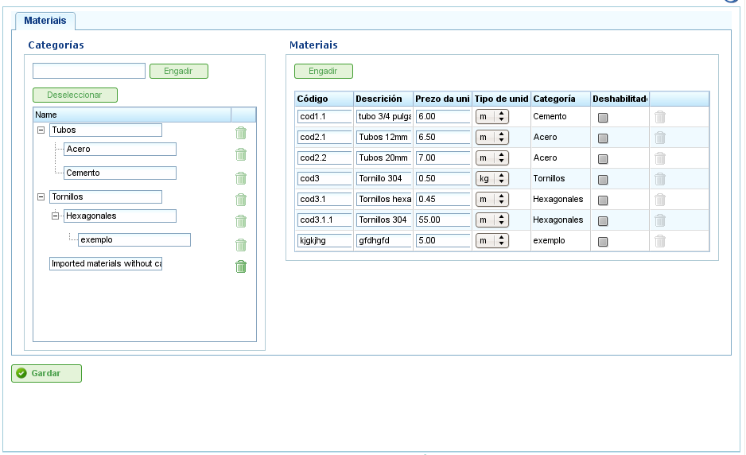

Materialforvaltning
###################

.. _materiales:
.. contents::

Administrasjon av materialer
============================

Brukere kan administrere en grunnleggende database med materialer, organisert etter kategorier.

Kategorier er beholdere som spesifikke materialer og andre kategorier kan tilordnes. De lagres i en hierarkisk trestruktur, ettersom materialer kan tilhøre bladkategorier eller mellomliggende kategorier.

For å administrere kategorier må brukerne følge disse trinnene:

*   Gå til alternativet "Administrasjon -> Materialer".
*   Programmet viser et tre av kategorier.
*   Skriv inn et kategorinavn i tekstboksen og klikk deretter "Legg til".
*   Programmet legger til kategorien i treet.

For å sette inn en kategori i kategorietreet, må brukerne først velge den overordnede kategorien i treet og deretter klikke "Legg til".

   Skjerm for materialadministrasjon

For å administrere materialer må brukerne følge disse trinnene:

*   Velg kategorien som materialer skal legges til og klikk "Legg til" til høyre for "Materialer".
*   Programmet legger til en ny tom rad med felt for å angi detaljer om materialet:

    *   **Kode:** Materialtypekode (dette kan være den eksterne koden fra et ERP-system).
    *   **Beskrivelse:** Beskrivelse av materialet.
    *   **Enhetspris:** Enhetspris for hvert stykke materiale.
    *   **Enhet:** Enhet som brukes til å måle hver enhet av materialet.
    *   **Kategori:** Kategorien materialet tilhører.
    *   **Tilgjengelighet:** Angir om materialet er aktivt eller ikke.

*   Brukere fyller ut feltene og klikker "Lagre".

Tilordning av materialer til prosjektelementer er forklart i kapittelet om "Prosjekter".
