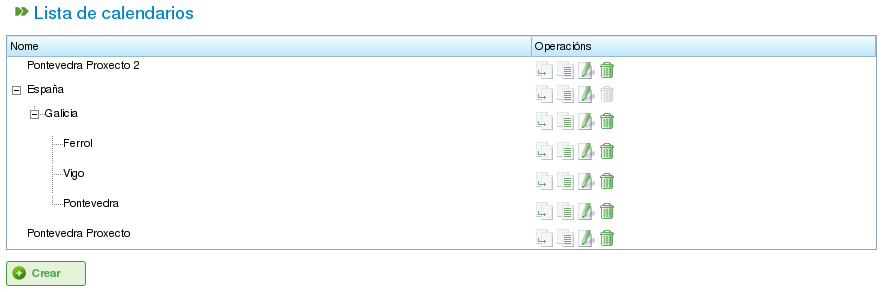

Kalenders
#########

.. contents::

Kalenders zijn entiteiten binnen het programma die de werkcapaciteit van resources definiëren. Een kalender bestaat uit een reeks dagen gedurende het jaar, waarbij elke dag is opgedeeld in beschikbare werkuren.

Een feestdag heeft bijvoorbeeld 0 beschikbare werkuren. Een typische werkdag heeft daarentegen 8 uur als beschikbare werktijd.

Er zijn twee primaire manieren om het aantal werkuren per dag te definiëren:

*   **Per weekdag:** Met deze methode wordt een standaard aantal werkuren ingesteld voor elke dag van de week. Maandagen hebben bijvoorbeeld doorgaans 8 werkuren.
*   **Als uitzondering:** Met deze methode kunnen specifieke afwijkingen van het standaard weekdagschema worden ingesteld. Maandag 30 januari kan bijvoorbeeld 10 werkuren hebben, wat het standaard maandagschema overschrijft.

Kalenderbeheer
==============

Het kalendersysteem is hiërarchisch, waardoor u basiskalenders kunt aanmaken en vervolgens nieuwe kalenders ervan kunt afleiden, wat een boomstructuur vormt. Een kalender die is afgeleid van een hogere kalender erft de dagelijkse schema's en uitzonderingen, tenzij expliciet gewijzigd. Om kalenders effectief te beheren, is het belangrijk de volgende concepten te begrijpen:

*   **Dagelijkse onafhankelijkheid:** Elke dag wordt onafhankelijk behandeld en elk jaar heeft zijn eigen set van dagen. Als 8 december 2009 bijvoorbeeld een feestdag is, betekent dit niet automatisch dat 8 december 2010 ook een feestdag is.
*   **Op weekdagen gebaseerde werkdagen:** Standaard werkdagen zijn gebaseerd op weekdagen. Als maandagen doorgaans 8 werkuren hebben, dan hebben alle maandagen in alle weken van alle jaren 8 beschikbare uren, tenzij een uitzondering is gedefinieerd.
*   **Uitzonderingen en uitzonderingsperioden:** U kunt uitzonderingen of uitzonderingsperioden definiëren om af te wijken van het standaard weekdagschema. U kunt bijvoorbeeld een enkele dag of een reeks dagen specificeren met een ander aantal beschikbare werkuren dan de algemene regel voor die weekdagen.

   Kalenderbeheer

Kalenderbeheer is toegankelijk via het menu "Beheer". Van daaruit kunnen gebruikers de volgende acties uitvoeren:

1.  Een nieuwe kalender helemaal opnieuw aanmaken.
2.  Een kalender aanmaken die is afgeleid van een bestaande.
3.  Een kalender aanmaken als kopie van een bestaande.
4.  Een bestaande kalender bewerken.

Een Nieuwe Kalender Aanmaken
-----------------------------

Om een nieuwe kalender aan te maken, klikt u op de knop "Aanmaken". Het systeem toont een formulier waar u het volgende kunt configureren:

*   **Tabblad selecteren:** Kies het tabblad waarop u wilt werken:

    *   **Uitzonderingen markeren:** Definieer uitzonderingen op het standaardschema.
    *   **Werkuren per dag:** Definieer de standaard werkuren voor elke weekdag.

*   **Uitzonderingen markeren:** Als u de optie "Uitzonderingen markeren" selecteert, kunt u:

    *   Een specifieke dag in de kalender selecteren.
    *   Het type uitzondering selecteren. De beschikbare typen zijn: vakantie, ziekte, staking, feestdag en werkende feestdag.
    *   De einddatum van de uitzonderingsperiode selecteren. (Dit veld hoeft niet te worden gewijzigd voor uitzonderingen van één dag.)
    *   Het aantal werkuren tijdens de dagen van de uitzonderingsperiode definiëren.
    *   Eerder gedefinieerde uitzonderingen verwijderen.

*   **Werkuren per dag:** Als u de optie "Werkuren per dag" selecteert, kunt u:

    *   De beschikbare werkuren definiëren voor elke weekdag (maandag, dinsdag, woensdag, donderdag, vrijdag, zaterdag en zondag).
    *   Verschillende wekelijkse uurverdelingen definiëren voor toekomstige perioden.
    *   Eerder gedefinieerde uurverdelingen verwijderen.

Met deze opties kunnen gebruikers kalenders volledig aanpassen aan hun specifieke behoeften. Klik op de knop "Opslaan" om eventuele wijzigingen in het formulier op te slaan.

.. figure:: images/calendar-edition.png
   :scale: 50

   Kalenders bewerken

.. figure:: images/calendar-exceptions.png
   :scale: 50

   Een uitzondering aan een kalender toevoegen

Afgeleide Kalenders Aanmaken
-----------------------------

Een afgeleide kalender wordt aangemaakt op basis van een bestaande kalender. Deze erft alle kenmerken van de originele kalender, maar u kunt deze wijzigen om andere opties op te nemen.

Een veelgebruikte toepassing voor afgeleide kalenders is wanneer u een algemene kalender heeft voor een land, zoals Spanje, en u een afgeleide kalender wilt aanmaken met aanvullende feestdagen die specifiek zijn voor een regio, zoals Galicië.

Het is belangrijk op te merken dat alle wijzigingen in de originele kalender automatisch worden doorgegeven aan de afgeleide kalender, tenzij er een specifieke uitzondering is gedefinieerd in de afgeleide kalender. De kalender voor Spanje heeft bijvoorbeeld een werkdag van 8 uur op 17 mei. De kalender voor Galicië (een afgeleide kalender) heeft echter mogelijk geen werkuren op diezelfde dag omdat het een regionaal feestdag is. Als de Spaanse kalender later wordt gewijzigd naar 4 beschikbare werkuren per dag voor de week van 17 mei, zal de Galicische kalender ook veranderen naar 4 beschikbare werkuren voor elke dag in die week, behalve voor 17 mei, wat een niet-werkdag blijft vanwege de gedefinieerde uitzondering.

.. figure:: images/calendar-create-derived.png
   :scale: 50

   Een afgeleide kalender aanmaken

Om een afgeleide kalender aan te maken:

*   Ga naar het menu *Beheer*.
*   Klik op de optie *Kalenderbeheer*.
*   Selecteer de kalender die u als basis wilt gebruiken voor de afgeleide kalender en klik op de knop "Aanmaken".
*   Het systeem toont een bewerkingsformulier met dezelfde kenmerken als het formulier dat wordt gebruikt om een kalender helemaal opnieuw aan te maken, behalve dat de voorgestelde uitzonderingen en de werkuren per weekdag zijn gebaseerd op de originele kalender.

Een Kalender Aanmaken Door Kopiëren
-------------------------------------

Een gekopieerde kalender is een exacte kopie van een bestaande kalender. Deze erft alle kenmerken van de originele kalender, maar u kunt deze onafhankelijk wijzigen.

Het belangrijkste verschil tussen een gekopieerde kalender en een afgeleide kalender is hoe ze worden beïnvloed door wijzigingen in het origineel. Als de originele kalender wordt gewijzigd, blijft de gekopieerde kalender onveranderd. Afgeleide kalenders worden echter beïnvloed door wijzigingen in het origineel, tenzij er een uitzondering is gedefinieerd.

Een veelgebruikte toepassing voor gekopieerde kalenders is wanneer u een kalender heeft voor één locatie, zoals "Pontevedra," en u een vergelijkbare kalender nodig heeft voor een andere locatie, zoals "A Coruña," waar de meeste kenmerken hetzelfde zijn. Wijzigingen in de ene kalender mogen echter geen invloed hebben op de andere.

Om een gekopieerde kalender aan te maken:

*   Ga naar het menu *Beheer*.
*   Klik op de optie *Kalenderbeheer*.
*   Selecteer de kalender die u wilt kopiëren en klik op de knop "Aanmaken".
*   Het systeem toont een bewerkingsformulier met dezelfde kenmerken als het formulier dat wordt gebruikt om een kalender helemaal opnieuw aan te maken, behalve dat de voorgestelde uitzonderingen en de werkuren per weekdag zijn gebaseerd op de originele kalender.

Standaardkalender
-----------------

Een van de bestaande kalenders kan worden aangewezen als standaardkalender. Deze kalender wordt automatisch toegewezen aan elke entiteit in het systeem die met kalenders wordt beheerd, tenzij een andere kalender is opgegeven.

Om een standaardkalender in te stellen:

*   Ga naar het menu *Beheer*.
*   Klik op de optie *Configuratie*.
*   Selecteer in het veld *Standaardkalender* de kalender die u als standaardkalender van het programma wilt gebruiken.
*   Klik op *Opslaan*.

.. figure:: images/default-calendar.png
   :scale: 50

   Een standaardkalender instellen

Een Kalender Toewijzen aan Resources
-------------------------------------

Resources kunnen alleen worden geactiveerd (dat wil zeggen beschikbare werkuren hebben) als ze een toegewezen kalender hebben met een geldige activatieperiode. Als er geen kalender aan een resource is toegewezen, wordt de standaardkalender automatisch toegewezen, met een activatieperiode die begint op de startdatum en geen vervaldatum heeft.

.. figure:: images/resource-calendar.png
   :scale: 50

   Resourcekalender

U kunt echter de kalender die eerder aan een resource is toegewezen verwijderen en een nieuwe kalender aanmaken op basis van een bestaande. Dit maakt volledige aanpassing van kalenders voor individuele resources mogelijk.

Om een kalender aan een resource toe te wijzen:

*   Ga naar de optie *Resources bewerken*.
*   Selecteer een resource en klik op *Bewerken*.
*   Selecteer het tabblad "Kalender".
*   De kalender, samen met zijn uitzonderingen, werkuren per dag en activatieperioden, wordt weergegeven.
*   Elk tabblad heeft de volgende opties:

    *   **Uitzonderingen:** Definieer uitzonderingen en de periode waarop ze van toepassing zijn, zoals vakantiedagen, feestdagen of andere werkdagen.
    *   **Werkweek:** Wijzig de werkuren voor elke weekdag (maandag, dinsdag, enz.).
    *   **Activatieperioden:** Maak nieuwe activatieperioden aan om de start- en einddatums van contracten voor de resource weer te geven. Zie de volgende afbeelding.

*   Klik op *Opslaan* om de informatie op te slaan.
*   Klik op *Verwijderen* als u de aan een resource toegewezen kalender wilt wijzigen.

.. figure:: images/new-resource-calendar.png
   :scale: 50

   Een nieuwe kalender aan een resource toewijzen

Kalenders Toewijzen aan Projecten
-----------------------------------

Projecten kunnen een andere kalender hebben dan de standaardkalender. Om de kalender voor een project te wijzigen:

*   Open de projectlijst in het bedrijfsoverzicht.
*   Bewerk het desbetreffende project.
*   Open het tabblad "Algemene informatie".
*   Selecteer de toe te wijzen kalender uit het vervolgkeuzemenu.
*   Klik op "Opslaan" of "Opslaan en doorgaan."

Kalenders Toewijzen aan Taken
--------------------------------

Vergelijkbaar met resources en projecten kunt u specifieke kalenders toewijzen aan individuele taken. Hiermee kunt u verschillende kalenders definiëren voor specifieke fasen van een project. Om een kalender aan een taak toe te wijzen:

*   Open de planningsweergave van een project.
*   Klik met de rechtermuisknop op de taak waaraan u een kalender wilt toewijzen.
*   Selecteer de optie "Kalender toewijzen".
*   Selecteer de aan de taak toe te wijzen kalender.
*   Klik op *Accepteren*.
