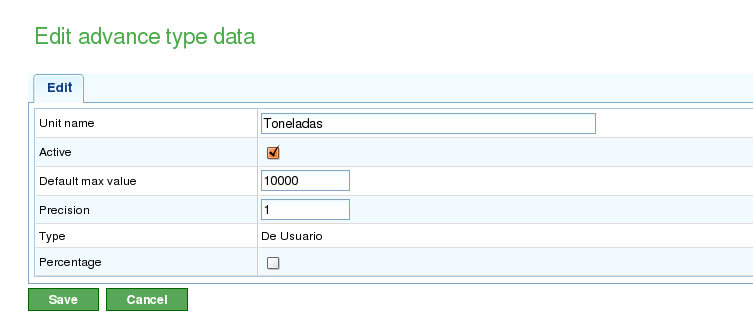

Voortgang
#########

.. contents::

Projectvoortgang geeft aan in welke mate de geschatte voltooitijd van het project wordt gehaald. Taakvoortgang geeft aan in welke mate de taak wordt voltooid volgens de geschatte voltooiing.

Over het algemeen kan voortgang niet automatisch worden gemeten. Een ervaren medewerker of een checklist moet de mate van voltooiing voor een taak of project bepalen.

Het is belangrijk het onderscheid te maken tussen de uren die aan een taak of project zijn toegewezen en de voortgang van die taak of dat project. Hoewel het aantal gebruikte uren meer of minder kan zijn dan verwacht, kan het project voor of achter lopen op de geschatte voltooiing op de bewaakde dag. Verschillende situaties kunnen uit deze twee metingen voortvloeien:

*   **Minder uren verbruikt dan verwacht, maar het project loopt achter op schema:** De voortgang is lager dan geschat voor de bewaakde dag.
*   **Minder uren verbruikt dan verwacht, en het project loopt voor op schema:** De voortgang is hoger dan geschat voor de bewaakde dag.
*   **Meer uren verbruikt dan verwacht, en het project loopt achter op schema:** De voortgang is lager dan geschat voor de bewaakde dag.
*   **Meer uren verbruikt dan verwacht, maar het project loopt voor op schema:** De voortgang is hoger dan geschat voor de bewaakde dag.

De planningsweergave stelt u in staat deze situaties te vergelijken door gebruik te maken van informatie over de geboekte voortgang en de gebruikte uren. In dit hoofdstuk wordt uitgelegd hoe u informatie kunt invoeren om voortgang te bewaken.

De filosofie achter voortgangsbewaking is gebaseerd op het feit dat gebruikers het niveau definiëren waarop ze hun projecten willen bewaken. Als gebruikers bijvoorbeeld projecten willen bewaken, hoeven ze alleen informatie in te voeren voor elementen op niveau 1. Als ze nauwkeurigere bewaking op taakniveau willen, moeten ze voortgangsinformatie invoeren op lagere niveaus. Het systeem aggregeert de gegevens vervolgens omhoog door de hiërarchie.

Voortgangstypen Beheren
========================

Bedrijven hebben uiteenlopende behoeften bij het bewaken van projectvoortgang, met name de betrokken taken. Daarom bevat het systeem "voortgangstypen." Gebruikers kunnen verschillende voortgangstypen definiëren om de voortgang van een taak te meten. Een taak kan bijvoorbeeld worden gemeten als percentage, maar dit percentage kan ook worden vertaald naar voortgang in *tonnen* op basis van de overeenkomst met de klant.

Een voortgangstype heeft een naam, een maximumwaarde en een precisiewaarde:

*   **Naam:** Een beschrijvende naam die gebruikers herkennen wanneer ze het voortgangstype selecteren. Deze naam moet duidelijk aangeven welk soort voortgang wordt gemeten.
*   **Maximumwaarde:** De maximumwaarde die kan worden vastgesteld voor een taak of project als de totale voortgangsmeting. Als u bijvoorbeeld werkt met *tonnen* en het normale maximum 4000 ton is, en geen taak ooit meer dan 4000 ton van een materiaal vereist, dan is 4000 de maximumwaarde.
*   **Precisiewaarde:** De toegestane incrementele waarde voor het voortgangstype. Als de voortgang in *tonnen* in hele getallen moet worden gemeten, is de precisiewaarde 1. Vanaf dat moment kunnen alleen hele getallen worden ingevoerd als voortgangsmetingen (bijv. 1, 2, 300).

Het systeem heeft twee standaard voortgangstypen:

*   **Percentage:** Een algemeen voortgangstype dat de voortgang van een project of taak meet op basis van een geschat voltooiingspercentage. Een taak is bijvoorbeeld 30% voltooid van de 100% die voor een specifieke dag is geschat.
*   **Eenheden:** Een algemeen voortgangstype dat voortgang in eenheden meet zonder het type eenheid te specificeren. Een taak omvat bijvoorbeeld het aanmaken van 3000 eenheden, en de voortgang is 500 eenheden van het totaal van 3000.

   Beheer van voortgangstypen

Gebruikers kunnen als volgt nieuwe voortgangstypen aanmaken:

*   Ga naar het gedeelte "Beheer".
*   Klik op de optie "Voortgangstypen beheren" in het menu op het tweede niveau.
*   Het systeem toont een lijst van bestaande voortgangstypen.
*   Voor elk voortgangstype kunnen gebruikers:

    *   Bewerken
    *   Verwijderen

*   Gebruikers kunnen vervolgens een nieuw voortgangstype aanmaken.
*   Bij het bewerken of aanmaken van een voortgangstype toont het systeem een formulier met de volgende informatie:

    *   Naam van het voortgangstype.
    *   Maximaal toegestane waarde voor het voortgangstype.
    *   Precisiewaarde voor het voortgangstype.

Voortgang Invoeren op Basis van Type
======================================

Voortgang wordt ingevoerd voor projectelementen, maar kan ook worden ingevoerd via een snelkoppeling vanuit de planningstaken. Gebruikers zijn verantwoordelijk voor het beslissen welk voortgangstype ze koppelen aan elk projectelement.

Gebruikers kunnen een enkel, standaard voortgangstype invoeren voor het gehele project.

Voordat voortgang wordt gemeten, moeten gebruikers het gekozen voortgangstype koppelen aan het project. Ze kunnen bijvoorbeeld kiezen voor percentage voortgang om voortgang op de gehele taak te meten of een overeengekomen voortgangspercentage als voortgangsmetingen die zijn overeengekomen met de klant in de toekomst worden ingevoerd.

.. figure:: images/avance.png
   :scale: 40

   Voortgangsinvoerscherm met grafische visualisatie

Om voortgangsmetingen in te voeren:

*   Selecteer het voortgangstype waaraan de voortgang wordt toegevoegd.
    *   Als er geen voortgangstype bestaat, moet er een nieuw worden aangemaakt.
*   Voer in het formulier dat verschijnt onder de velden "Waarde" en "Datum" de absolute waarde van de meting en de datum van de meting in.
*   Het systeem slaat de ingevoerde gegevens automatisch op.

Voortgang Vergelijken voor een Projectelement
===============================================

Gebruikers kunnen grafisch de geboekte voortgang op projecten vergelijken met de genomen metingen. Alle voortgangstypen hebben een kolom met een selectieknop ("Tonen"). Wanneer deze knop is geselecteerd, wordt de voortgangsgrafiek van de genomen metingen weergegeven voor het projectelement.

.. figure:: images/contraste-avance.png
   :scale: 40

   Vergelijking van meerdere voortgangstypen
