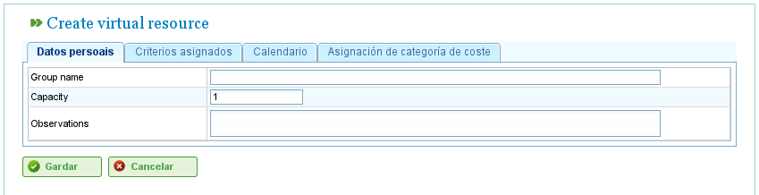

Resourcebeheer
##############

.. _recursos:
.. contents::

Het programma beheert twee onderscheiden soorten resources: personeel en machines.

Personeelsresources
--------------------

Personeelsresources vertegenwoordigen de medewerkers van het bedrijf. Hun belangrijkste kenmerken zijn:

*   Ze voldoen aan één of meer generieke of medewerkersspecifieke criteria.
*   Ze kunnen specifiek worden toegewezen aan een taak.
*   Ze kunnen generiek worden toegewezen aan een taak waarvoor een resourcecriterium vereist is.
*   Ze kunnen een standaard- of een specifieke kalender hebben, naar behoefte.

Machineresources
-----------------

Machineresources vertegenwoordigen de machinerie van het bedrijf. Hun belangrijkste kenmerken zijn:

*   Ze voldoen aan één of meer generieke of machinespecifieke criteria.
*   Ze kunnen specifiek worden toegewezen aan een taak.
*   Ze kunnen generiek worden toegewezen aan een taak waarvoor een machinecriterium vereist is.
*   Ze kunnen een standaard- of een specifieke kalender hebben, naar behoefte.
*   Het programma bevat een configuratiescherm waar een *alfa*-waarde kan worden gedefinieerd om de machine/medewerkersverhouding te vertegenwoordigen.

    *   De *alfa*-waarde geeft de hoeveelheid medewerkerstijd aan die nodig is om de machine te bedienen. Een alfawaarde van 0,5 betekent bijvoorbeeld dat elke 8 uur machinewerking 4 uur medewerkerijd vereist.
    *   Gebruikers kunnen een *alfa*-waarde specifiek toewijzen aan een medewerker, waarmee die medewerker wordt aangewezen om de machine dat percentage van de tijd te bedienen.
    *   Gebruikers kunnen ook een generieke toewijzing maken op basis van een criterium, zodat een percentage van gebruik wordt toegewezen aan alle resources die aan dat criterium voldoen en beschikbare tijd hebben. Generieke toewijzing werkt op dezelfde manier als generieke toewijzing voor taken, zoals eerder beschreven.

Resources Beheren
-----------------

Gebruikers kunnen medewerkers en machines binnen het bedrijf aanmaken, bewerken en deactiveren (maar niet permanent verwijderen) door naar het gedeelte "Resources" te navigeren. Dit gedeelte biedt de volgende functies:

*   **Lijst van medewerkers:** Toont een genummerde lijst van medewerkers, waarmee gebruikers hun gegevens kunnen beheren.
*   **Lijst van machines:** Toont een genummerde lijst van machines, waarmee gebruikers hun gegevens kunnen beheren.

Medewerkers Beheren
====================

Medewerkerbeheer is toegankelijk door naar het gedeelte "Resources" te gaan en vervolgens "Lijst van medewerkers" te selecteren. Gebruikers kunnen elke medewerker in de lijst bewerken door op het standaard bewerkingspictogram te klikken.

Bij het bewerken van een medewerker kunnen gebruikers de volgende tabbladen openen:

1.  **Medewerkersgegevens:** Met dit tabblad kunnen gebruikers de basisidentificatiegegevens van de medewerker bewerken:

    *   Naam
    *   Achternaam/achternamen
    *   Nationaal identificatiedocument (DNI)
    *   Op wachtrij gebaseerde resource (zie sectie over op wachtrij gebaseerde resources)

    .. figure:: images/worker-personal-data.png
       :scale: 50

       Persoonlijke gegevens van medewerkers bewerken

2.  **Criteria:** Dit tabblad wordt gebruikt om de criteria te configureren waaraan een medewerker voldoet. Gebruikers kunnen alle medewerkers- of generieke criteria toewijzen die ze gepast achten. Het is cruciaal dat medewerkers criteria vervullen om de functionaliteit van het programma te maximaliseren. Om criteria toe te wijzen:

    i.  Klik op de knop "Criteria toevoegen".
    ii. Zoek naar het toe te voegen criterium en selecteer het meest geschikte.
    iii. Klik op de knop "Toevoegen".
    iv. Selecteer de startdatum waarop het criterium van toepassing wordt.
    v.  Selecteer de einddatum voor het toepassen van het criterium op de resource. Deze datum is optioneel als het criterium als onbeperkt wordt beschouwd.

    .. figure:: images/worker-criterions.png
       :scale: 50

       Criteria koppelen aan medewerkers

3.  **Kalender:** Met dit tabblad kunnen gebruikers een specifieke kalender voor de medewerker configureren. Alle medewerkers hebben een standaardkalender toegewezen; het is echter mogelijk om een specifieke kalender toe te wijzen aan elke medewerker op basis van een bestaande kalender.

    .. figure:: images/worker-calendar.png
       :scale: 50

       Kalendertabblad voor een resource

4.  **Kostencategorie:** Met dit tabblad kunnen gebruikers de kostencategorie configureren die een medewerker vervult gedurende een bepaalde periode. Deze informatie wordt gebruikt om de kosten te berekenen die verband houden met een medewerker op een project.

    .. figure:: images/worker-costcategory.png
       :scale: 50

       Kostencategorietabblad voor een resource

Resourcetoewijzing wordt uitgelegd in het gedeelte "Resourcetoewijzing".

Machines Beheren
================

Machines worden voor alle doeleinden als resources behandeld. Daarom kunnen machines, net als medewerkers, worden beheerd en aan taken worden toegewezen. Resourcetoewijzing wordt behandeld in het gedeelte "Resourcetoewijzing", dat de specifieke kenmerken van machines uitlegt.

Machines worden beheerd vanuit de menuvermelding "Resources". Dit gedeelte heeft een bewerking genaamd "Machinelijst", die de machines van het bedrijf weergeeft. Gebruikers kunnen een machine uit deze lijst bewerken of verwijderen.

Bij het bewerken van machines toont het systeem een reeks tabbladen voor het beheren van verschillende details:

1.  **Machinegegevens:** Met dit tabblad kunnen gebruikers de identificatiegegevens van de machine bewerken:

    i.  Naam
    ii. Machinecode
    iii. Beschrijving van de machine

    .. figure:: images/machine-data.png
       :scale: 50

       Machinegegevens bewerken

2.  **Criteria:** Net als bij personeelsresources wordt dit tabblad gebruikt om criteria toe te voegen waaraan de machine voldoet. Twee soorten criteria kunnen worden toegewezen aan machines: machinespecifiek of generiek. Medewerkercriteria kunnen niet worden toegewezen aan machines. Om criteria toe te wijzen:

    i.  Klik op de knop "Criteria toevoegen".
    ii. Zoek naar het toe te voegen criterium en selecteer het meest geschikte.
    iii. Selecteer de startdatum waarop het criterium van toepassing wordt.
    iv. Selecteer de einddatum voor het toepassen van het criterium op de resource. Deze datum is optioneel als het criterium als onbeperkt wordt beschouwd.
    v.  Klik op de knop "Opslaan en doorgaan".

    .. figure:: images/machine-criterions.png
       :scale: 50

       Criteria toewijzen aan machines

3.  **Kalender:** Met dit tabblad kunnen gebruikers een specifieke kalender voor de machine configureren. Alle machines hebben een standaardkalender toegewezen; het is echter mogelijk om een specifieke kalender toe te wijzen aan elke machine op basis van een bestaande kalender.

    .. figure:: images/machine-calendar.png
       :scale: 50

       Kalenders toewijzen aan machines

4.  **Machineconfiguratie:** Met dit tabblad kunnen gebruikers de verhouding van machines tot personeelsresources configureren. Een machine heeft een alfawaarde die de machine/medewerkersverhouding aangeeft. Zoals eerder vermeld, geeft een alfawaarde van 0,5 aan dat 0,5 personen vereist zijn voor elke volledige dag machinewerking. Op basis van de alfawaarde wijst het systeem automatisch medewerkers toe die gekoppeld zijn aan de machine zodra de machine aan een taak is toegewezen. Het koppelen van een medewerker aan een machine kan op twee manieren worden gedaan:

    i.  **Specifieke toewijzing:** Wijs een datumbereik toe waarin de medewerker aan de machine is toegewezen. Dit is een specifieke toewijzing, omdat het systeem automatisch uren toewijst aan de medewerker wanneer de machine is gepland.
    ii. **Generieke toewijzing:** Wijs criteria toe waaraan medewerkers die aan de machine zijn toegewezen, moeten voldoen. Dit creëert een generieke toewijzing van medewerkers die aan de criteria voldoen.

    .. figure:: images/machine-configuration.png
       :scale: 50

       Configuratie van machines

5.  **Kostencategorie:** Met dit tabblad kunnen gebruikers de kostencategorie configureren die een machine vervult gedurende een bepaalde periode. Deze informatie wordt gebruikt om de kosten te berekenen die verband houden met een machine op een project.

    .. figure:: images/machine-costcategory.png
       :scale: 50

       Kostencategorieën toewijzen aan machines

Virtuele Medewerkersgroepen
============================

Het programma stelt gebruikers in staat virtuele medewerkersgroepen aan te maken, die geen echte medewerkers zijn maar gesimuleerd personeel. Deze groepen stellen gebruikers in staat om hogere productiecapaciteit op specifieke tijden te modelleren, op basis van de kalenderinstellingen.

Virtuele medewerkersgroepen stellen gebruikers in staat te beoordelen hoe projectplanning zou worden beïnvloed door het aannemen en toewijzen van personeel dat aan specifieke criteria voldoet, en helpen zo bij het besluitvormingsproces.

De tabbladen voor het aanmaken van virtuele medewerkersgroepen zijn hetzelfde als die voor het configureren van medewerkers:

*   Algemene gegevens
*   Toegewezen criteria
*   Kalenders
*   Gekoppelde uren

Het verschil tussen virtuele medewerkersgroepen en werkelijke medewerkers is dat virtuele medewerkersgroepen een naam hebben voor de groep en een hoeveelheid, die het aantal echte mensen in de groep vertegenwoordigt. Er is ook een veld voor opmerkingen, waar aanvullende informatie kan worden verstrekt, zoals welk project het inhuren van het equivalent van de virtuele medewerkersgroep zou vereisen.

   Virtuele resources

Op Wachtrij Gebaseerde Resources
==================================

Op wachtrij gebaseerde resources zijn een specifiek type productieve elementen die ofwel niet toegewezen zijn of 100% toewijding hebben. Met andere woorden, ze kunnen niet meer dan één taak tegelijkertijd ingepland hebben en kunnen ook niet worden overbelast.

Voor elke op wachtrij gebaseerde resource wordt automatisch een wachtrij aangemaakt. De taken die voor deze resources zijn ingepland, kunnen specifiek worden beheerd met de geboden toewijzingsmethoden, automatische toewijzingen aanmaken tussen taken en wachtrijen die aan de vereiste criteria voldoen, of taken tussen wachtrijen verplaatsen.
