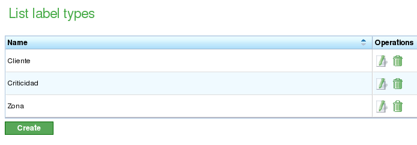
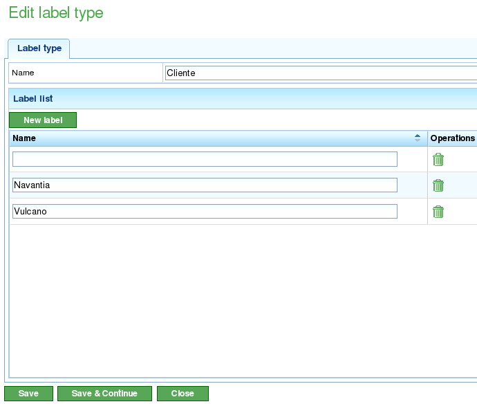

Labels
######

.. contents::

Labels zijn entiteiten die in het programma worden gebruikt om taken of projectelementen conceptueel te organiseren.

Labels worden gecategoriseerd op basis van labeltype. Een label kan slechts tot één labeltype behoren; gebruikers kunnen echter veel gelijksoortige labels aanmaken die tot verschillende labeltypen behoren.

Labeltypen
==========

Labeltypen worden gebruikt om de soorten labels te groeperen die gebruikers in het programma willen beheren. Hier zijn enkele voorbeelden van mogelijke labeltypen:

*   **Klant:** Gebruikers zijn wellicht geïnteresseerd in het labelen van taken, projecten of projectelementen in relatie tot de klant die ze aanvraagt.
*   **Afdeling:** Gebruikers zijn wellicht geïnteresseerd in het labelen van taken, projecten of projectelementen in relatie tot de afdelingen waaraan ze worden uitgevoerd.

Het beheer van labeltypen wordt beheerd vanuit de menu-optie "Beheer." Hier kunnen gebruikers labeltypen bewerken, nieuwe labeltypen aanmaken en labels aan labeltypen toevoegen. Gebruikers hebben vanuit deze optie toegang tot de lijst van labels.

   Lijst van labeltypen

Vanuit de lijst van labeltypen kunnen gebruikers:

*   Een nieuw labeltype aanmaken.
*   Een bestaand labeltype bewerken.
*   Een labeltype met al zijn labels verwijderen.

Het bewerken en aanmaken van labels gebruikt hetzelfde formulier. Vanuit dit formulier kan de gebruiker een naam toewijzen aan het labeltype, labels aanmaken of verwijderen en de wijzigingen opslaan. De procedure is als volgt:

*   Selecteer een label om te bewerken of klik op de maakknop voor een nieuw label.
*   Het systeem toont een formulier met een tekstinvoer voor de naam en een lijst van tekstinvoervelden met bestaande en toegewezen labels.
*   Als gebruikers een nieuw label willen toevoegen, moeten ze op de knop "Nieuw label" klikken.
*   Het systeem toont een nieuwe rij in de lijst met een leeg tekstvak dat gebruikers moeten bewerken.
*   Gebruikers voeren een naam in voor het label.
*   Het systeem voegt de naam toe aan de lijst.
*   Gebruikers klikken op "Opslaan" of "Opslaan en doorgaan" om door te gaan met het bewerken van het formulier.

   Labeltypen bewerken

Labels
======

Labels zijn entiteiten die behoren tot een labeltype. Deze entiteiten kunnen worden toegewezen aan projectelementen. Het toewijzen van een label aan een projectelement betekent dat alle elementen die van dit element afstammen het label zullen erven waaraan ze behoren. Het hebben van een toegewezen label betekent dat deze entiteiten kunnen worden gefilterd waar zoekopdrachten kunnen worden uitgevoerd:

*   Zoeken naar taken in het Gantt-diagram.
*   Zoeken naar projectelementen in de lijst van projectelementen.
*   Filters voor rapporten.

De toewijzing van labels aan projectelementen wordt behandeld in het hoofdstuk over projecten.
