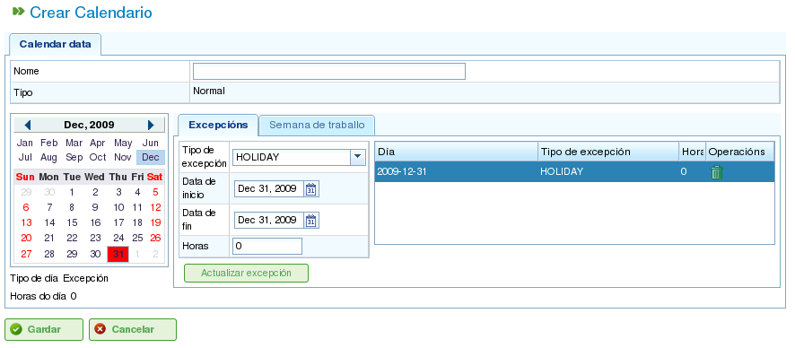

Kalendarze
##########

.. contents::

Kalendarze to jednostki w programie, które definiują zdolność roboczą zasobów. Kalendarz składa się z serii dni w roku, przy czym każdy dzień jest podzielony na dostępne godziny pracy.

Na przykład dzień wolny może mieć 0 dostępnych godzin pracy. I odwrotnie, typowy dzień roboczy może mieć wyznaczone 8 godzin jako dostępny czas pracy.

Istnieją dwa podstawowe sposoby definiowania liczby godzin pracy w ciągu dnia:

*   **Według dnia tygodnia:** Ta metoda ustawia standardową liczbę godzin pracy dla każdego dnia tygodnia. Na przykład poniedziałki zazwyczaj mają 8 godzin pracy.
*   **Jako wyjątek:** Ta metoda pozwala na konkretne odchylenia od standardowego harmonogramu dni tygodnia. Na przykład poniedziałek 30 stycznia może mieć 10 godzin pracy, zastępując standardowy harmonogram poniedziałku.

Administracja Kalendarzami
===========================

System kalendarzy jest hierarchiczny, umożliwiając tworzenie kalendarzy bazowych, a następnie wyprowadzanie nowych kalendarzy z nich, tworząc strukturę drzewa. Kalendarz wyprowadzony z kalendarza wyższego poziomu dziedziczy jego harmonogramy dzienne i wyjątki, chyba że zostaną jawnie zmodyfikowane. Aby skutecznie zarządzać kalendarzami, ważne jest zrozumienie następujących koncepcji:

*   **Niezależność dni:** Każdy dzień jest traktowany niezależnie, a każdy rok ma własny zestaw dni. Na przykład jeśli 8 grudnia 2009 roku jest dniem wolnym, nie oznacza to automatycznie, że 8 grudnia 2010 roku jest również dniem wolnym.
*   **Dni robocze oparte na dniach tygodnia:** Standardowe dni robocze są oparte na dniach tygodnia. Na przykład jeśli poniedziałki zazwyczaj mają 8 godzin pracy, to wszystkie poniedziałki we wszystkich tygodniach wszystkich lat będą miały 8 dostępnych godzin, chyba że zostanie zdefiniowany wyjątek.
*   **Wyjątki i okresy wyjątków:** Możesz definiować wyjątki lub okresy wyjątków, aby odejść od standardowego harmonogramu dni tygodnia. Na przykład możesz określić jeden dzień lub zakres dni z inną liczbą dostępnych godzin pracy niż ogólna reguła dla tych dni tygodnia.

.. figure:: images/calendar-administration.png
   :scale: 50

   Administracja kalendarzami

Administracja kalendarzami jest dostępna za pośrednictwem menu "Administracja". Stamtąd użytkownicy mogą wykonywać następujące działania:

1.  Tworzenie nowego kalendarza od podstaw.
2.  Tworzenie kalendarza wyprowadzonego z istniejącego.
3.  Tworzenie kalendarza jako kopii istniejącego.
4.  Edytowanie istniejącego kalendarza.

Tworzenie Nowego Kalendarza
-----------------------------

Aby utworzyć nowy kalendarz, kliknij przycisk "Utwórz". System wyświetli formularz, w którym możesz skonfigurować następujące elementy:

*   **Wybierz zakładkę:** Wybierz zakładkę, na której chcesz pracować:

    *   **Oznaczanie wyjątków:** Zdefiniuj wyjątki od standardowego harmonogramu.
    *   **Godziny pracy na dzień:** Zdefiniuj standardowe godziny pracy dla każdego dnia tygodnia.

*   **Oznaczanie wyjątków:** Jeśli wybierzesz opcję "Oznaczanie wyjątków", możesz:

    *   Wybrać konkretny dzień w kalendarzu.
    *   Wybrać typ wyjątku. Dostępne typy to: urlop, choroba, strajk, dzień wolny i pracujące święto.
    *   Wybrać datę zakończenia okresu wyjątku. (To pole nie musi być zmieniane dla wyjątków jednodniowych.)
    *   Zdefiniować liczbę godzin pracy w ciągu dni okresu wyjątku.
    *   Usuwać wcześniej zdefiniowane wyjątki.

*   **Godziny pracy na dzień:** Jeśli wybierzesz opcję "Godziny pracy na dzień", możesz:

    *   Zdefiniować dostępne godziny pracy dla każdego dnia tygodnia (poniedziałek, wtorek, środa, czwartek, piątek, sobota i niedziela).
    *   Zdefiniować różne tygodniowe rozkłady godzin dla przyszłych okresów.
    *   Usuwać wcześniej zdefiniowane rozkłady godzin.

Te opcje umożliwiają użytkownikom pełne dostosowanie kalendarzy do ich konkretnych potrzeb. Kliknij przycisk "Zapisz", aby zachować wszelkie zmiany wprowadzone w formularzu.

.. figure:: images/calendar-edition.png
   :scale: 50

   Edytowanie kalendarzy

   Dodawanie wyjątku do kalendarza

Tworzenie Kalendarzy Pochodnych
---------------------------------

Kalendarz pochodny jest tworzony na podstawie istniejącego kalendarza. Dziedziczy wszystkie cechy oryginalnego kalendarza, ale możesz go modyfikować, aby uwzględnić różne opcje.

Typowym przypadkiem użycia kalendarzy pochodnych jest sytuacja, gdy masz ogólny kalendarz dla kraju, takiego jak Hiszpania, i musisz utworzyć kalendarz pochodny zawierający dodatkowe dni wolne specyficzne dla regionu, takiego jak Galicja.

Ważne jest, aby pamiętać, że wszelkie zmiany wprowadzone w oryginalnym kalendarzu automatycznie zostaną przeniesione do kalendarza pochodnego, chyba że w kalendarzu pochodnym zdefiniowano konkretny wyjątek. Na przykład kalendarz Hiszpanii może mieć 8-godzinny dzień pracy 17 maja. Jednak kalendarz Galicji (kalendarz pochodny) może nie mieć godzin pracy tego samego dnia, ponieważ jest to regionalne święto. Jeśli kalendarz hiszpański zostanie później zmieniony na 4 dostępne godziny pracy dziennie przez tydzień 17 maja, kalendarz galicyjski również zmieni się na 4 dostępne godziny pracy na każdy dzień w tym tygodniu, z wyjątkiem 17 maja, który pozostanie dniem wolnym od pracy ze względu na zdefiniowany wyjątek.

.. figure:: images/calendar-create-derived.png
   :scale: 50

   Tworzenie kalendarza pochodnego

Aby utworzyć kalendarz pochodny:

*   Przejdź do menu *Administracja*.
*   Kliknij opcję *Administracja kalendarzami*.
*   Wybierz kalendarz, którego chcesz użyć jako podstawy dla kalendarza pochodnego, i kliknij przycisk "Utwórz".
*   System wyświetli formularz edycji z tymi samymi cechami co formularz używany do tworzenia kalendarza od podstaw, z tą różnicą, że proponowane wyjątki i godziny pracy na dzień tygodnia będą oparte na oryginalnym kalendarzu.

Tworzenie Kalendarza Przez Kopiowanie
---------------------------------------

Skopiowany kalendarz jest dokładnym duplikatem istniejącego kalendarza. Dziedziczy wszystkie cechy oryginalnego kalendarza, ale możesz go niezależnie modyfikować.

Kluczową różnicą między skopiowanym kalendarzem a kalendarzem pochodnym jest to, jak są one dotknięte zmianami w oryginale. Jeśli oryginalny kalendarz zostanie zmodyfikowany, skopiowany kalendarz pozostaje niezmieniony. Jednak kalendarze pochodne są dotknięte zmianami wprowadzonymi w oryginale, chyba że zostanie zdefiniowany wyjątek.

Typowym przypadkiem użycia skopiowanych kalendarzy jest sytuacja, gdy masz kalendarz dla jednej lokalizacji, takiej jak "Pontevedra," i potrzebujesz podobnego kalendarza dla innej lokalizacji, takiej jak "A Coruña," gdzie większość cech jest taka sama. Jednak zmiany w jednym kalendarzu nie powinny wpływać na drugi.

Aby utworzyć skopiowany kalendarz:

*   Przejdź do menu *Administracja*.
*   Kliknij opcję *Administracja kalendarzami*.
*   Wybierz kalendarz, który chcesz skopiować, i kliknij przycisk "Utwórz".
*   System wyświetli formularz edycji z tymi samymi cechami co formularz używany do tworzenia kalendarza od podstaw, z tą różnicą, że proponowane wyjątki i godziny pracy na dzień tygodnia będą oparte na oryginalnym kalendarzu.

Domyślny Kalendarz
-------------------

Jeden z istniejących kalendarzy może zostać wyznaczony jako domyślny kalendarz. Ten kalendarz zostanie automatycznie przypisany do każdej jednostki w systemie zarządzanej kalendarzami, chyba że zostanie określony inny kalendarz.

Aby skonfigurować domyślny kalendarz:

*   Przejdź do menu *Administracja*.
*   Kliknij opcję *Konfiguracja*.
*   W polu *Domyślny kalendarz* wybierz kalendarz, który chcesz użyć jako domyślny kalendarz programu.
*   Kliknij *Zapisz*.

.. figure:: images/default-calendar.png
   :scale: 50

   Ustawianie domyślnego kalendarza

Przypisywanie Kalendarza do Zasobów
-------------------------------------

Zasoby mogą być aktywowane (tj. mieć dostępne godziny pracy) tylko wtedy, gdy mają przypisany kalendarz z ważnym okresem aktywacji. Jeśli żaden kalendarz nie jest przypisany do zasobu, domyślny kalendarz jest przypisywany automatycznie, z okresem aktywacji rozpoczynającym się w dniu startowym i bez daty wygaśnięcia.

.. figure:: images/resource-calendar.png
   :scale: 50

   Kalendarz zasobu

Możesz jednak usunąć kalendarz, który był wcześniej przypisany do zasobu, i utworzyć nowy kalendarz oparty na istniejącym. Umożliwia to pełne dostosowanie kalendarzy dla poszczególnych zasobów.

Aby przypisać kalendarz do zasobu:

*   Przejdź do opcji *Edytuj zasoby*.
*   Wybierz zasób i kliknij *Edytuj*.
*   Wybierz zakładkę "Kalendarz".
*   Zostanie wyświetlony kalendarz wraz z jego wyjątkami, godzinami pracy na dzień i okresami aktywacji.
*   Każda zakładka będzie miała następujące opcje:

    *   **Wyjątki:** Zdefiniuj wyjątki i okres, do którego się odnoszą, takie jak dni urlopowe, święta lub inne dni robocze.
    *   **Tydzień roboczy:** Modyfikuj godziny pracy dla każdego dnia tygodnia (poniedziałek, wtorek itp.).
    *   **Okresy aktywacji:** Twórz nowe okresy aktywacji odzwierciedlające daty rozpoczęcia i zakończenia umów związanych z zasobem. Patrz poniższy obraz.

*   Kliknij *Zapisz*, aby zachować informacje.
*   Kliknij *Usuń*, jeśli chcesz zmienić kalendarz przypisany do zasobu.

.. figure:: images/new-resource-calendar.png
   :scale: 50

   Przypisywanie nowego kalendarza do zasobu

Przypisywanie Kalendarzy do Projektów
--------------------------------------

Projekty mogą mieć inny kalendarz niż domyślny. Aby zmienić kalendarz dla projektu:

*   Uzyskaj dostęp do listy projektów w przeglądzie firmy.
*   Edytuj dany projekt.
*   Uzyskaj dostęp do zakładki "Informacje ogólne".
*   Wybierz kalendarz do przypisania z menu rozwijanego.
*   Kliknij "Zapisz" lub "Zapisz i kontynuuj."

Przypisywanie Kalendarzy do Zadań
-----------------------------------

Podobnie jak w przypadku zasobów i projektów, możesz przypisywać konkretne kalendarze do poszczególnych zadań. Umożliwia to definiowanie różnych kalendarzy dla konkretnych etapów projektu. Aby przypisać kalendarz do zadania:

*   Uzyskaj dostęp do widoku planowania projektu.
*   Kliknij prawym przyciskiem myszy zadanie, do którego chcesz przypisać kalendarz.
*   Wybierz opcję "Przypisz kalendarz".
*   Wybierz kalendarz do przypisania do zadania.
*   Kliknij *Akceptuj*.
