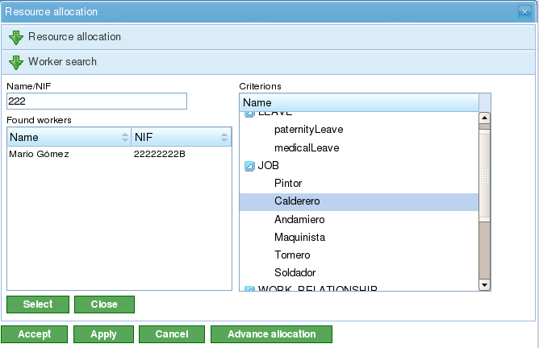

Przydzielanie zasobów
#####################

.. _asigacion_:
.. contents::

Przydzielanie zasobów jest jedną z najważniejszych funkcji programu i może być realizowane na dwa różne sposoby:

*   Przydzielanie specyficzne
*   Przydzielanie ogólne

Oba typy przydziałów zostały opisane w poniższych sekcjach.

Aby wykonać dowolny typ przydzielania zasobów, konieczne są następujące kroki:

*   Przejdź do widoku planowania projektu.
*   Kliknij prawym przyciskiem myszy na zadanie, które ma być zaplanowane.

.. figure:: images/resource-assignment-planning.png
   :scale: 50

   Menu przydzielania zasobów

*   Program wyświetla ekran z następującymi informacjami:

    *   **Lista kryteriów do spełnienia:** Dla każdej grupy godzin wyświetlana jest lista wymaganych kryteriów.
    *   **Informacje o zadaniu:** Daty rozpoczęcia i zakończenia zadania.
    *   **Typ obliczeń:** System umożliwia użytkownikom wybór strategii obliczania przydziałów:

        *   **Oblicz liczbę godzin:** Oblicza liczbę godzin wymaganych od przydzielonych zasobów, przy zadanej dacie końcowej i liczbie zasobów na dzień.
        *   **Oblicz datę końcową:** Oblicza datę zakończenia zadania na podstawie liczby zasobów przydzielonych do zadania oraz łącznej liczby godzin potrzebnych do jego wykonania.
        *   **Oblicz liczbę zasobów:** Oblicza liczbę zasobów potrzebnych do ukończenia zadania w określonym terminie, przy znanej liczbie godzin na zasób.
    *   **Zalecany przydział:** Ta opcja pozwala programowi zebrać kryteria do spełnienia oraz łączną liczbę godzin ze wszystkich grup godzin, a następnie zaproponować przydział ogólny. Jeśli istnieje wcześniejszy przydział, system go usuwa i zastępuje nowym.
    *   **Przydziały:** Lista wykonanych przydziałów. Na liście wyświetlane są przydziały ogólne (liczba to lista spełnionych kryteriów oraz liczba godzin i zasobów na dzień). Każdy przydział może być jawnie usunięty przez kliknięcie przycisku usuwania.

.. figure:: images/resource-assignment.png
   :scale: 50

   Przydzielanie zasobów

*   Użytkownicy wybierają „Szukaj zasobów."
*   Program wyświetla nowy ekran składający się z drzewa kryteriów oraz listy pracowników spełniających wybrane kryteria po prawej stronie:

.. figure:: images/resource-assignment-search.png
   :scale: 50

   Wyszukiwanie przy przydzielaniu zasobów

*   Użytkownicy mogą wybrać:

    *   **Przydział specyficzny:** Szczegóły dotyczące tej opcji znajdują się w sekcji „Przydział specyficzny".
    *   **Przydział ogólny:** Szczegóły dotyczące tej opcji znajdują się w sekcji „Przydział ogólny".

*   Użytkownicy wybierają listę kryteriów (ogólnych) lub listę pracowników (specyficznych). Można dokonać wielu wyborów, przytrzymując klawisz „Ctrl" i klikając każdego pracownika/kryterium.
*   Następnie użytkownicy klikają przycisk „Wybierz". Ważne jest, aby pamiętać, że jeśli nie wybrano przydziału ogólnego, użytkownicy muszą wybrać pracownika lub maszynę do wykonania przydziału. Jeśli wybrano przydział ogólny, wystarczy wybrać jedno lub więcej kryteriów.
*   Program wyświetla następnie wybrane kryteria lub listę zasobów na liście przydziałów na oryginalnym ekranie przydzielania zasobów.
*   Użytkownicy muszą wybrać godziny lub zasoby na dzień, w zależności od metody przydziału używanej w programie.

Przydział specyficzny
=====================

Jest to specyficzne przydzielenie zasobu do zadania projektowego. Innymi słowy, użytkownik decyduje, który konkretny pracownik (po imieniu i nazwisku) lub maszyna musi być przydzielona do zadania.

Przydział specyficzny można wykonać na ekranie pokazanym na tym obrazku:

   Specyficzne przydzielanie zasobów

Gdy zasób jest specyficznie przydzielony, program tworzy dzienne przydziały na podstawie wybranego procentu dziennie przydzielonych zasobów, po porównaniu z dostępnym kalendarzem zasobów. Na przykład przydział 0,5 zasobu dla zadania 32-godzinnego oznacza, że 4 godziny dziennie są przydzielane konkretnemu zasobowi do wykonania zadania (przy założeniu kalendarza pracy wynoszącego 8 godzin dziennie).

Specyficzne przydzielanie maszyn
--------------------------------

Specyficzne przydzielanie maszyn działa w taki sam sposób jak przydzielanie pracowników. Gdy maszyna jest przydzielona do zadania, system przechowuje specyficzny przydział godzin dla wybranej maszyny. Główna różnica polega na tym, że system przeszukuje listę przydzielonych pracowników lub kryteriów w momencie przydzielania maszyny:

*   Jeśli maszyna ma listę przydzielonych pracowników, program wybiera spośród tych, których maszyna wymaga, na podstawie przydzielonego kalendarza. Na przykład jeśli kalendarz maszyny wynosi 16 godzin dziennie, a kalendarz zasobu 8 godzin, z listy dostępnych zasobów przydzielane są dwa zasoby.
*   Jeśli maszyna ma jedno lub więcej przydzielonych kryteriów, dokonywane są ogólne przydziały spośród zasobów spełniających kryteria przydzielone do maszyny.

Przydział ogólny
================

Przydział ogólny ma miejsce, gdy użytkownicy nie wybierają zasobów konkretnie, lecz pozostawiają decyzję programowi, który rozdziela obciążenia pomiędzy dostępne zasoby firmy.

.. figure:: images/asignacion-xenerica.png
   :scale: 50

   Ogólne przydzielanie zasobów

System przydziałów używa następujących założeń jako podstawy:

*   Zadania mają kryteria wymagane od zasobów.
*   Zasoby są skonfigurowane tak, aby spełniać kryteria.

Jednak system nie kończy się niepowodzeniem, gdy kryteria nie zostały przydzielone, ale gdy wszystkie zasoby spełniają brak wymagania kryteriów.

Algorytm przydziału ogólnego działa w następujący sposób:

*   Wszystkie zasoby i dni są traktowane jako kontenery, w których mieszczą się dzienne przydziały godzin, na podstawie maksymalnej pojemności przydziału w kalendarzu zadania.
*   System szuka zasobów spełniających kryterium.
*   System analizuje, które przydziały mają obecnie różne zasoby spełniające kryteria.
*   Zasoby spełniające kryteria są wybierane spośród tych, które mają wystarczającą dostępność.
*   Jeśli wolniejsze zasoby nie są dostępne, przydziały są dokonywane do zasobów z mniejszą dostępnością.
*   Nadmierne przydzielanie zasobów rozpoczyna się dopiero, gdy wszystkie zasoby spełniające odpowiednie kryteria są przydzielone w 100%, aż do osiągnięcia łącznej wymaganej ilości do realizacji zadania.

Ogólne przydzielanie maszyn
---------------------------

Ogólne przydzielanie maszyn działa w taki sam sposób jak przydzielanie pracowników. Na przykład gdy maszyna jest przydzielona do zadania, system przechowuje ogólny przydział godzin dla wszystkich maszyn spełniających kryteria, jak opisano dla zasobów ogólnie. Jednak dodatkowo system wykonuje następującą procedurę dla maszyn:

*   Dla wszystkich maszyn wybranych do przydziału ogólnego:

    *   Zbiera informacje konfiguracyjne maszyny: wartość alfa, przydzielonych pracowników i kryteria.
    *   Jeśli maszyna ma przydzieloną listę pracowników, program wybiera liczbę wymaganą przez maszynę, w zależności od przydzielonego kalendarza. Na przykład jeśli kalendarz maszyny wynosi 16 godzin dziennie, a kalendarz zasobu 8 godzin, program przydziela dwa zasoby z listy dostępnych zasobów.
    *   Jeśli maszyna ma jedno lub więcej przydzielonych kryteriów, program dokonuje ogólnych przydziałów spośród zasobów spełniających kryteria przydzielone do maszyny.

Zaawansowany przydział
======================

Zaawansowane przydziały umożliwiają użytkownikom projektowanie przydziałów, które są automatycznie realizowane przez aplikację w celu ich personalizacji. Procedura ta pozwala użytkownikom ręcznie wybierać dzienne godziny przeznaczane przez zasoby na przydzielone zadania lub definiować funkcję stosowaną do przydziału.

Kroki do zarządzania zaawansowanymi przydziałami to:

*   Przejdź do okna zaawansowanego przydziału. Istnieją dwa sposoby dostępu do zaawansowanych przydziałów:

    *   Przejdź do określonego projektu i zmień widok na zaawansowany przydział. W tym przypadku zostaną wyświetlone wszystkie zadania projektu i przydzielone zasoby (specyficzne i ogólne).
    *   Przejdź do okna przydzielania zasobów, klikając przycisk „Zaawansowany przydział". W tym przypadku zostaną wyświetlone przydziały pokazujące zasoby (ogólne i specyficzne) przydzielone do zadania.

.. figure:: images/advance-assignment.png
   :scale: 45

   Zaawansowane przydzielanie zasobów

*   Użytkownicy mogą wybrać żądany poziom powiększenia:

    *   **Poziomy powiększenia większe niż jeden dzień:** Jeśli użytkownicy zmienią wartość przydzielonych godzin na tydzień, miesiąc, cztery miesiące lub sześć miesięcy, system rozdziela godziny liniowo na wszystkie dni w wybranym okresie.
    *   **Powiększenie dzienne:** Jeśli użytkownicy zmienią wartość przydzielonych godzin na dzień, godziny te mają zastosowanie tylko do tego dnia. W rezultacie użytkownicy mogą decydować, ile godzin chcą przydzielać dziennie zasobom zadania.

*   Użytkownicy mogą zdecydować się na zaprojektowanie zaawansowanej funkcji przydziału. W tym celu użytkownicy muszą:

    *   Wybrać funkcję z listy wyboru pojawiającej się obok każdego zasobu i kliknąć „Konfiguruj."
    *   System wyświetla nowe okno, jeśli wybrana funkcja wymaga szczególnej konfiguracji. Obsługiwane funkcje:

        *   **Segmenty:** Funkcja umożliwiająca użytkownikom definiowanie segmentów, do których stosowana jest funkcja wielomianowa. Funkcja dla segmentu jest konfigurowana w następujący sposób:

            *   **Data:** Data zakończenia segmentu. Jeśli ustalona jest następna wartość (długość), obliczana jest data; w przeciwnym razie obliczana jest długość.
            *   **Definiowanie długości każdego segmentu:** Wskazuje, jaki procent czasu trwania zadania jest wymagany dla segmentu.
            *   **Definiowanie ilości pracy:** Wskazuje, jaki procent obciążenia pracą ma zostać ukończony w tym segmencie. Ilość pracy musi być przyrostowa. Na przykład jeśli istnieje segment 10%, następny musi być większy (na przykład 20%).
            *   **Wykresy segmentów i skumulowane obciążenia.**

    *   Użytkownicy następnie klikają „Akceptuj."
    *   Program przechowuje funkcję i stosuje ją do dziennych przydziałów zasobów.

.. figure:: images/stretches.png
   :scale: 40

   Konfiguracja funkcji segmentów
