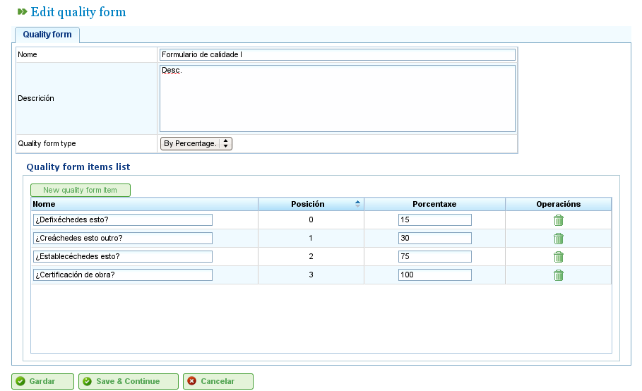

Formularze jakości
##################

.. _calidad:
.. contents::

Administracja formularzami jakości
===================================

Formularze jakości składają się z listy pytań lub stwierdzeń wskazujących zadania lub procesy, które powinny zostać ukończone przed oznaczeniem zadania jako zakończonego przez firmę. Formularze te zawierają następujące pola:

*   **Nazwa:** Nazwa formularza jakości.
*   **Opis:** Opis formularza jakości.
*   **Typ formularza jakości:** Typ może przyjmować dwie wartości:

    *   **Procentowy:** Wskazuje, że pytania muszą być odpowiadane w logicznej kolejności, a odpowiedzi twierdzące wskazują na postęp zadania. Na przykład podstawowy proces dla zadania może sugerować, że zadanie jest ukończone w 15%. Użytkownicy muszą odpowiedzieć na pytanie przed przejściem do następnego.
    *   **Pozycja:** Wskazuje, że pytania nie muszą być odpowiadane w logicznej kolejności i mogą być udzielane w dowolnej kolejności.

Użytkownicy muszą wykonać następujące kroki w celu zarządzania formularzami jakości:

*   Z menu „Administracja" przejść do opcji „Formularze jakości".
*   Kliknąć „Edytuj" na istniejącym formularzu lub kliknąć „Utwórz", aby utworzyć nowy.
*   Program wyświetla formularz z polami nazwy, opisu i typu.
*   Wybrać typ.
*   Program wyświetla pola dozwolone dla każdego typu:

    *   **Procentowy:** Pytanie i wartość procentowa.
    *   **Pozycja:** Pytanie.

*   Kliknąć „Zapisz" lub „Zapisz i kontynuuj".

   Ekran administracji formularzem jakości
