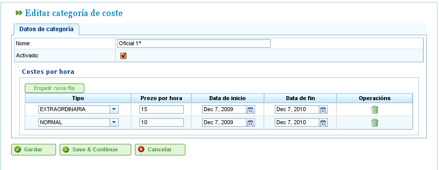

Zarządzanie kosztami
####################

.. _costes:
.. contents::

Koszty
======

Zarządzanie kosztami umożliwia użytkownikom szacowanie kosztów zasobów wykorzystanych w projekcie. Aby zarządzać kosztami, należy zdefiniować następujące elementy:

*   **Typy godzin:** Wskazują typy godzin przepracowanych przez zasób. Użytkownicy mogą definiować typy godzin zarówno dla maszyn, jak i pracowników. Przykłady typów godzin obejmują: „Godziny dodatkowe płatne w wysokości 20 € za godzinę." Dla typów godzin można zdefiniować następujące pola:

    *   **Kod:** Zewnętrzny kod dla typu godzin.
    *   **Nazwa:** Nazwa typu godzin. Na przykład „Dodatkowe".
    *   **Stawka domyślna:** Podstawowa domyślna stawka dla typu godzin.
    *   **Aktywacja:** Wskazuje, czy typ godzin jest aktywny, czy nie.

*   **Kategorie kosztów:** Kategorie kosztów definiują koszty związane z różnymi typami godzin w określonych okresach (które mogą być nieokreślone). Na przykład koszt godzin dodatkowych dla pracowników pierwszej klasy w następnym roku wynosi 24 € za godzinę. Kategorie kosztów obejmują:

    *   **Nazwa:** Nazwa kategorii kosztów.
    *   **Aktywacja:** Wskazuje, czy kategoria jest aktywna, czy nie.
    *   **Lista typów godzin:** Ta lista definiuje typy godzin uwzględnione w kategorii kosztów. Określa okresy i stawki dla każdego typu godzin. Na przykład, gdy stawki się zmieniają, każdy rok może być uwzględniony na tej liście jako okres typu godzin ze specyficzną stawką godzinową dla każdego typu godzin (która może różnić się od domyślnej stawki godzinowej dla tego typu godzin).

Zarządzanie typami godzin
--------------------------

Użytkownicy muszą wykonać następujące kroki w celu rejestrowania typów godzin:

*   Wybrać „Zarządzanie typami przepracowanych godzin" w menu „Administracja".
*   Program wyświetla listę istniejących typów godzin.

.. figure:: images/hour-type-list.png
   :scale: 35

   Lista typów godzin

*   Kliknąć „Edytuj" lub „Utwórz".
*   Program wyświetla formularz edycji typu godzin.

.. figure:: images/hour-type-edit.png
   :scale: 50

   Edytowanie typów godzin

*   Użytkownicy mogą wprowadzić lub zmienić:

    *   Nazwę typu godzin.
    *   Kod typu godzin.
    *   Stawkę domyślną.
    *   Aktywację/dezaktywację typu godzin.

*   Kliknąć „Zapisz" lub „Zapisz i kontynuuj".

Kategorie kosztów
-----------------

Użytkownicy muszą wykonać następujące kroki w celu rejestrowania kategorii kosztów:

*   Wybrać „Zarządzanie kategoriami kosztów" w menu „Administracja".
*   Program wyświetla listę istniejących kategorii.

.. figure:: images/category-cost-list.png
   :scale: 50

   Lista kategorii kosztów

*   Kliknąć przycisk „Edytuj" lub „Utwórz".
*   Program wyświetla formularz edycji kategorii kosztów.

   Edytowanie kategorii kosztów

*   Użytkownicy wprowadzają lub zmieniają:

    *   Nazwę kategorii kosztów.
    *   Aktywację/dezaktywację kategorii kosztów.
    *   Listę typów godzin uwzględnionych w kategorii. Wszystkie typy godzin mają następujące pola:

        *   **Typ godzin:** Wybierz jeden z istniejących typów godzin w systemie. Jeśli żaden nie istnieje, należy utworzyć typ godzin (ten proces jest opisany w poprzedniej podsekcji).
        *   **Data rozpoczęcia i zakończenia:** Data rozpoczęcia i zakończenia (ta ostatnia jest opcjonalna) okresu, który dotyczy kategorii kosztów.
        *   **Stawka godzinowa:** Stawka godzinowa dla tej konkretnej kategorii.

*   Kliknąć „Zapisz" lub „Zapisz i kontynuuj".

Przypisanie kategorii kosztów do zasobów opisano w rozdziale dotyczącym zasobów. Przejdź do sekcji „Zasoby".
