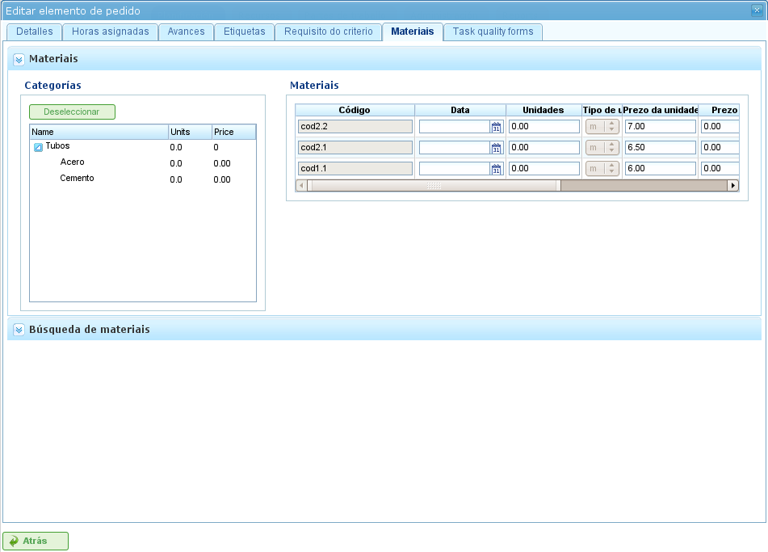

Projetos e Elementos de Projeto
####################################

.. contents::

As projetos representam o trabalho a ser executado pelos utilizadores do programa. Cada projeto corresponde a um projecto que a empresa oferecerá aos seus clientes.

Uma projeto consiste em um ou mais elementos de projeto. Cada elemento de projeto representa uma parte específica do trabalho a realizar e define como o trabalho na projeto deve ser planeado e executado. Os elementos de projeto são organizados hierarquicamente, sem limitações na profundidade da hierarquia. Esta estrutura hierárquica permite a herança de determinadas características, como etiquetas.

As secções seguintes descrevem as operações que os utilizadores podem efectuar com projetos e elementos de projeto.

Projetos
===========

Uma projeto representa um projecto ou trabalho solicitado por um cliente à empresa. A projeto identifica o projecto no planeamento da empresa. Ao contrário de programas de gestão abrangentes, o LibrePlan apenas requer determinados detalhes chave para uma projeto. Esses detalhes são:

*   **Nome da Projeto:** O nome da projeto.
*   **Código da Projeto:** Um código único para a projeto.
*   **Valor Total da Projeto:** O valor financeiro total da projeto.
*   **Data de Início Estimada:** A data de início planeada para a projeto.
*   **Data de Fim:** A data de conclusão planeada para a projeto.
*   **Responsável:** O indivíduo responsável pela projeto.
*   **Descrição:** Uma descrição da projeto.
*   **Calendário Atribuído:** O calendário associado à projeto.
*   **Geração Automática de Códigos:** Uma definição para instruir o sistema a gerar automaticamente códigos para elementos de projeto e grupos de horas.
*   **Preferência entre Dependências e Restrições:** Os utilizadores podem escolher se as dependências ou restrições têm prioridade em caso de conflitos.

No entanto, uma projeto completa também inclui outras entidades associadas:

*   **Horas Atribuídas à Projeto:** O total de horas alocadas à projeto.
*   **Progresso Atribuído à Projeto:** O progresso efectuado na projeto.
*   **Etiquetas:** Etiquetas atribuídas à projeto.
*   **Critérios Atribuídos à Projeto:** Critérios associados à projeto.
*   **Materiais:** Materiais necessários para a projeto.
*   **Formulários de Qualidade:** Formulários de qualidade associados à projeto.

Criar ou editar uma projeto pode ser feito a partir de vários locais no programa:

*   **A partir da "Lista de Projetos" na Visão Geral da Empresa:**

    *   **Editar:** Clique no botão de edição na projeto desejada.
    *   **Criar:** Clique em "Nova projeto".

*   **A partir de uma Projeto no Diagrama de Gantt:** Mude para a vista de detalhes da projeto.

Os utilizadores podem aceder aos seguintes separadores ao editar uma projeto:

*   **Edição dos Detalhes da Projeto:** Este ecrã permite aos utilizadores editar os detalhes básicos da projeto:

    *   Nome
    *   Código
    *   Data de Início Estimada
    *   Data de Fim
    *   Responsável
    *   Cliente
    *   Descrição

    .. figure:: images/order-edition.png
       :scale: 50

       Edição de Projetos

*   **Lista de Elementos de Projeto:** Este ecrã permite aos utilizadores efectuar várias operações em elementos de projeto:

    *   Criar novos elementos de projeto.
    *   Promover um elemento de projeto um nível acima na hierarquia.
    *   Rebaixar um elemento de projeto um nível abaixo na hierarquia.
    *   Recuar um elemento de projeto (movê-lo para baixo na hierarquia).
    *   Avançar um elemento de projeto (movê-lo para cima na hierarquia).
    *   Filtrar elementos de projeto.
    *   Eliminar elementos de projeto.
    *   Mover um elemento dentro da hierarquia por arrastar e largar.

    .. figure:: images/order-elements-list.png
       :scale: 40

       Lista de Elementos de Projeto

*   **Horas Atribuídas:** Este ecrã apresenta o total de horas atribuídas ao projecto, agrupando as horas introduzidas nos elementos de projeto.

    .. figure:: images/order-assigned-hours.png
       :scale: 50

       Atribuição de Horas ao Projecto pelos Trabalhadores

*   **Progresso:** Este ecrã permite aos utilizadores atribuir tipos de progresso e introduzir medições de progresso para a projeto. Consulte a secção "Progresso" para mais detalhes.

*   **Etiquetas:** Este ecrã permite aos utilizadores atribuir etiquetas a uma projeto e ver as etiquetas directas e indirectas previamente atribuídas. Consulte a secção seguinte sobre edição de elementos de projeto para uma descrição detalhada da gestão de etiquetas.

    .. figure:: images/order-labels.png
       :scale: 35

       Etiquetas de Projeto

*   **Critérios:** Este ecrã permite aos utilizadores atribuir critérios que se aplicarão a todas as tarefas da projeto. Estes critérios serão automaticamente aplicados a todos os elementos de projeto, excepto os que tenham sido explicitamente invalidados. Os grupos de horas dos elementos de projeto, que são agrupados por critérios, também podem ser visualizados, permitindo aos utilizadores identificar os critérios necessários para uma projeto.

    .. figure:: images/order-criterions.png
       :scale: 50

       Critérios de Projeto

*   **Materiais:** Este ecrã permite aos utilizadores atribuir materiais a projetos. Os materiais podem ser seleccionados a partir das categorias de materiais disponíveis no programa. Os materiais são geridos da seguinte forma:

    *   Seleccione o separador "Pesquisar materiais" na parte inferior do ecrã.
    *   Introduza texto para pesquisar materiais ou seleccione as categorias para as quais pretende encontrar materiais.
    *   O sistema filtra os resultados.
    *   Seleccione os materiais desejados (múltiplos materiais podem ser seleccionados premindo a tecla "Ctrl").
    *   Clique em "Atribuir".
    *   O sistema apresenta a lista de materiais já atribuídos à projeto.
    *   Seleccione as unidades e o estado a atribuir à projeto.
    *   Clique em "Guardar" ou "Guardar e continuar".
    *   Para gerir a recepção de materiais, clique em "Dividir" para alterar o estado de uma quantidade parcial de material.

    .. figure:: images/order-material.png
       :scale: 50

       Materiais Associados a uma Projeto

*   **Qualidade:** Os utilizadores podem atribuir um formulário de qualidade à projeto. Este formulário é então preenchido para garantir que determinadas actividades associadas à projeto são realizadas. Consulte a secção seguinte sobre edição de elementos de projeto para detalhes sobre a gestão de formulários de qualidade.

    .. figure:: images/order-quality.png
       :scale: 50

       Formulário de Qualidade Associado à Projeto

Edição de Elementos de Projeto
==================================

Os elementos de projeto são editados a partir do separador "Lista de elementos de projeto" clicando no ícone de edição. Isto abre um novo ecrã onde os utilizadores podem:

*   Editar informações sobre o elemento de projeto.
*   Ver horas atribuídas a elementos de projeto.
*   Gerir o progresso de elementos de projeto.
*   Gerir etiquetas de projeto.
*   Gerir critérios requeridos pelo elemento de projeto.
*   Gerir materiais.
*   Gerir formulários de qualidade.

As subsecções seguintes descrevem cada uma destas operações em detalhe.

Edição de Informações sobre o Elemento de Projeto
-----------------------------------------------------

A edição de informações sobre o elemento de projeto inclui a modificação dos seguintes detalhes:

*   **Nome do Elemento de Projeto:** O nome do elemento de projeto.
*   **Código do Elemento de Projeto:** Um código único para o elemento de projeto.
*   **Data de Início:** A data de início planeada do elemento de projeto.
*   **Data de Fim Estimada:** A data de conclusão planeada do elemento de projeto.
*   **Total de Horas:** O total de horas alocadas ao elemento de projeto. Estas horas podem ser calculadas a partir dos grupos de horas adicionados ou introduzidas directamente. Se introduzidas directamente, as horas devem ser distribuídas pelos grupos de horas, e um novo grupo de horas criado se as percentagens não corresponderem às percentagens iniciais.
*   **Grupos de Horas:** Um ou mais grupos de horas podem ser adicionados ao elemento de projeto. **O objectivo destes grupos de horas** é definir os requisitos para os recursos que serão atribuídos para efectuar o trabalho.
*   **Critérios:** Podem ser adicionados critérios que devem ser cumpridos para possibilitar a atribuição genérica para o elemento de projeto.

.. figure:: images/order-element-edition.png
   :scale: 50

   Edição de Elementos de Projeto

Visualização de Horas Atribuídas a Elementos de Projeto
-----------------------------------------------------------

O separador "Horas atribuídas" permite aos utilizadores ver os relatórios de trabalho associados a um elemento de projeto e verificar quantas das horas estimadas já foram concluídas.

.. figure:: images/order-element-hours.png
   :scale: 50

   Horas Atribuídas a Elementos de Projeto

O ecrã está dividido em duas partes:

*   **Lista de Relatórios de Trabalho:** Os utilizadores podem ver a lista de relatórios de trabalho associados ao elemento de projeto, incluindo a data e hora, recurso e número de horas dedicadas à tarefa.
*   **Utilização das Horas Estimadas:** O sistema calcula o número total de horas dedicadas à tarefa e compara-as com as horas estimadas.

Gestão do Progresso de Elementos de Projeto
----------------------------------------------

A introdução de tipos de progresso e a gestão do progresso de elementos de projeto estão descritas no capítulo "Progresso".

Gestão de Etiquetas de Projeto
---------------------------------

As etiquetas, conforme descrito no capítulo sobre etiquetas, permitem aos utilizadores categorizar elementos de projeto. Isto permite aos utilizadores agrupar informações de planeamento ou projeto com base nestas etiquetas.

Os utilizadores podem atribuir etiquetas directamente a um elemento de projeto ou a um elemento de projeto de nível superior na hierarquia. Uma vez atribuída uma etiqueta por qualquer um dos métodos, o elemento de projeto e a tarefa de planeamento relacionada são associados à etiqueta e podem ser utilizados para filtragem subsequente.

.. figure:: images/order-element-tags.png
   :scale: 50

   Atribuição de Etiquetas para Elementos de Projeto

Conforme mostrado na imagem, os utilizadores podem efectuar as seguintes acções a partir do separador **Etiquetas**:

*   **Ver Etiquetas Herdadas:** Ver etiquetas associadas ao elemento de projeto que foram herdadas de um elemento de projeto de nível superior. A tarefa de planeamento associada a cada elemento de projeto tem as mesmas etiquetas associadas.
*   **Ver Etiquetas Directamente Atribuídas:** Ver etiquetas directamente associadas ao elemento de projeto utilizando o formulário de atribuição para etiquetas de nível inferior.
*   **Atribuir Etiquetas Existentes:** Atribuir etiquetas pesquisando-as entre as etiquetas disponíveis no formulário abaixo da lista de etiquetas directas. Para pesquisar uma etiqueta, clique no ícone da lupa ou introduza as primeiras letras da etiqueta na caixa de texto para apresentar as opções disponíveis.
*   **Criar e Atribuir Novas Etiquetas:** Criar novas etiquetas associadas a um tipo de etiqueta existente a partir deste formulário. Para tal, seleccione um tipo de etiqueta e introduza o valor da etiqueta para o tipo seleccionado. O sistema cria automaticamente a etiqueta e atribui-a ao elemento de projeto quando se clica em "Criar e atribuir".

Gestão de Critérios Requeridos pelo Elemento de Projeto e Grupos de Horas
----------------------------------------------------------------------------

Tanto uma projeto como um elemento de projeto podem ter critérios atribuídos que devem ser cumpridos para o trabalho ser realizado. Os critérios podem ser directos ou indirectos:

*   **Critérios Directos:** São atribuídos directamente ao elemento de projeto. São critérios requeridos pelos grupos de horas no elemento de projeto.
*   **Critérios Indirectos:** São atribuídos a elementos de projeto de nível superior na hierarquia e são herdados pelo elemento que está a ser editado.

Para além dos critérios requeridos, podem ser definidos um ou mais grupos de horas que fazem parte do elemento de projeto. Isto depende de o elemento de projeto conter outros elementos de projeto como nós filhos ou ser um nó folha. No primeiro caso, as informações sobre horas e grupos de horas só podem ser vistas. No entanto, os nós folha podem ser editados. Os nós folha funcionam da seguinte forma:

*   O sistema cria um grupo de horas predefinido associado ao elemento de projeto. Os detalhes que podem ser modificados para um grupo de horas são:

    *   **Código:** O código para o grupo de horas (se não gerado automaticamente).
    *   **Tipo de Critério:** Os utilizadores podem escolher atribuir um critério de máquina ou trabalhador.
    *   **Número de Horas:** O número de horas no grupo de horas.
    *   **Lista de Critérios:** Os critérios a aplicar ao grupo de horas. Para adicionar novos critérios, clique em "Adicionar critério" e seleccione um no motor de pesquisa que aparece após clicar no botão.

*   Os utilizadores podem adicionar novos grupos de horas com características diferentes dos grupos de horas anteriores. Por exemplo, um elemento de projeto pode requerer um soldador (30 horas) e um pintor (40 horas).

.. figure:: images/order-element-criterion.png
   :scale: 50

   Atribuição de Critérios a Elementos de Projeto

Gestão de Materiais
--------------------

Os materiais são geridos em projectos como uma lista associada a cada elemento de projeto ou a uma projeto em geral. A lista de materiais inclui os seguintes campos:

*   **Código:** O código do material.
*   **Data:** A data associada ao material.
*   **Unidades:** O número de unidades necessário.
*   **Tipo de Unidade:** O tipo de unidade utilizado para medir o material.
*   **Preço por Unidade:** O preço por unidade.
*   **Preço Total:** O preço total (calculado multiplicando o preço por unidade pelo número de unidades).
*   **Categoria:** A categoria à qual o material pertence.
*   **Estado:** O estado do material (por exemplo, Recebido, Solicitado, Pendente, Em processamento, Cancelado).

O trabalho com materiais é efectuado da seguinte forma:

*   Seleccione o separador "Materiais" num elemento de projeto.
*   O sistema apresenta dois sub-separadores: "Materiais" e "Pesquisar materiais".
*   Se o elemento de projeto não tiver materiais atribuídos, o primeiro separador estará vazio.
*   Clique em "Pesquisar materiais" na parte inferior esquerda da janela.
*   O sistema apresenta a lista de categorias disponíveis e materiais associados.

.. figure:: images/order-element-material-search.png
   :scale: 50

   Pesquisa de Materiais

*   Seleccione categorias para refinar a pesquisa de materiais.
*   O sistema apresenta os materiais que pertencem às categorias seleccionadas.
*   Na lista de materiais, seleccione os materiais a atribuir ao elemento de projeto.
*   Clique em "Atribuir".
*   O sistema apresenta a lista seleccionada de materiais no separador "Materiais" com novos campos a preencher.

   Atribuição de Materiais a Elementos de Projeto

*   Seleccione as unidades, estado e data para os materiais atribuídos.

Para o acompanhamento subsequente de materiais, é possível alterar o estado de um grupo de unidades do material recebido. Isto é feito da seguinte forma:

*   Clique no botão "Dividir" na lista de materiais à direita de cada linha.
*   Seleccione o número de unidades para dividir a linha.
*   O programa apresenta duas linhas com o material dividido.
*   Altere o estado da linha que contém o material.

A vantagem de utilizar esta ferramenta de divisão é a capacidade de receber entregas parciais de material sem ter de esperar pela entrega total para a marcar como recebida.

Gestão de Formulários de Qualidade
------------------------------------

Alguns elementos de projeto requerem a certificação de que determinadas tarefas foram concluídas antes de poderem ser marcados como completos. Por isso, o programa tem formulários de qualidade, que consistem numa lista de questões que são consideradas importantes se respondidas positivamente.

É importante notar que um formulário de qualidade deve ser criado previamente para ser atribuído a um elemento de projeto.

Para gerir formulários de qualidade:

*   Vá ao separador "Formulários de qualidade".

    .. figure:: images/order-element-quality.png
       :scale: 50

       Atribuição de Formulários de Qualidade a Elementos de Projeto

*   O programa tem um motor de pesquisa para formulários de qualidade. Existem dois tipos de formulários de qualidade: por elemento ou por percentagem.

    *   **Elemento:** Cada elemento é independente.
    *   **Percentagem:** Cada questão aumenta o progresso do elemento de projeto por uma percentagem. As percentagens devem poder somar 100%.

*   Seleccione um dos formulários criados na interface de administração e clique em "Atribuir".
*   O programa atribui o formulário escolhido da lista de formulários atribuídos ao elemento de projeto.
*   Clique no botão "Editar" no elemento de projeto.
*   O programa apresenta as questões do formulário de qualidade na lista inferior.
*   Marque as questões que foram concluídas como alcançadas.

    *   Se o formulário de qualidade se basear em percentagens, as questões são respondidas por ordem.
    *   Se o formulário de qualidade se basear em elementos, as questões podem ser respondidas em qualquer ordem.
