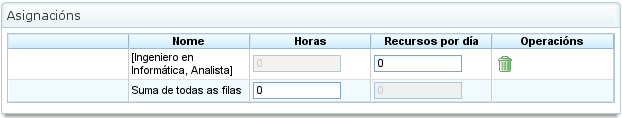

Atribuição de Recursos
#######################

.. _asigacion_:
.. contents::

A atribuição de recursos é uma das funcionalidades mais importantes do programa e pode ser efectuada de duas formas diferentes:

*   Atribuição específica
*   Atribuição genérica

Ambos os tipos de atribuição são explicados nas secções seguintes.

Para efectuar qualquer tipo de atribuição de recursos, são necessários os seguintes passos:

*   Vá à vista de planeamento de uma projeto.
*   Clique com o botão direito na tarefa a ser planeada.

.. figure:: images/resource-assignment-planning.png
   :scale: 50

   Menu de Atribuição de Recursos

*   O programa apresenta um ecrã com as seguintes informações:

    *   **Lista de Critérios a Cumprir:** Para cada grupo de horas, é mostrada uma lista de critérios necessários.
    *   **Informações da Tarefa:** As datas de início e fim da tarefa.
    *   **Tipo de Cálculo:** O sistema permite aos utilizadores escolher a estratégia para calcular atribuições:

        *   **Calcular Número de Horas:** Calcula o número de horas necessárias dos recursos atribuídos, dada uma data de fim e um número de recursos por dia.
        *   **Calcular Data de Fim:** Calcula a data de fim da tarefa com base no número de recursos atribuídos à tarefa e no número total de horas necessárias para concluir a tarefa.
        *   **Calcular Número de Recursos:** Calcula o número de recursos necessários para terminar a tarefa numa data específica, dado um número conhecido de horas por recurso.
    *   **Atribuição Recomendada:** Esta opção permite ao programa recolher os critérios a cumprir e o número total de horas de todos os grupos de horas, e depois recomendar uma atribuição genérica. Se existir uma atribuição prévia, o sistema elimina-a e substitui-a pela nova.
    *   **Atribuições:** Uma lista de atribuições que foram efectuadas. Esta lista mostra as atribuições genéricas (o número será a lista de critérios cumpridos, e o número de horas e recursos por dia). Cada atribuição pode ser explicitamente removida clicando no botão de eliminar.

.. figure:: images/resource-assignment.png
   :scale: 50

   Atribuição de Recursos

*   Os utilizadores seleccionam "Pesquisar recursos".
*   O programa apresenta um novo ecrã composto por uma árvore de critérios e uma lista de trabalhadores que cumprem os critérios seleccionados à direita:

.. figure:: images/resource-assignment-search.png
   :scale: 50

   Pesquisa de Atribuição de Recursos

*   Os utilizadores podem seleccionar:

    *   **Atribuição Específica:** Consulte a secção "Atribuição Específica" para detalhes sobre esta opção.
    *   **Atribuição Genérica:** Consulte a secção "Atribuição Genérica" para detalhes sobre esta opção.

*   Os utilizadores seleccionam uma lista de critérios (genérico) ou uma lista de trabalhadores (específico). Podem ser feitas múltiplas selecções premindo a tecla "Ctrl" enquanto se clica em cada trabalhador/critério.
*   Os utilizadores clicam então no botão "Seleccionar". É importante lembrar que se uma atribuição genérica não for seleccionada, os utilizadores devem escolher um trabalhador ou máquina para efectuar a atribuição. Se uma atribuição genérica for seleccionada, é suficiente para os utilizadores escolherem um ou mais critérios.
*   O programa apresenta então os critérios seleccionados ou a lista de recursos na lista de atribuições no ecrã de atribuição de recursos original.
*   Os utilizadores devem escolher as horas ou recursos por dia, dependendo do método de atribuição utilizado no programa.

Atribuição Específica
======================

Esta é a atribuição específica de um recurso a uma tarefa do projecto. Por outras palavras, o utilizador decide qual trabalhador específico (por nome e apelido) ou máquina deve ser atribuído a uma tarefa.

A atribuição específica pode ser efectuada no ecrã mostrado nesta imagem:

.. figure:: images/asignacion-especifica.png
   :scale: 50

   Atribuição Específica de Recursos

Quando um recurso é especificamente atribuído, o programa cria atribuições diárias com base na percentagem de recursos diários atribuídos seleccionada, após comparação com o calendário de recursos disponível. Por exemplo, uma atribuição de 0,5 recursos para uma tarefa de 32 horas significa que são atribuídas 4 horas por dia ao recurso específico para concluir a tarefa (assumindo um calendário de trabalho de 8 horas por dia).

Atribuição Específica de Máquinas
-----------------------------------

A atribuição específica de máquinas funciona da mesma forma que a atribuição de trabalhadores. Quando uma máquina é atribuída a uma tarefa, o sistema armazena uma atribuição específica de horas para a máquina escolhida. A principal diferença é que o sistema pesquisa a lista de trabalhadores ou critérios atribuídos no momento em que a máquina é atribuída:

*   Se a máquina tiver uma lista de trabalhadores atribuídos, o programa escolhe os que são necessários pela máquina, com base no calendário atribuído. Por exemplo, se o calendário da máquina é de 16 horas por dia e o calendário do recurso é de 8 horas, dois recursos são atribuídos da lista de recursos disponíveis.
*   Se a máquina tiver um ou mais critérios atribuídos, são efectuadas atribuições genéricas de entre os recursos que cumprem os critérios atribuídos à máquina.

Atribuição Genérica
====================

A atribuição genérica ocorre quando os utilizadores não escolhem recursos especificamente, mas deixam a decisão ao programa, que distribui as cargas pelos recursos disponíveis da empresa.

   Atribuição Genérica de Recursos

O sistema de atribuição utiliza os seguintes pressupostos como base:

*   As tarefas têm critérios que são requeridos dos recursos.
*   Os recursos estão configurados para cumprir critérios.

No entanto, o sistema não falha quando os critérios não foram atribuídos, mas quando todos os recursos cumprem a não-exigência de critérios.

O algoritmo de atribuição genérica funciona da seguinte forma:

*   Todos os recursos e dias são tratados como contentores onde cabem atribuições diárias de horas, com base na capacidade máxima de atribuição no calendário da tarefa.
*   O sistema pesquisa os recursos que cumprem o critério.
*   O sistema analisa quais as atribuições que têm actualmente diferentes recursos que cumprem critérios.
*   Os recursos que cumprem os critérios são escolhidos de entre os que têm disponibilidade suficiente.
*   Se não estiverem disponíveis recursos mais livres, são efectuadas atribuições aos recursos que têm menos disponibilidade.
*   A sobre-atribuição de recursos só começa quando todos os recursos que cumprem os respectivos critérios estão 100% atribuídos, até ser atingida a quantidade total necessária para efectuar a tarefa.

Atribuição Genérica de Máquinas
---------------------------------

A atribuição genérica de máquinas funciona da mesma forma que a atribuição de trabalhadores. Por exemplo, quando uma máquina é atribuída a uma tarefa, o sistema armazena uma atribuição genérica de horas para todas as máquinas que cumprem os critérios, conforme descrito para os recursos em geral. No entanto, adicionalmente, o sistema efectua o seguinte procedimento para máquinas:

*   Para todas as máquinas escolhidas para atribuição genérica:

    *   Recolhe as informações de configuração da máquina: valor alfa, trabalhadores atribuídos e critérios.
    *   Se a máquina tiver uma lista atribuída de trabalhadores, o programa escolhe o número requerido pela máquina, dependendo do calendário atribuído. Por exemplo, se o calendário da máquina é de 16 horas por dia e o calendário do recurso é de 8 horas, o programa atribui dois recursos da lista de recursos disponíveis.
    *   Se a máquina tiver um ou mais critérios atribuídos, o programa efectua atribuições genéricas de entre os recursos que cumprem os critérios atribuídos à máquina.

Atribuição Avançada
====================

As atribuições avançadas permitem aos utilizadores conceber atribuições que são automaticamente efectuadas pela aplicação para as personalizar. Este procedimento permite aos utilizadores escolher manualmente as horas diárias dedicadas pelos recursos às tarefas atribuídas ou definir uma função que é aplicada à atribuição.

Os passos a seguir para gerir atribuições avançadas são:

*   Vá à janela de atribuição avançada. Existem duas formas de aceder às atribuições avançadas:

    *   Vá a uma projeto específica e altere a vista para atribuição avançada. Neste caso, serão mostradas todas as tarefas da projeto e os recursos atribuídos (específicos e genéricos).
    *   Vá à janela de atribuição de recursos clicando no botão "Atribuição avançada". Neste caso, serão mostradas as atribuições que mostram os recursos (genéricos e específicos) atribuídos a uma tarefa.

.. figure:: images/advance-assignment.png
   :scale: 45

   Atribuição Avançada de Recursos

*   Os utilizadores podem escolher o nível de zoom desejado:

    *   **Níveis de Zoom Superiores a Um Dia:** Se os utilizadores alterarem o valor de horas atribuídas para um período semanal, mensal, quadrimestral ou semestral, o sistema distribui as horas linearmente por todos os dias ao longo do período escolhido.
    *   **Zoom Diário:** Se os utilizadores alterarem o valor de horas atribuídas para um dia, essas horas apenas se aplicam a esse dia. Consequentemente, os utilizadores podem decidir quantas horas pretendem atribuir por dia aos recursos da tarefa.

*   Os utilizadores podem optar por conceber uma função de atribuição avançada. Para tal, os utilizadores devem:

    *   Escolher a função da lista de selecção que aparece ao lado de cada recurso e clicar em "Configurar".
    *   O sistema apresenta uma nova janela se a função escolhida precisar de ser especificamente configurada. Funções suportadas:

        *   **Segmentos:** Uma função que permite aos utilizadores definir segmentos aos quais é aplicada uma função polinomial. A função por segmento é configurada da seguinte forma:

            *   **Data:** A data na qual o segmento termina. Se o valor seguinte (comprimento) for estabelecido, a data é calculada; caso contrário, o comprimento é calculado.
            *   **Definir o Comprimento de Cada Segmento:** Indica que percentagem da duração da tarefa é necessária para o segmento.
            *   **Definir a Quantidade de Trabalho:** Indica que percentagem da carga de trabalho se espera que seja concluída neste segmento. A quantidade de trabalho deve ser incremental. Por exemplo, se houver um segmento de 10%, o seguinte deve ser maior (por exemplo, 20%).
            *   **Gráficos de Segmentos e Cargas Acumuladas.**

    *   Os utilizadores clicam então em "Aceitar".
    *   O programa armazena a função e aplica-a às atribuições diárias de recursos.

.. figure:: images/stretches.png
   :scale: 40

   Configuração da Função de Segmentos
