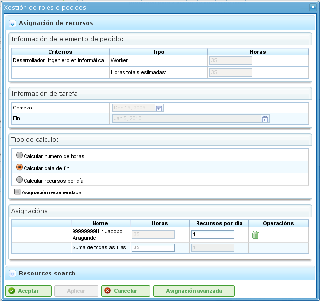
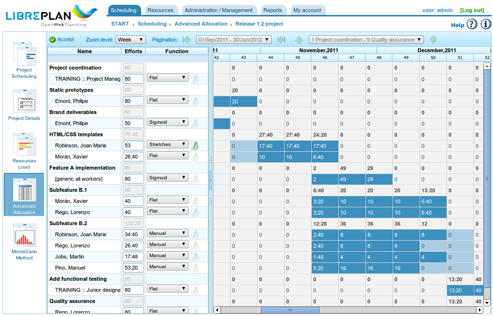
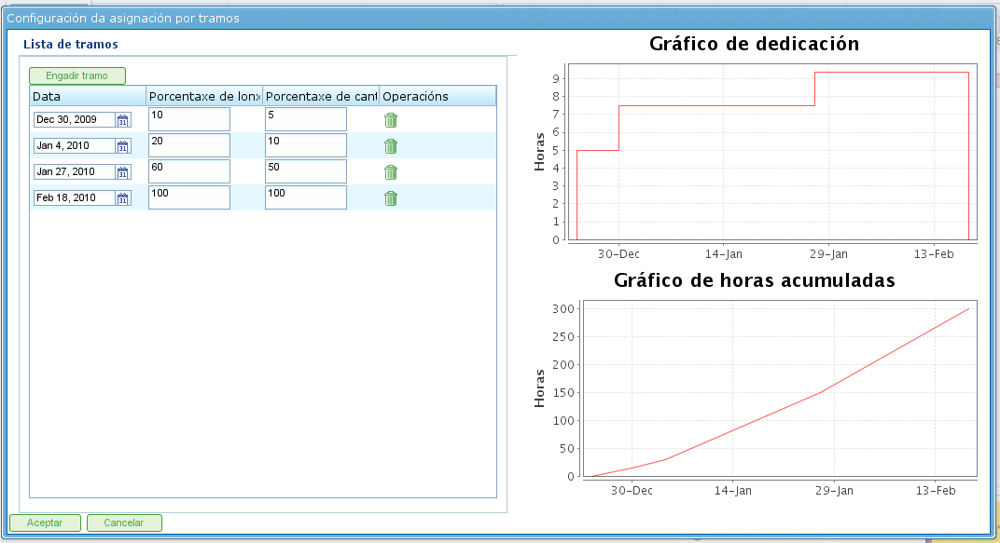

Atribuição de Recursos
#######################

.. _asigacion_:
.. contents::

A atribuição de recursos é uma das funcionalidades mais importantes do programa e pode ser realizada de duas formas diferentes:

*   Atribuição específica
*   Atribuição genérica

Ambos os tipos de atribuição são explicados nas seções a seguir.

Para realizar qualquer tipo de atribuição de recursos, os seguintes passos são necessários:

*   Vá à visualização de planejamento de um projeto.
*   Clique com o botão direito na tarefa a ser planejada.

.. figure:: images/resource-assignment-planning.png
   :scale: 50

   Menu de Atribuição de Recursos

*   O programa exibe uma tela com as seguintes informações:

    *   **Lista de Critérios a Cumprir:** Para cada grupo de horas, uma lista de critérios necessários é mostrada.
    *   **Informações da Tarefa:** As datas de início e fim da tarefa.
    *   **Tipo de Cálculo:** O sistema permite aos usuários escolher a estratégia para calcular atribuições:

        *   **Calcular Número de Horas:** Calcula o número de horas necessárias dos recursos atribuídos, dada uma data de fim e um número de recursos por dia.
        *   **Calcular Data de Fim:** Calcula a data de fim da tarefa com base no número de recursos atribuídos à tarefa e no número total de horas necessárias para concluir a tarefa.
        *   **Calcular Número de Recursos:** Calcula o número de recursos necessários para terminar a tarefa em uma data específica, dado um número conhecido de horas por recurso.
    *   **Atribuição Recomendada:** Esta opção permite ao programa coletar os critérios a cumprir e o número total de horas de todos os grupos de horas, e então recomendar uma atribuição genérica. Se existir uma atribuição prévia, o sistema a exclui e a substitui pela nova.
    *   **Atribuições:** Uma lista de atribuições que foram feitas. Esta lista mostra as atribuições genéricas (o número será a lista de critérios cumpridos, e o número de horas e recursos por dia). Cada atribuição pode ser explicitamente removida clicando no botão de excluir.

   Atribuição de Recursos

*   Os usuários selecionam "Pesquisar recursos".
*   O programa exibe uma nova tela composta por uma árvore de critérios e uma lista de trabalhadores que cumprem os critérios selecionados à direita:

.. figure:: images/resource-assignment-search.png
   :scale: 50

   Pesquisa de Atribuição de Recursos

*   Os usuários podem selecionar:

    *   **Atribuição Específica:** Consulte a seção "Atribuição Específica" para detalhes sobre esta opção.
    *   **Atribuição Genérica:** Consulte a seção "Atribuição Genérica" para detalhes sobre esta opção.

*   Os usuários selecionam uma lista de critérios (genérico) ou uma lista de trabalhadores (específico). Múltiplas seleções podem ser feitas pressionando a tecla "Ctrl" enquanto se clica em cada trabalhador/critério.
*   Os usuários então clicam no botão "Selecionar". É importante lembrar que se uma atribuição genérica não for selecionada, os usuários devem escolher um trabalhador ou máquina para realizar a atribuição. Se uma atribuição genérica for selecionada, é suficiente para os usuários escolherem um ou mais critérios.
*   O programa então exibe os critérios selecionados ou a lista de recursos na lista de atribuições na tela de atribuição de recursos original.
*   Os usuários devem escolher as horas ou recursos por dia, dependendo do método de atribuição utilizado no programa.

Atribuição Específica
======================

Esta é a atribuição específica de um recurso a uma tarefa do projeto. Em outras palavras, o usuário decide qual trabalhador específico (por nome e sobrenome) ou máquina deve ser atribuído a uma tarefa.

A atribuição específica pode ser realizada na tela mostrada nesta imagem:

.. figure:: images/asignacion-especifica.png
   :scale: 50

   Atribuição Específica de Recursos

Quando um recurso é especificamente atribuído, o programa cria atribuições diárias com base na porcentagem de recursos diários atribuídos selecionada, após comparação com o calendário de recursos disponível. Por exemplo, uma atribuição de 0,5 recursos para uma tarefa de 32 horas significa que 4 horas por dia são atribuídas ao recurso específico para concluir a tarefa (assumindo um calendário de trabalho de 8 horas por dia).

Atribuição Específica de Máquinas
-----------------------------------

A atribuição específica de máquinas funciona da mesma forma que a atribuição de trabalhadores. Quando uma máquina é atribuída a uma tarefa, o sistema armazena uma atribuição específica de horas para a máquina escolhida. A principal diferença é que o sistema pesquisa a lista de trabalhadores ou critérios atribuídos no momento em que a máquina é atribuída:

*   Se a máquina tiver uma lista de trabalhadores atribuídos, o programa escolhe os que são necessários pela máquina, com base no calendário atribuído. Por exemplo, se o calendário da máquina é de 16 horas por dia e o calendário do recurso é de 8 horas, dois recursos são atribuídos da lista de recursos disponíveis.
*   Se a máquina tiver um ou mais critérios atribuídos, atribuições genéricas são feitas de entre os recursos que cumprem os critérios atribuídos à máquina.

Atribuição Genérica
====================

A atribuição genérica ocorre quando os usuários não escolhem recursos especificamente, mas deixam a decisão ao programa, que distribui as cargas entre os recursos disponíveis da empresa.

.. figure:: images/asignacion-xenerica.png
   :scale: 50

   Atribuição Genérica de Recursos

O sistema de atribuição utiliza os seguintes pressupostos como base:

*   As tarefas têm critérios que são requeridos dos recursos.
*   Os recursos estão configurados para cumprir critérios.

No entanto, o sistema não falha quando os critérios não foram atribuídos, mas quando todos os recursos cumprem a não exigência de critérios.

O algoritmo de atribuição genérica funciona da seguinte forma:

*   Todos os recursos e dias são tratados como contêineres onde cabem atribuições diárias de horas, com base na capacidade máxima de atribuição no calendário da tarefa.
*   O sistema pesquisa os recursos que cumprem o critério.
*   O sistema analisa quais atribuições têm atualmente diferentes recursos que cumprem critérios.
*   Os recursos que cumprem os critérios são escolhidos de entre os que têm disponibilidade suficiente.
*   Se recursos mais livres não estiverem disponíveis, atribuições são feitas aos recursos que têm menos disponibilidade.
*   A superatribuição de recursos só começa quando todos os recursos que cumprem os respectivos critérios estão 100% atribuídos, até ser atingida a quantidade total necessária para realizar a tarefa.

Atribuição Genérica de Máquinas
---------------------------------

A atribuição genérica de máquinas funciona da mesma forma que a atribuição de trabalhadores. Por exemplo, quando uma máquina é atribuída a uma tarefa, o sistema armazena uma atribuição genérica de horas para todas as máquinas que cumprem os critérios, conforme descrito para os recursos em geral. No entanto, adicionalmente, o sistema realiza o seguinte procedimento para máquinas:

*   Para todas as máquinas escolhidas para atribuição genérica:

    *   Coleta as informações de configuração da máquina: valor alfa, trabalhadores atribuídos e critérios.
    *   Se a máquina tiver uma lista atribuída de trabalhadores, o programa escolhe o número requerido pela máquina, dependendo do calendário atribuído. Por exemplo, se o calendário da máquina é de 16 horas por dia e o calendário do recurso é de 8 horas, o programa atribui dois recursos da lista de recursos disponíveis.
    *   Se a máquina tiver um ou mais critérios atribuídos, o programa faz atribuições genéricas de entre os recursos que cumprem os critérios atribuídos à máquina.

Atribuição Avançada
====================

As atribuições avançadas permitem aos usuários projetar atribuições que são automaticamente realizadas pela aplicação para personalizá-las. Este procedimento permite aos usuários escolher manualmente as horas diárias dedicadas pelos recursos às tarefas atribuídas ou definir uma função que é aplicada à atribuição.

Os passos a seguir para gerenciar atribuições avançadas são:

*   Vá à janela de atribuição avançada. Existem duas formas de acessar as atribuições avançadas:

    *   Vá a um projeto específico e altere a visualização para atribuição avançada. Neste caso, todas as tarefas do projeto e os recursos atribuídos (específicos e genéricos) serão mostrados.
    *   Vá à janela de atribuição de recursos clicando no botão "Atribuição avançada". Neste caso, as atribuições que mostram os recursos (genéricos e específicos) atribuídos a uma tarefa serão mostradas.

   Atribuição Avançada de Recursos

*   Os usuários podem escolher o nível de zoom desejado:

    *   **Níveis de Zoom Superiores a Um Dia:** Se os usuários alterarem o valor de horas atribuídas para um período semanal, mensal, quadrimestral ou semestral, o sistema distribui as horas linearmente por todos os dias ao longo do período escolhido.
    *   **Zoom Diário:** Se os usuários alterarem o valor de horas atribuídas para um dia, essas horas só se aplicam a esse dia. Consequentemente, os usuários podem decidir quantas horas desejam atribuir por dia aos recursos da tarefa.

*   Os usuários podem optar por projetar uma função de atribuição avançada. Para isso, os usuários devem:

    *   Escolher a função da lista de seleção que aparece ao lado de cada recurso e clicar em "Configurar".
    *   O sistema exibe uma nova janela se a função escolhida precisar ser especificamente configurada. Funções suportadas:

        *   **Segmentos:** Uma função que permite aos usuários definir segmentos aos quais uma função polinomial é aplicada. A função por segmento é configurada da seguinte forma:

            *   **Data:** A data na qual o segmento termina. Se o valor seguinte (comprimento) for estabelecido, a data é calculada; caso contrário, o comprimento é calculado.
            *   **Definir o Comprimento de Cada Segmento:** Indica que porcentagem da duração da tarefa é necessária para o segmento.
            *   **Definir a Quantidade de Trabalho:** Indica que porcentagem da carga de trabalho se espera que seja concluída neste segmento. A quantidade de trabalho deve ser incremental. Por exemplo, se houver um segmento de 10%, o seguinte deve ser maior (por exemplo, 20%).
            *   **Gráficos de Segmentos e Cargas Acumuladas.**

    *   Os usuários então clicam em "Aceitar".
    *   O programa armazena a função e a aplica às atribuições diárias de recursos.

   Configuração da Função de Segmentos
