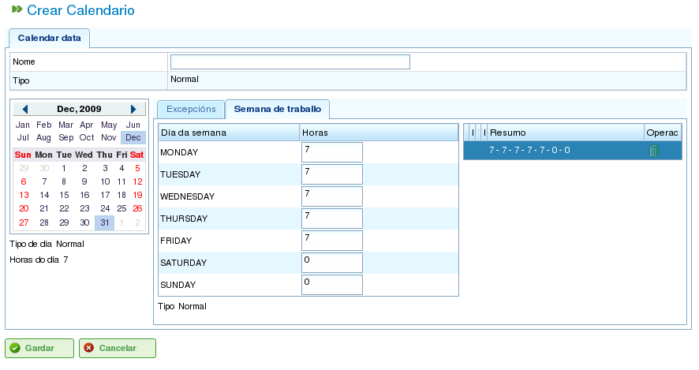

Календари
#########

.. contents::

Календари — это сущности в программе, определяющие рабочую мощность ресурсов. Календарь состоит из ряда дней в течение года, причём каждый день разделён на доступные рабочие часы.

Например, в праздничный день может быть 0 доступных рабочих часов. Напротив, типичный рабочий день может иметь 8 часов, обозначенных как доступное рабочее время.

Есть два основных способа определить количество рабочих часов в день:

*   **По дням недели:** Этот метод устанавливает стандартное количество рабочих часов для каждого дня недели. Например, в понедельник обычно может быть 8 рабочих часов.
*   **По исключениям:** Этот метод позволяет устанавливать конкретные отклонения от стандартного графика по дням недели. Например, понедельник, 30 января, может иметь 10 рабочих часов, заменяя стандартный понедельничный график.

Администрирование календарей
==============================

Система календарей является иерархической, позволяя создавать базовые календари и затем выводить из них новые календари, формируя древовидную структуру. Производный от вышестоящего календаря будет наследовать его ежедневные расписания и исключения, если не изменить их явно. Для эффективного управления календарями важно понимать следующие концепции:

*   **Независимость дней:** Каждый день рассматривается независимо, и каждый год имеет свой собственный набор дней. Например, если 8 декабря 2009 года является праздничным днём, это не означает автоматически, что 8 декабря 2010 года тоже является праздником.
*   **Рабочие дни на основе дней недели:** Стандартные рабочие дни основаны на днях недели. Например, если в понедельник обычно 8 рабочих часов, то все понедельники во всех неделях всех лет будут иметь 8 доступных часов, если не определено исключение.
*   **Исключения и периоды исключений:** Можно определить исключения или периоды исключений для отклонения от стандартного расписания по дням недели. Например, можно указать один день или диапазон дней с иным количеством доступных рабочих часов, чем общее правило для этих дней недели.

.. figure:: images/calendar-administration.png
   :scale: 50

   Администрирование календарей

Администрирование календарей доступно через меню «Администрирование». Оттуда пользователи могут выполнять следующие действия:

1.  Создать новый календарь с нуля.
2.  Создать календарь, производный от существующего.
3.  Создать календарь как копию существующего.
4.  Редактировать существующий календарь.

Создание нового календаря
--------------------------

Для создания нового календаря нажмите кнопку «Создать». Система отобразит форму, в которой можно настроить следующее:

*   **Выберите вкладку:** Выберите вкладку, с которой хотите работать:

    *   **Отмечание исключений:** Определите исключения из стандартного расписания.
    *   **Рабочие часы в день:** Определите стандартные рабочие часы для каждого дня недели.

*   **Отмечание исключений:** Если вы выбрали опцию «Отмечание исключений», вы можете:

    *   Выбрать конкретный день в календаре.
    *   Выбрать тип исключения. Доступные типы: праздник, болезнь, забастовка, государственный праздник и рабочий праздник.
    *   Выбрать дату окончания периода исключения. (Это поле не нужно менять для однодневных исключений.)
    *   Определить количество рабочих часов в дни периода исключения.
    *   Удалять ранее определённые исключения.

*   **Рабочие часы в день:** Если вы выбрали опцию «Рабочие часы в день», вы можете:

    *   Определить доступные рабочие часы для каждого дня недели (понедельник, вторник, среда, четверг, пятница, суббота и воскресенье).
    *   Определить различные недельные распределения часов для будущих периодов.
    *   Удалять ранее определённые распределения часов.

Эти параметры позволяют пользователям полностью настраивать календари в соответствии со своими конкретными потребностями. Нажмите кнопку «Сохранить» для сохранения изменений, внесённых в форму.

   Редактирование календарей

.. figure:: images/calendar-exceptions.png
   :scale: 50

   Добавление исключения в календарь

Создание производных календарей
---------------------------------

Производный календарь создаётся на основе существующего календаря. Он наследует все функции исходного календаря, но вы можете изменить его, включив различные параметры.

Распространённым случаем использования производных календарей является ситуация, когда у вас есть общий календарь для страны, например, Испании, и необходимо создать производный календарь, включающий дополнительные государственные праздники, характерные для региона, например, Галисии.

Важно отметить, что любые изменения в исходном календаре автоматически распространяются на производный календарь, если только в производном календаре не определено конкретное исключение. Например, в календаре Испании может быть 8-часовой рабочий день 17 мая. Однако в календаре Галисии (производный календарь) в тот же день может не быть рабочих часов, поскольку это региональный государственный праздник. Если испанский календарь позднее будет изменён так, чтобы иметь 4 доступных рабочих часа в день для недели 17 мая, галисийский календарь также изменится, чтобы иметь 4 доступных рабочих часа для каждого дня в эту неделю, за исключением 17 мая, который останется нерабочим днём из-за определённого исключения.

.. figure:: images/calendar-create-derived.png
   :scale: 50

   Создание производного календаря

Для создания производного календаря:

*   Перейдите в меню *Администрирование*.
*   Нажмите опцию *Администрирование календарей*.
*   Выберите календарь, который хотите использовать в качестве основы для производного календаря, и нажмите кнопку «Создать».
*   Система отобразит форму редактирования с теми же характеристиками, что и форма для создания календаря с нуля, за исключением того, что предлагаемые исключения и рабочие часы в день будут основаны на исходном календаре.

Создание календаря путём копирования
--------------------------------------

Скопированный календарь — это точная копия существующего календаря. Он наследует все функции исходного календаря, но вы можете изменять его независимо.

Ключевое различие между скопированным и производным календарём заключается в том, как на них влияют изменения в исходном. Если исходный календарь изменяется, скопированный календарь остаётся неизменным. Однако производные календари подвержены влиянию изменений, внесённых в исходный, если только не определено исключение.

Распространённым случаем использования скопированных календарей является ситуация, когда у вас есть календарь для одного места, например «Понтеведра», и вам нужен похожий календарь для другого места, например «А Корунья», где большинство функций одинаковы. Однако изменения одного календаря не должны влиять на другой.

Для создания скопированного календаря:

*   Перейдите в меню *Администрирование*.
*   Нажмите опцию *Администрирование календарей*.
*   Выберите календарь, который хотите скопировать, и нажмите кнопку «Создать».
*   Система отобразит форму редактирования с теми же характеристиками, что и форма для создания календаря с нуля, за исключением того, что предлагаемые исключения и рабочие часы в день будут основаны на исходном календаре.

Календарь по умолчанию
------------------------

Один из существующих календарей может быть назначен календарём по умолчанию. Этот календарь будет автоматически присваиваться любой сущности в системе, управляемой с использованием календарей, если не указан другой календарь.

Для настройки календаря по умолчанию:

*   Перейдите в меню *Администрирование*.
*   Нажмите опцию *Конфигурация*.
*   В поле *Календарь по умолчанию* выберите календарь, который хотите использовать в качестве календаря программы по умолчанию.
*   Нажмите *Сохранить*.

.. figure:: images/default-calendar.png
   :scale: 50

   Установка календаря по умолчанию

Назначение календаря ресурсам
-------------------------------

Ресурсы могут быть активированы (то есть иметь доступные рабочие часы) только при наличии назначенного календаря с действующим периодом активации. Если ресурсу не назначен календарь, ему автоматически присваивается календарь по умолчанию с периодом активации, начинающимся с даты начала и без срока истечения.

.. figure:: images/resource-calendar.png
   :scale: 50

   Календарь ресурса

Однако вы можете удалить ранее назначенный ресурсу календарь и создать новый на основе существующего. Это позволяет полностью настраивать календари для отдельных ресурсов.

Для назначения календаря ресурсу:

*   Перейдите к опции *Редактировать ресурсы*.
*   Выберите ресурс и нажмите *Редактировать*.
*   Выберите вкладку «Календарь».
*   Будет отображён календарь вместе с исключениями, рабочими часами в день и периодами активации.
*   Каждая вкладка будет иметь следующие параметры:

    *   **Исключения:** Определите исключения и период, к которому они применяются, например, праздники, государственные праздники или другие рабочие дни.
    *   **Рабочая неделя:** Измените рабочие часы для каждого дня недели (понедельник, вторник и т.д.).
    *   **Периоды активации:** Создайте новые периоды активации, чтобы отражать даты начала и окончания контрактов, связанных с ресурсом. Смотрите следующее изображение.

*   Нажмите *Сохранить* для сохранения информации.
*   Нажмите *Удалить*, если хотите изменить календарь, назначенный ресурсу.

.. figure:: images/new-resource-calendar.png
   :scale: 50

   Назначение нового календаря ресурсу

Назначение календарей проектам
-------------------------------

Проекты могут иметь иной календарь, чем календарь по умолчанию. Для изменения календаря проекта:

*   Перейдите к списку проектов в обзоре компании.
*   Отредактируйте соответствующий проект.
*   Перейдите на вкладку «Общая информация».
*   Выберите назначаемый календарь из раскрывающегося меню.
*   Нажмите «Сохранить» или «Сохранить и продолжить».

Назначение календарей задачам
-------------------------------

Аналогично ресурсам и проектам, вы можете назначать конкретные календари отдельным задачам. Это позволяет определять различные календари для конкретных этапов проекта. Для назначения календаря задаче:

*   Перейдите к представлению планирования проекта.
*   Щёлкните правой кнопкой мыши задачу, которой хотите назначить календарь.
*   Выберите опцию «Назначить календарь».
*   Выберите календарь для назначения задаче.
*   Нажмите *Принять*.
