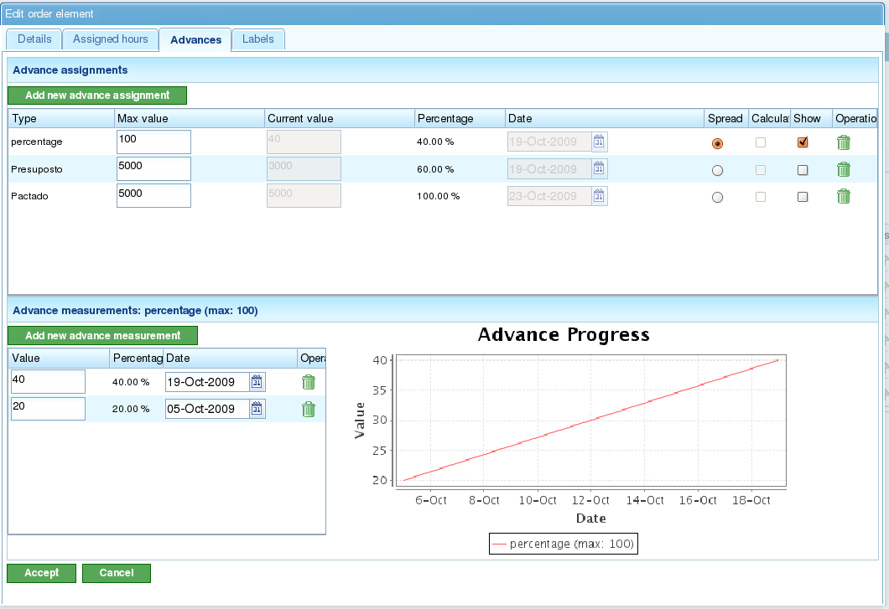

Прогресс
########

.. contents::

Прогресс проекта показывает степень выполнения оценочного времени завершения проекта. Прогресс задачи показывает степень выполнения задачи в соответствии с её оценочным сроком завершения.

Как правило, прогресс нельзя измерить автоматически. Опытный сотрудник или контрольный список должны определить степень завершения задачи или проекта.

Важно отметить разницу между часами, назначенными задаче или проекту, и прогрессом этой задачи или проекта. Хотя фактически использованное количество часов может быть больше или меньше ожидаемого, проект может быть впереди или позади оценочного завершения на контрольный день. Из этих двух измерений может возникнуть несколько ситуаций:

*   **Использовано часов меньше ожидаемого, но проект отстаёт от графика:** Прогресс ниже ожидаемого на контрольный день.
*   **Использовано часов меньше ожидаемого, и проект опережает график:** Прогресс выше ожидаемого на контрольный день.
*   **Использовано часов больше ожидаемого, и проект отстаёт от графика:** Прогресс ниже ожидаемого на контрольный день.
*   **Использовано часов больше ожидаемого, но проект опережает график:** Прогресс выше ожидаемого на контрольный день.

Представление планирования позволяет сравнивать эти ситуации, используя информацию о достигнутом прогрессе и использованных часах. В этой главе объясняется, как вводить информацию для мониторинга прогресса.

Философия мониторинга прогресса основана на том, что пользователи определяют уровень, на котором хотят отслеживать свои проекты. Например, если пользователи хотят отслеживать проекты, им нужно вводить информацию только для элементов первого уровня. Если они хотят более точного мониторинга на уровне задач, они должны вводить информацию о прогрессе на более низких уровнях. Затем система будет агрегировать данные вверх по иерархии.

Управление типами прогресса
=============================

У компаний есть различные потребности при мониторинге прогресса проекта, особенно задействованных задач. Поэтому система включает «типы прогресса». Пользователи могут определять различные типы прогресса для измерения прогресса задачи. Например, задача может измеряться в процентах, но этот процент также может быть переведён в прогресс в *тоннах* на основе соглашения с клиентом.

Тип прогресса имеет имя, максимальное значение и значение точности:

*   **Имя:** Описательное имя, которое пользователи будут узнавать при выборе типа прогресса. Это имя должно чётко указывать, какой вид прогресса измеряется.
*   **Максимальное значение:** Максимальное значение, которое может быть установлено для задачи или проекта в качестве общего измерения прогресса. Например, если вы работаете с *тоннами* и обычный максимум составляет 4000 тонн, и ни одна задача никогда не потребует более 4000 тонн какого-либо материала, то максимальным значением будет 4000.
*   **Значение точности:** Значение приращения, допустимое для типа прогресса. Например, если прогресс в *тоннах* будет измеряться целыми числами, значение точности будет равно 1. С этого момента в качестве измерений прогресса можно вводить только целые числа (например, 1, 2, 300).

Система имеет два типа прогресса по умолчанию:

*   **Процент:** Общий тип прогресса, измеряющий прогресс проекта или задачи на основе расчётного процента завершения. Например, задача выполнена на 30% из 100% ожидаемых на конкретный день.
*   **Единицы:** Общий тип прогресса, измеряющий прогресс в единицах без указания типа единицы. Например, задача включает создание 3000 единиц, и прогресс составляет 500 единиц из общего количества 3000.

.. figure:: images/tipos-avances.png
   :scale: 50

   Администрирование типов прогресса

Пользователи могут создавать новые типы прогресса следующим образом:

*   Перейдите в раздел «Администрирование».
*   Нажмите опцию «Управление типами прогресса» в меню второго уровня.
*   Система отобразит список существующих типов прогресса.
*   Для каждого типа прогресса пользователи могут:

    *   Редактировать
    *   Удалить

*   Затем пользователи могут создать новый тип прогресса.
*   При редактировании или создании типа прогресса система отображает форму со следующей информацией:

    *   Название типа прогресса.
    *   Максимальное значение, допустимое для типа прогресса.
    *   Значение точности для типа прогресса.

Ввод прогресса по типу
=======================

Прогресс вводится для элементов проекта, но его также можно ввести с помощью ярлыка из задач планирования. Пользователи несут ответственность за решение о том, какой тип прогресса связать с каждым элементом проекта.

Пользователи могут ввести один тип прогресса по умолчанию для всего проекта.

Прежде чем измерять прогресс, пользователи должны связать выбранный тип прогресса с проектом. Например, они могут выбрать прогресс в процентах для измерения прогресса по всей задаче или согласованный коэффициент прогресса, если в будущем будут вводиться измерения прогресса, согласованные с клиентом.

   Экран ввода прогресса с графической визуализацией

Для ввода измерений прогресса:

*   Выберите тип прогресса, к которому будет добавлен прогресс.
    *   Если тип прогресса не существует, необходимо создать новый.
*   В форме, появившейся под полями «Значение» и «Дата», введите абсолютное значение измерения и дату измерения.
*   Система автоматически сохраняет введённые данные.

Сравнение прогресса для элемента проекта
========================================

Пользователи могут графически сравнить достигнутый прогресс по проектам с выполненными измерениями. Все типы прогресса имеют столбец с кнопкой-флажком («Показать»). При нажатии этой кнопки для элемента проекта отображается диаграмма прогресса выполненных измерений.

.. figure:: images/contraste-avance.png
   :scale: 40

   Сравнение нескольких типов прогресса
