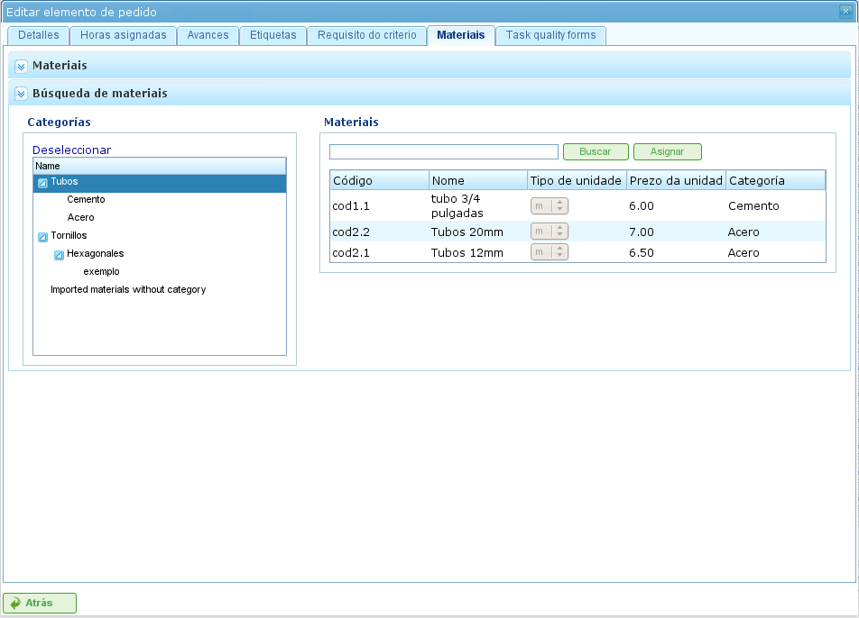

Проекты и элементы проектов
############################

.. contents::

Проекты представляют работу, которую должны выполнить пользователи программы. Каждый проект соответствует проекту, который компания предложит своим клиентам.

Проект состоит из одного или нескольких элементов проекта. Каждый элемент проекта представляет конкретную часть работы, которую необходимо выполнить, и определяет, как работа по проекту должна быть спланирована и выполнена. Элементы проекта организованы иерархически без ограничений на глубину иерархии. Эта иерархическая структура позволяет наследовать определённые функции, например, метки.

В следующих разделах описываются операции, которые пользователи могут выполнять с проектами и элементами проектов.

Проекты
=======

Проект представляет проект или работу, запрошенную клиентом у компании. Проект идентифицирует проект в рамках планирования компании. В отличие от комплексных программ управления, LibrePlan требует только определённых ключевых сведений для проекта. Эти сведения:

*   **Название проекта:** Название проекта.
*   **Код проекта:** Уникальный код для проекта.
*   **Общая сумма проекта:** Общая финансовая стоимость проекта.
*   **Предполагаемая дата начала:** Плановая дата начала проекта.
*   **Дата окончания:** Плановая дата завершения проекта.
*   **Ответственное лицо:** Физическое лицо, ответственное за проект.
*   **Описание:** Описание проекта.
*   **Назначенный календарь:** Календарь, связанный с проектом.
*   **Автоматическая генерация кодов:** Параметр для указания системе автоматически генерировать коды для элементов проекта и групп часов.
*   **Приоритет между зависимостями и ограничениями:** Пользователи могут выбрать, имеют ли зависимости или ограничения приоритет в случае конфликтов.

Однако полный проект также включает другие связанные сущности:

*   **Часы, назначенные проекту:** Общие часы, распределённые на проект.
*   **Прогресс, приписанный проекту:** Прогресс, достигнутый по проекту.
*   **Метки:** Метки, назначенные проекту.
*   **Критерии, назначенные проекту:** Критерии, связанные с проектом.
*   **Материалы:** Материалы, необходимые для проекта.
*   **Формы качества:** Формы качества, связанные с проектом.

Создание или редактирование проекта может осуществляться из нескольких мест в программе:

*   **Из «Списка проектов» в обзоре компании:**

    *   **Редактирование:** Нажмите кнопку редактирования нужного проекта.
    *   **Создание:** Нажмите «Новый проект».

*   **Из проекта на диаграмме Ганта:** Перейдите к представлению сведений о проекте.

Пользователи могут получить доступ к следующим вкладкам при редактировании проекта:

*   **Редактирование сведений о проекте:** Этот экран позволяет пользователям редактировать основные сведения о проекте:

    *   Название
    *   Код
    *   Предполагаемая дата начала
    *   Дата окончания
    *   Ответственное лицо
    *   Клиент
    *   Описание

    .. figure:: images/order-edition.png
       :scale: 50

       Редактирование проектов

*   **Список элементов проекта:** Этот экран позволяет пользователям выполнять несколько операций с элементами проекта:

    *   Создание новых элементов проекта.
    *   Повышение уровня элемента проекта на один уровень в иерархии.
    *   Понижение уровня элемента проекта на один уровень в иерархии.
    *   Добавление отступа элемента проекта (перемещение вниз по иерархии).
    *   Снятие отступа элемента проекта (перемещение вверх по иерархии).
    *   Фильтрация элементов проекта.
    *   Удаление элементов проекта.
    *   Перемещение элемента внутри иерархии путём перетаскивания.

    .. figure:: images/order-elements-list.png
       :scale: 40

       Список элементов проекта

*   **Назначенные часы:** На этом экране отображается общее количество часов, приписанных проекту, с группировкой часов, введённых в элементах проекта.

    .. figure:: images/order-assigned-hours.png
       :scale: 50

       Назначение часов, приписанных проекту, работниками

*   **Прогресс:** Этот экран позволяет пользователям назначать типы прогресса и вводить измерения прогресса для проекта. Подробнее см. в разделе «Прогресс».

*   **Метки:** Этот экран позволяет пользователям назначать метки проекту и просматривать ранее назначенные прямые и косвенные метки. Подробное описание управления метками см. в следующем разделе о редактировании элементов проекта.

    .. figure:: images/order-labels.png
       :scale: 35

       Метки проекта

*   **Критерии:** Этот экран позволяет пользователям назначать критерии, которые будут применяться ко всем задачам в рамках проекта. Эти критерии будут автоматически применяться ко всем элементам проекта, за исключением тех, которые были явно аннулированы. Также можно просматривать группы часов элементов проекта, сгруппированные по критериям, что позволяет пользователям определять критерии, необходимые для проекта.

    .. figure:: images/order-criterions.png
       :scale: 50

       Критерии проекта

*   **Материалы:** Этот экран позволяет пользователям назначать материалы проектам. Материалы можно выбирать из доступных категорий материалов в программе. Управление материалами осуществляется следующим образом:

    *   Выберите вкладку «Поиск материалов» в нижней части экрана.
    *   Введите текст для поиска материалов или выберите категории, для которых хотите найти материалы.
    *   Система фильтрует результаты.
    *   Выберите нужные материалы (несколько материалов можно выбрать, удерживая клавишу «Ctrl»).
    *   Нажмите «Назначить».
    *   Система отображает список материалов, уже назначенных проекту.
    *   Выберите единицы и статус для назначения проекту.
    *   Нажмите «Сохранить» или «Сохранить и продолжить».
    *   Для управления получением материалов нажмите «Разделить», чтобы изменить статус частичного количества материала.

    .. figure:: images/order-material.png
       :scale: 50

       Материалы, связанные с проектом

*   **Качество:** Пользователи могут назначить форму качества проекту. Эта форма затем заполняется для обеспечения выполнения определённых мероприятий, связанных с проектом. Сведения об управлении формами качества см. в следующем разделе о редактировании элементов проекта.

    .. figure:: images/order-quality.png
       :scale: 50

       Форма качества, связанная с проектом

Редактирование элементов проекта
=================================

Элементы проекта редактируются на вкладке «Список элементов проекта» путём нажатия значка редактирования. Это открывает новый экран, где пользователи могут:

*   Редактировать информацию об элементе проекта.
*   Просматривать часы, приписанные элементам проекта.
*   Управлять прогрессом элементов проекта.
*   Управлять метками проекта.
*   Управлять критериями, необходимыми для элемента проекта.
*   Управлять материалами.
*   Управлять формами качества.

В следующих подразделах подробно описывается каждая из этих операций.

Редактирование информации об элементе проекта
---------------------------------------------

Редактирование информации об элементе проекта включает изменение следующих сведений:

*   **Название элемента проекта:** Название элемента проекта.
*   **Код элемента проекта:** Уникальный код для элемента проекта.
*   **Дата начала:** Плановая дата начала элемента проекта.
*   **Предполагаемая дата окончания:** Плановая дата завершения элемента проекта.
*   **Всего часов:** Общее количество часов, распределённых на элемент проекта. Эти часы могут быть рассчитаны из добавленных групп часов или введены непосредственно. При прямом вводе часы должны быть распределены между группами часов, и должна быть создана новая группа часов, если процентное соотношение не совпадает с начальным.
*   **Группы часов:** К элементу проекта можно добавить одну или несколько групп часов. **Цель этих групп часов** — определить требования к ресурсам, которые будут назначены для выполнения работы.
*   **Критерии:** Можно добавить критерии, которые должны быть выполнены для включения общего назначения для элемента проекта.

.. figure:: images/order-element-edition.png
   :scale: 50

   Редактирование элементов проекта

Просмотр часов, приписанных элементам проекта
---------------------------------------------

Вкладка «Назначенные часы» позволяет пользователям просматривать рабочие отчёты, связанные с элементом проекта, и видеть, сколько из запланированных часов уже выполнено.

.. figure:: images/order-element-hours.png
   :scale: 50

   Часы, назначенные элементам проекта

Экран разделён на две части:

*   **Список рабочих отчётов:** Пользователи могут просматривать список рабочих отчётов, связанных с элементом проекта, включая дату и время, ресурс и количество часов, посвящённых задаче.
*   **Использование расчётных часов:** Система вычисляет общее количество часов, посвящённых задаче, и сравнивает их с расчётными часами.

Управление прогрессом элементов проекта
---------------------------------------

Ввод типов прогресса и управление прогрессом элементов проекта описаны в главе «Прогресс».

Управление метками проекта
--------------------------

Метки, как описано в главе о метках, позволяют пользователям категоризировать элементы проекта. Это позволяет пользователям группировать информацию о планировании или проекте на основе этих меток.

Пользователи могут назначать метки непосредственно элементу проекта или элементу проекта более высокого уровня в иерархии. После назначения метки любым из этих методов элемент проекта и связанная задача планирования ассоциируются с меткой и могут использоваться для последующей фильтрации.

.. figure:: images/order-element-tags.png
   :scale: 50

   Назначение меток для элементов проекта

Как показано на изображении, пользователи могут выполнять следующие действия на вкладке **Метки**:

*   **Просматривать унаследованные метки:** Просматривать метки, связанные с элементом проекта, унаследованные от элемента проекта более высокого уровня. Задача планирования, связанная с каждым элементом проекта, имеет те же связанные метки.
*   **Просматривать непосредственно назначенные метки:** Просматривать метки, непосредственно связанные с элементом проекта, с использованием формы назначения для меток нижнего уровня.
*   **Назначать существующие метки:** Назначать метки, ища их среди доступных меток в форме ниже списка прямых меток. Для поиска метки нажмите значок лупы или введите первые буквы метки в текстовое поле для отображения доступных вариантов.
*   **Создавать и назначать новые метки:** Создавать новые метки, связанные с существующим типом метки, из этой формы. Для этого выберите тип метки и введите значение метки для выбранного типа. Система автоматически создаёт метку и назначает её элементу проекта при нажатии «Создать и назначить».

Управление критериями, необходимыми для элемента проекта, и группами часов
--------------------------------------------------------------------------

Как проекту, так и элементу проекта могут быть назначены критерии, которые должны быть выполнены для осуществления работы. Критерии могут быть прямыми или косвенными:

*   **Прямые критерии:** Они назначаются непосредственно элементу проекта. Это критерии, необходимые для групп часов элемента проекта.
*   **Косвенные критерии:** Они назначаются элементам проекта более высокого уровня в иерархии и наследуются редактируемым элементом.

В дополнение к необходимым критериям можно определить одну или несколько групп часов, являющихся частью элемента проекта. Это зависит от того, содержит ли элемент проекта другие элементы проекта в качестве дочерних узлов или является ли он листовым узлом. В первом случае можно только просматривать информацию о часах и группах часов. Однако листовые узлы можно редактировать. Листовые узлы работают следующим образом:

*   Система создаёт группу часов по умолчанию, связанную с элементом проекта. Детали, которые можно изменить для группы часов:

    *   **Код:** Код для группы часов (если не генерируется автоматически).
    *   **Тип критерия:** Пользователи могут выбрать назначение машинного или рабочего критерия.
    *   **Количество часов:** Количество часов в группе часов.
    *   **Список критериев:** Критерии, применяемые к группе часов. Для добавления новых критериев нажмите «Добавить критерий» и выберите один из поисковика, появляющегося после нажатия кнопки.

*   Пользователи могут добавлять новые группы часов с другими характеристиками, чем предыдущие. Например, элемент проекта может требовать сварщика (30 часов) и маляра (40 часов).

.. figure:: images/order-element-criterion.png
   :scale: 50

   Назначение критериев элементам проекта

Управление материалами
-----------------------

Материалами в проектах управляют как списком, связанным с каждым элементом проекта или проектом в целом. Список материалов включает следующие поля:

*   **Код:** Код материала.
*   **Дата:** Дата, связанная с материалом.
*   **Единицы:** Необходимое количество единиц.
*   **Тип единицы:** Тип единицы измерения материала.
*   **Цена за единицу:** Цена за единицу.
*   **Общая цена:** Общая цена (рассчитывается путём умножения цены за единицу на количество единиц).
*   **Категория:** Категория, к которой относится материал.
*   **Статус:** Статус материала (например, «Получен», «Запрошен», «В ожидании», «В обработке», «Отменён»).

Работа с материалами осуществляется следующим образом:

*   Выберите вкладку «Материалы» для элемента проекта.
*   Система отображает две подвкладки: «Материалы» и «Поиск материалов».
*   Если элементу проекта не назначены материалы, первая вкладка будет пустой.
*   Нажмите «Поиск материалов» в нижней левой части окна.
*   Система отображает список доступных категорий и связанных материалов.

   Поиск материалов

*   Выберите категории для уточнения поиска материалов.
*   Система отображает материалы, принадлежащие к выбранным категориям.
*   Из списка материалов выберите материалы для назначения элементу проекта.
*   Нажмите «Назначить».
*   Система отображает выбранный список материалов на вкладке «Материалы» с новыми полями для заполнения.

.. figure:: images/order-element-material-assign.png
   :scale: 50

   Назначение материалов элементам проекта

*   Выберите единицы, статус и дату для назначенных материалов.

Для последующего мониторинга материалов можно изменить статус группы единиц полученного материала. Это делается следующим образом:

*   Нажмите кнопку «Разделить» в списке материалов справа от каждой строки.
*   Выберите количество единиц, на которое нужно разделить строку.
*   Программа отображает две строки с разделённым материалом.
*   Измените статус строки, содержащей материал.

Преимущество использования этого инструмента разделения — возможность получать частичные поставки материала без необходимости ждать всей поставки для отметки её как полученной.

Управление формами качества
-----------------------------

Некоторые элементы проекта требуют сертификации того, что определённые задачи были выполнены, прежде чем они могут быть отмечены как завершённые. Вот почему в программе есть формы качества, состоящие из списка вопросов, которые считаются важными при положительном ответе на них.

Важно отметить, что форма качества должна быть создана заранее, чтобы её можно было назначить элементу проекта.

Для управления формами качества:

*   Перейдите на вкладку «Формы качества».

    .. figure:: images/order-element-quality.png
       :scale: 50

       Назначение форм качества элементам проекта

*   В программе есть поисковик форм качества. Существует два типа форм качества: по элементу или по проценту.

    *   **Элемент:** Каждый элемент независим.
    *   **Процент:** Каждый вопрос увеличивает прогресс элемента проекта на процент. Проценты должны складываться до 100%.

*   Выберите одну из форм, созданных в интерфейсе администрирования, и нажмите «Назначить».
*   Программа назначает выбранную форму из списка форм, назначенных элементу проекта.
*   Нажмите кнопку «Редактировать» на элементе проекта.
*   Программа отображает вопросы из формы качества в нижнем списке.
*   Отметьте выполненные вопросы как достигнутые.

    *   Если форма качества основана на процентах, вопросы отвечаются по порядку.
    *   Если форма качества основана на элементах, вопросы можно отвечать в любом порядке.
