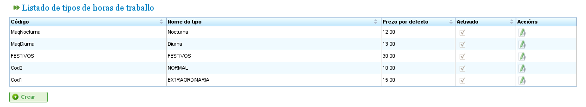

Управление затратами
####################

.. _costes:
.. contents::

Затраты
=======

Управление затратами позволяет пользователям оценивать стоимость ресурсов, используемых в проекте. Для управления затратами необходимо определить следующие сущности:

*   **Типы часов:** Указывают типы отработанных часов ресурса. Пользователи могут определять типы часов как для машин, так и для работников. Примеры типов часов: «Дополнительные часы по €20 в час». Для типов часов можно определить следующие поля:

    *   **Код:** Внешний код для типа часов.
    *   **Название:** Название типа часов. Например, «Дополнительные».
    *   **Ставка по умолчанию:** Базовая ставка по умолчанию для типа часов.
    *   **Активация:** Указывает, является ли тип часов активным.

*   **Категории затрат:** Категории затрат определяют стоимость, связанную с различными типами часов в течение определённых периодов (которые могут быть бессрочными). Например, стоимость дополнительных часов для квалифицированных работников первого разряда в следующем году составляет €24 в час. Категории затрат включают:

    *   **Название:** Название категории затрат.
    *   **Активация:** Указывает, является ли категория активной.
    *   **Список типов часов:** Этот список определяет типы часов, включённые в категорию затрат. В нём указываются периоды и ставки для каждого типа часов. Например, по мере изменения ставок каждый год может быть включён в этот список как период типа часов с конкретной почасовой ставкой для каждого типа часов (которая может отличаться от ставки по умолчанию для данного типа часов).

Управление типами часов
-----------------------

Для регистрации типов часов необходимо выполнить следующие шаги:

*   Выберите «Управление отработанными типами часов» в меню «Администрирование».
*   Программа отображает список существующих типов часов.

   Список типов часов

*   Нажмите «Редактировать» или «Создать».
*   Программа отображает форму редактирования типа часов.

.. figure:: images/hour-type-edit.png
   :scale: 50

   Редактирование типов часов

*   Пользователи могут вводить или изменять:

    *   Название типа часов.
    *   Код типа часов.
    *   Ставку по умолчанию.
    *   Активацию/деактивацию типа часов.

*   Нажмите «Сохранить» или «Сохранить и продолжить».

Категории затрат
----------------

Для регистрации категорий затрат необходимо выполнить следующие шаги:

*   Выберите «Управление категориями затрат» в меню «Администрирование».
*   Программа отображает список существующих категорий.

.. figure:: images/category-cost-list.png
   :scale: 50

   Список категорий затрат

*   Нажмите кнопку «Редактировать» или «Создать».
*   Программа отображает форму редактирования категории затрат.

.. figure:: images/category-cost-edit.png
   :scale: 50

   Редактирование категорий затрат

*   Пользователи вводят или изменяют:

    *   Название категории затрат.
    *   Активацию/деактивацию категории затрат.
    *   Список типов часов, включённых в категорию. Все типы часов имеют следующие поля:

        *   **Тип часов:** Выберите один из существующих в системе типов часов. Если ни одного нет, необходимо создать тип часов (этот процесс описан в предыдущем подразделе).
        *   **Дата начала и окончания:** Дата начала и окончания (последняя необязательна) периода, применимого к категории затрат.
        *   **Почасовая ставка:** Почасовая ставка для данной конкретной категории.

*   Нажмите «Сохранить» или «Сохранить и продолжить».

Назначение категорий затрат ресурсам описано в главе о ресурсах. Перейдите в раздел «Ресурсы».
