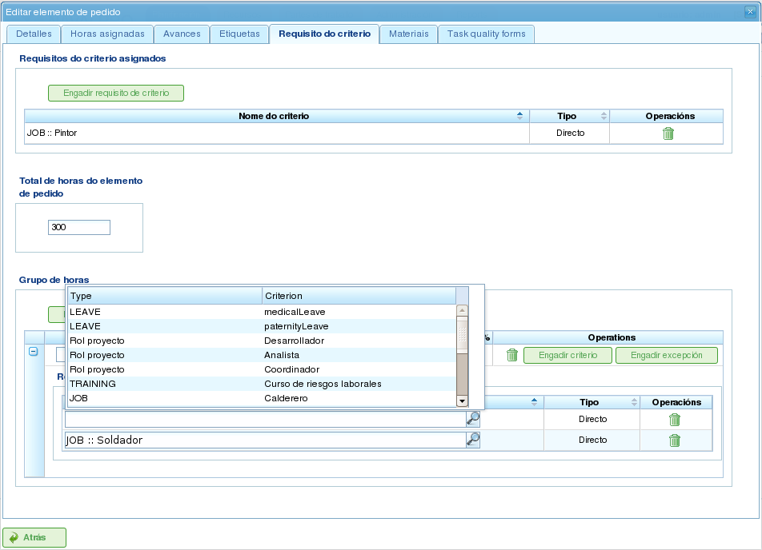

Projekt och projektelement
##########################

.. contents::

Projekt representerar det arbete som ska utföras av programmets användare. Varje projekt motsvarar ett projekt som företaget kommer att erbjuda sina klienter.

Ett projekt består av ett eller flera projektelement. Varje projektelement representerar en specifik del av det arbete som ska utföras och definierar hur arbetet med projektet ska planeras och utföras. Projektelement är organiserade hierarkiskt, utan begränsningar på hierarkins djup. Denna hierarkiska struktur möjliggör arv av vissa funktioner, till exempel etiketter.

Följande avsnitt beskriver de operationer som användare kan utföra med projekt och projektelement.

Projekt
=======

En projekt representerar ett projekt eller arbete som begärs av en klient från företaget. Projekten identifierar projektet inom företagets planering. Till skillnad från heltäckande hanteringsprogram kräver LibrePlan bara vissa nyckeluppgifter för en projekt. Dessa uppgifter är:

*   **Projektsnamn:** Projektens namn.
*   **Projektskod:** En unik kod för projekten.
*   **Totalt projektsbelopp:** Det totala finansiella värdet på projekten.
*   **Beräknat startdatum:** Det planerade startdatumet för projekten.
*   **Slutdatum:** Det planerade slutförandedatumet för projekten.
*   **Ansvarig person:** Den person som ansvarar för projekten.
*   **Beskrivning:** En beskrivning av projekten.
*   **Tilldelad kalender:** Den kalender som är associerad med projekten.
*   **Automatisk generering av koder:** En inställning för att instruera systemet att automatiskt generera koder för projektelement och timgrupper.
*   **Preferens mellan beroenden och begränsningar:** Användare kan välja om beroenden eller begränsningar har prioritet vid konflikter.

En komplett projekt innehåller dock också andra associerade entiteter:

*   **Timmar tilldelade projekten:** De totala timmar som tilldelats projekten.
*   **Framsteg attribuerade till projekten:** De framsteg som gjorts på projekten.
*   **Etiketter:** Etiketter tilldelade projekten.
*   **Kriterier tilldelade projekten:** Kriterier associerade med projekten.
*   **Material:** Material som krävs för projekten.
*   **Kvalitetsformulär:** Kvalitetsformulär associerade med projekten.

Att skapa eller redigera en projekt kan göras från flera platser i programmet:

*   **Från "Projektslistan" i företagsöversikten:**

    *   **Redigering:** Klicka på redigeringsknappen för önskad projekt.
    *   **Skapande:** Klicka på "Ny projekt."

*   **Från en projekt i Gantt-diagrammet:** Byt till detaljvyn för projekten.

Användare kan komma åt följande flikar när de redigerar en projekt:

*   **Redigering av projektsuppgifter:** Den här skärmen låter användare redigera grundläggande projektsuppgifter:

    *   Namn
    *   Kod
    *   Beräknat startdatum
    *   Slutdatum
    *   Ansvarig person
    *   Klient
    *   Beskrivning

    .. figure:: images/order-edition.png
       :scale: 50

       Redigera projekt

*   **Lista över projektelement:** Den här skärmen låter användare utföra flera operationer på projektelement:

    *   Skapa nya projektelement.
    *   Flytta upp ett projektelement en nivå i hierarkin.
    *   Flytta ned ett projektelement en nivå i hierarkin.
    *   Indraga ett projektelement (flytta det nedåt i hierarkin).
    *   Ta bort indrag för ett projektelement (flytta det uppåt i hierarkin).
    *   Filtrera projektelement.
    *   Ta bort projektelement.
    *   Flytta ett element inom hierarkin genom att dra och släppa.

    .. figure:: images/order-elements-list.png
       :scale: 40

       Lista över projektelement

*   **Tilldelade timmar:** Den här skärmen visar det totala antal timmar som attribuerats till projektet och grupperar de timmar som angetts i projektelementen.

    .. figure:: images/order-assigned-hours.png
       :scale: 50

       Tilldela timmar attribuerade till projekten av medarbetare

*   **Framsteg:** Den här skärmen låter användare tilldela framstegstyper och ange framstegsmätningar för projekten. Se avsnittet "Framsteg" för mer information.

*   **Etiketter:** Den här skärmen låter användare tilldela etiketter till en projekt och visa tidigare tilldelade direkta och indirekta etiketter. Se följande avsnitt om redigering av projektelement för en detaljerad beskrivning av etiketthantering.

    .. figure:: images/order-labels.png
       :scale: 35

       Projektsetiketter

*   **Kriterier:** Den här skärmen låter användare tilldela kriterier som gäller för alla uppgifter inom projekten. Dessa kriterier tillämpas automatiskt på alla projektelement, utom de som uttryckligen har ogiltigförklarats. Timgrupperna för projektelement, som är grupperade efter kriterier, kan också visas, vilket gör att användare kan identifiera de kriterier som krävs för en projekt.

    .. figure:: images/order-criterions.png
       :scale: 50

       Projektskriterier

*   **Material:** Den här skärmen låter användare tilldela material till projekt. Material kan väljas från de tillgängliga materialkategorierna i programmet. Material hanteras på följande sätt:

    *   Välj fliken "Sök material" längst ned på skärmen.
    *   Ange text för att söka efter material eller välj de kategorier för vilka du vill hitta material.
    *   Systemet filtrerar resultaten.
    *   Välj önskat material (flera material kan väljas genom att hålla ned "Ctrl"-tangenten).
    *   Klicka på "Tilldela."
    *   Systemet visar listan över material som redan tilldelats projekten.
    *   Välj de enheter och den status som ska tilldelas projekten.
    *   Klicka på "Spara" eller "Spara och fortsätt."
    *   För att hantera mottagning av material, klicka på "Dela" för att ändra status på en partiell mängd material.

    .. figure:: images/order-material.png
       :scale: 50

       Material associerade med en projekt

*   **Kvalitet:** Användare kan tilldela ett kvalitetsformulär till projekten. Det här formuläret fylls sedan i för att säkerställa att vissa aktiviteter associerade med projekten utförs. Se följande avsnitt om redigering av projektelement för detaljer om hantering av kvalitetsformulär.

    .. figure:: images/order-quality.png
       :scale: 50

       Kvalitetsformulär associerat med projekten

Redigera projektelement
=============================

Projektelement redigeras från fliken "Lista över projektelement" genom att klicka på redigeringsikonen. Detta öppnar en ny skärm där användare kan:

*   Redigera information om projektelementet.
*   Visa timmar attribuerade till projektelement.
*   Hantera framsteg för projektelement.
*   Hantera projektsetiketter.
*   Hantera kriterier som krävs av projektelementet.
*   Hantera material.
*   Hantera kvalitetsformulär.

Följande underavsnitt beskriver var och en av dessa operationer i detalj.

Redigera information om projektelementet
----------------------------------------------

Redigering av information om projektelementet inkluderar att ändra följande uppgifter:

*   **Projektelementets namn:** Projektelementets namn.
*   **Projektelementets kod:** En unik kod för projektelementet.
*   **Startdatum:** Det planerade startdatumet för projektelementet.
*   **Beräknat slutdatum:** Det planerade slutförandedatumet för projektelementet.
*   **Totala timmar:** Det totala antal timmar som tilldelats projektelementet. Dessa timmar kan beräknas från de tillagda timgrupperna eller anges direkt. Om de anges direkt måste timmarna fördelas mellan timgrupperna, och en ny timgrupp måste skapas om procentsatserna inte stämmer överens med de ursprungliga procentsatserna.
*   **Timgrupper:** En eller flera timgrupper kan läggas till projektelementet. **Syftet med dessa timgrupper** är att definiera kraven på de resurser som ska tilldelas för att utföra arbetet.
*   **Kriterier:** Kriterier kan läggas till som måste uppfyllas för att möjliggöra generisk tilldelning för projektelementet.

.. figure:: images/order-element-edition.png
   :scale: 50

   Redigera projektelement

Visa timmar attribuerade till projektelement
--------------------------------------------------

Fliken "Tilldelade timmar" låter användare visa de arbetsrapporter som är associerade med ett projektelement och se hur många av de uppskattade timmarna som redan har slutförts.

.. figure:: images/order-element-hours.png
   :scale: 50

   Timmar tilldelade till projektelement

Skärmen är uppdelad i två delar:

*   **Lista över arbetsrapporter:** Användare kan visa listan över arbetsrapporter som är associerade med projektelementet, inklusive datum och tid, resurs och antal timmar som ägnas åt uppgiften.
*   **Användning av uppskattade timmar:** Systemet beräknar det totala antal timmar som ägnas åt uppgiften och jämför dem med de uppskattade timmarna.

Hantera framsteg för projektelement
-----------------------------------------

Att ange framstegstyper och hantera framsteg för projektelement beskrivs i kapitlet "Framsteg".

Hantera projektsetiketter
------------------------------

Etiketter, enligt beskrivningen i kapitlet om etiketter, låter användare kategorisera projektelement. Detta gör det möjligt för användare att gruppera planerings- eller projektsinformation baserat på dessa etiketter.

Användare kan tilldela etiketter direkt till ett projektelement eller till ett projektelement på högre nivå i hierarkin. När en etikett har tilldelats med någon av dessa metoder associeras projektelementet och den relaterade planeringsuppgiften med etiketten och kan användas för efterföljande filtrering.

.. figure:: images/order-element-tags.png
   :scale: 50

   Tilldela etiketter för projektelement

Som visas i bilden kan användare utföra följande åtgärder från fliken **Etiketter**:

*   **Visa ärvda etiketter:** Visa etiketter associerade med projektelementet som ärvts från ett projektelement på högre nivå. Planeringsuppgiften associerad med varje projektelement har samma associerade etiketter.
*   **Visa direkt tilldelade etiketter:** Visa etiketter direkt associerade med projektelementet med hjälp av tilldelningsformuläret för etiketter på lägre nivå.
*   **Tilldela befintliga etiketter:** Tilldela etiketter genom att söka efter dem bland de tillgängliga etiketterna i formuläret nedanför listan med direkta etiketter. Klicka på förstoringsglasets ikon för att söka efter en etikett eller ange de första bokstäverna i etiketten i textrutan för att visa tillgängliga alternativ.
*   **Skapa och tilldela nya etiketter:** Skapa nya etiketter associerade med en befintlig etikettyp från det här formuläret. För att göra detta, välj en etikettyp och ange etikettvärdet för den valda typen. Systemet skapar automatiskt etiketten och tilldelar den till projektelementet när "Skapa och tilldela" klickas.

Hantera kriterier som krävs av projektelementet och timgrupper
--------------------------------------------------------------------

Både en projekt och ett projektelement kan ha kriterier tilldelade som måste uppfyllas för att arbetet ska kunna utföras. Kriterier kan vara direkta eller indirekta:

*   **Direkta kriterier:** Dessa tilldelas direkt till projektelementet. De är kriterier som krävs av timgrupperna på projektelementet.
*   **Indirekta kriterier:** Dessa tilldelas projektelement på högre nivå i hierarkin och ärvs av det element som redigeras.

Utöver de nödvändiga kriterierna kan en eller flera timgrupper som är en del av projektelementet definieras. Detta beror på om projektelementet innehåller andra projektelement som underordnade noder eller om det är en lövnod. I det första fallet kan information om timmar och timgrupper bara visas. Lövnoder kan dock redigeras. Lövnoder fungerar på följande sätt:

*   Systemet skapar en standardtimgrupp associerad med projektelementet. De detaljer som kan ändras för en timgrupp är:

    *   **Kod:** Koden för timgruppen (om den inte genereras automatiskt).
    *   **Kriterietyp:** Användare kan välja att tilldela ett maskin- eller medarbetarkriterium.
    *   **Antal timmar:** Antalet timmar i timgruppen.
    *   **Lista över kriterier:** De kriterier som ska tillämpas på timgruppen. För att lägga till nya kriterier, klicka på "Lägg till kriterium" och välj ett från sökmotorn som visas efter att knappen klickats.

*   Användare kan lägga till nya timgrupper med andra funktioner än tidigare timgrupper. Till exempel kan ett projektelement kräva en svetsare (30 timmar) och en målare (40 timmar).

   Tilldela kriterier till projektelement

Hantera material
-----------------

Material hanteras i projekt som en lista associerad med varje projektelement eller en projekt i allmänhet. Listan över material innehåller följande fält:

*   **Kod:** Materialkoden.
*   **Datum:** Det datum som är associerat med materialet.
*   **Enheter:** Det nödvändiga antalet enheter.
*   **Enhetstyp:** Den typ av enhet som används för att mäta materialet.
*   **Enhetspris:** Priset per enhet.
*   **Totalpris:** Det totala priset (beräknat genom att multiplicera enhetspriset med antalet enheter).
*   **Kategori:** Den kategori som materialet tillhör.
*   **Status:** Materialets status (t.ex. Mottaget, Begärt, Väntande, Bearbetning, Annullerat).

Att arbeta med material görs på följande sätt:

*   Välj fliken "Material" på ett projektelement.
*   Systemet visar två underflikar: "Material" och "Sök material."
*   Om projektelementet saknar tilldelat material kommer den första fliken att vara tom.
*   Klicka på "Sök material" i fönstrets nedre vänstra del.
*   Systemet visar listan över tillgängliga kategorier och associerat material.

.. figure:: images/order-element-material-search.png
   :scale: 50

   Söka efter material

*   Välj kategorier för att förfina materialsökningen.
*   Systemet visar de material som tillhör de valda kategorierna.
*   Från materiallistan, välj de material som ska tilldelas projektelementet.
*   Klicka på "Tilldela."
*   Systemet visar den valda listan över material på fliken "Material" med nya fält att fylla i.

.. figure:: images/order-element-material-assign.png
   :scale: 50

   Tilldela material till projektelement

*   Välj enheter, status och datum för de tilldelade materialen.

För efterföljande övervakning av material är det möjligt att ändra status för en grupp enheter av det mottagna materialet. Detta görs på följande sätt:

*   Klicka på knappen "Dela" i materiallistan till höger om varje rad.
*   Välj antalet enheter att dela raden i.
*   Programmet visar två rader med det delade materialet.
*   Ändra status för raden som innehåller materialet.

Fördelen med att använda det här delningsverktyget är möjligheten att ta emot delleveranser av material utan att behöva vänta på hela leveransen för att markera den som mottagen.

Hantera kvalitetsformulär
--------------------------

Vissa projektelement kräver certifiering av att vissa uppgifter har slutförts innan de kan markeras som slutförda. Det är därför programmet har kvalitetsformulär, som består av en lista med frågor som anses viktiga om de besvaras positivt.

Det är viktigt att notera att ett kvalitetsformulär måste skapas i förväg för att kunna tilldelas ett projektelement.

För att hantera kvalitetsformulär:

*   Gå till fliken "Kvalitetsformulär".

    .. figure:: images/order-element-quality.png
       :scale: 50

       Tilldela kvalitetsformulär till projektelement

*   Programmet har en sökmotor för kvalitetsformulär. Det finns två typer av kvalitetsformulär: per element eller per procent.

    *   **Element:** Varje element är oberoende.
    *   **Procent:** Varje fråga ökar projektelementets framsteg med en procentandel. Procentandelarna måste kunna summeras till 100%.

*   Välj ett av formulären som skapats i administrationsgränssnittet och klicka på "Tilldela."
*   Programmet tilldelar det valda formuläret från listan med formulär tilldelade till projektelementet.
*   Klicka på knappen "Redigera" på projektelementet.
*   Programmet visar frågorna från kvalitetsformuläret i den nedre listan.
*   Markera de frågor som har slutförts som uppnådda.

    *   Om kvalitetsformuläret är baserat på procentsatser besvaras frågorna i ordning.
    *   Om kvalitetsformuläret är baserat på element kan frågorna besvaras i valfri ordning.
