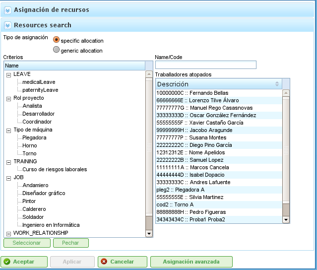

Resurstilldelning
#################

.. _asigacion_:
.. contents::

Resurstilldelning är en av programmets viktigaste funktioner och kan utföras på två olika sätt:

*   Specifik tilldelning
*   Generisk tilldelning

Båda typerna av tilldelning förklaras i följande avsnitt.

För att utföra någon typ av resurstilldelning krävs följande steg:

*   Gå till planeringsvy för ett projekt.
*   Högerklicka på uppgiften som ska planeras.

.. figure:: images/resource-assignment-planning.png
   :scale: 50

   Meny för resurstilldelning

*   Programmet visar en skärm med följande information:

    *   **Lista med kriterier som ska uppfyllas:** För varje timgrupp visas en lista med obligatoriska kriterier.
    *   **Uppgiftsinformation:** Uppgiftens start- och slutdatum.
    *   **Typ av beräkning:** Systemet låter användare välja strategi för att beräkna tilldelningar:

        *   **Beräkna antal timmar:** Beräknar det antal timmar som krävs av tilldelade resurser, givet ett slutdatum och ett antal resurser per dag.
        *   **Beräkna slutdatum:** Beräknar uppgiftens slutdatum baserat på antalet tilldelade resurser och det totala antalet timmar som krävs för att slutföra uppgiften.
        *   **Beräkna antal resurser:** Beräknar antalet resurser som krävs för att slutföra uppgiften vid ett visst datum, givet ett känt antal timmar per resurs.
    *   **Rekommenderad tilldelning:** Det här alternativet låter programmet samla in kriterierna och det totala antalet timmar från alla timgrupper och sedan rekommendera en generisk tilldelning. Om en tidigare tilldelning finns raderar systemet den och ersätter den med den nya.
    *   **Tilldelningar:** En lista med tilldelningar som har gjorts. Listan visar de generiska tilldelningarna (numret är listan med uppfyllda kriterier, samt antal timmar och resurser per dag). Varje tilldelning kan explicit tas bort genom att klicka på raderingsknappen.

.. figure:: images/resource-assignment.png
   :scale: 50

   Resurstilldelning

*   Användare väljer "Sök resurser."
*   Programmet visar en ny skärm bestående av ett kriterieträd och en lista med arbetstagare som uppfyller de valda kriterierna till höger:

   Sökning vid resurstilldelning

*   Användare kan välja:

    *   **Specifik tilldelning:** Se avsnittet "Specifik tilldelning" för information om det här alternativet.
    *   **Generisk tilldelning:** Se avsnittet "Generisk tilldelning" för information om det här alternativet.

*   Användare väljer en lista med kriterier (generisk) eller en lista med arbetstagare (specifik). Flera val kan göras genom att hålla ned "Ctrl"-tangenten och klicka på varje arbetstagare/kriterium.
*   Användare klickar sedan på knappen "Välj". Det är viktigt att komma ihåg att om en generisk tilldelning inte är vald måste användare välja en arbetstagare eller maskin för att utföra tilldelningen. Om en generisk tilldelning är vald räcker det att användare väljer ett eller flera kriterier.
*   Programmet visar sedan de valda kriterierna eller resurslistan i tilldelningslistan på den ursprungliga skärmen för resurstilldelning.
*   Användare måste välja timmar eller resurser per dag, beroende på vilken tilldelningsmetod som används i programmet.

Specifik tilldelning
====================

Detta är den specifika tilldelningen av en resurs till en projektuppgift. Med andra ord bestämmer användaren vilken specifik arbetstagare (med för- och efternamn) eller maskin som måste tilldelas en uppgift.

Specifik tilldelning kan utföras på den skärm som visas på den här bilden:

.. figure:: images/asignacion-especifica.png
   :scale: 50

   Specifik resurstilldelning

När en resurs tilldelas specifikt skapar programmet dagliga tilldelningar baserade på den valda procentandelen dagligt tilldelade resurser, efter att ha jämfört med den tillgängliga resurskalendern. Till exempel innebär en tilldelning på 0,5 resurser för en 32-timmarsuppgift att 4 timmar per dag tilldelas den specifika resursen för att slutföra uppgiften (förutsatt en arbetskalender på 8 timmar per dag).

Specifik maskintilldelning
--------------------------

Specifik maskintilldelning fungerar på samma sätt som arbetstilldelning. När en maskin tilldelas en uppgift lagrar systemet en specifik tilldelning av timmar för den valda maskinen. Den viktigaste skillnaden är att systemet söker i listan över tilldelade arbetstagare eller kriterier när maskinen tilldelas:

*   Om maskinen har en lista med tilldelade arbetstagare väljer programmet bland dem som maskinen kräver, baserat på den tilldelade kalendern. Till exempel, om maskinkalendern är 16 timmar per dag och resurskalendern är 8 timmar, tilldelas två resurser från listan med tillgängliga resurser.
*   Om maskinen har ett eller flera tilldelade kriterier görs generiska tilldelningar från de resurser som uppfyller de kriterier som tilldelats maskinen.

Generisk tilldelning
====================

Generisk tilldelning sker när användare inte väljer resurser specifikt utan överlåter beslutet till programmet, som fördelar belastningarna bland företagets tillgängliga resurser.

.. figure:: images/asignacion-xenerica.png
   :scale: 50

   Generisk resurstilldelning

Tilldelningssystemet använder följande antaganden som grund:

*   Uppgifter har kriterier som krävs av resurser.
*   Resurser är konfigurerade för att uppfylla kriterier.

Systemet misslyckas dock inte när kriterier inte har tilldelats, utan när alla resurser uppfyller icke-kravet på kriterier.

Den generiska tilldelningsalgoritmen fungerar enligt följande:

*   Alla resurser och dagar behandlas som behållare där dagliga timtilldelningar passar, baserat på den maximala tilldelningskapaciteten i uppgiftskalendern.
*   Systemet söker efter de resurser som uppfyller kriteriet.
*   Systemet analyserar vilka tilldelningar som för närvarande har olika resurser som uppfyller kriterier.
*   Resurser som uppfyller kriterierna väljs bland dem som har tillräcklig tillgänglighet.
*   Om friare resurser inte är tillgängliga görs tilldelningar till de resurser som har mindre tillgänglighet.
*   Övertilldelning av resurser börjar bara när alla resurser som uppfyller respektive kriterier är 100% tilldelade, tills den totala mängden som krävs för att utföra uppgiften uppnås.

Generisk maskintilldelning
--------------------------

Generisk maskintilldelning fungerar på samma sätt som arbetstilldelning. Till exempel, när en maskin tilldelas en uppgift, lagrar systemet en generisk tilldelning av timmar för alla maskiner som uppfyller kriterierna, enligt beskrivningen för resurser i allmänhet. Dessutom utför systemet följande procedur för maskiner:

*   För alla maskiner som valts för generisk tilldelning:

    *   Den samlar in maskinens konfigurationsinformation: alpha-värde, tilldelade arbetstagare och kriterier.
    *   Om maskinen har en tilldelad lista med arbetstagare väljer programmet det antal som maskinen kräver, beroende på den tilldelade kalendern. Till exempel, om maskinkalendern är 16 timmar per dag och resurskalendern är 8 timmar, tilldelar programmet två resurser från listan med tillgängliga resurser.
    *   Om maskinen har ett eller flera tilldelade kriterier gör programmet generiska tilldelningar från de resurser som uppfyller de kriterier som tilldelats maskinen.

Avancerad tilldelning
=====================

Avancerade tilldelningar låter användare utforma tilldelningar som automatiskt utförs av applikationen för att anpassa dem. Den här proceduren låter användare manuellt välja de dagliga timmar som ägnas av resurser till tilldelade uppgifter eller definiera en funktion som tillämpas på tilldelningen.

Stegen för att hantera avancerade tilldelningar är:

*   Gå till fönstret för avancerad tilldelning. Det finns två sätt att komma åt avancerade tilldelningar:

    *   Gå till ett specifikt projekt och ändra vyn till avancerad tilldelning. I det här fallet visas alla uppgifter i projektet och tilldelade resurser (specifika och generiska).
    *   Gå till fönstret för resurstilldelning genom att klicka på knappen "Avancerad tilldelning". I det här fallet visas de tilldelningar som visar resurser (generiska och specifika) som tilldelats en uppgift.

.. figure:: images/advance-assignment.png
   :scale: 45

   Avancerad resurstilldelning

*   Användare kan välja önskad zoomnivå:

    *   **Zoomnivåer större än en dag:** Om användare ändrar det tilldelade timvärdet till en vecka, månad, fyra månader eller sex månader, fördelar systemet timmarna linjärt över alla dagar under den valda perioden.
    *   **Daglig zoom:** Om användare ändrar det tilldelade timvärdet till en dag gäller dessa timmar bara den dagen. Följaktligen kan användare bestämma hur många timmar de vill tilldela per dag till uppgiftsresurser.

*   Användare kan välja att utforma en avancerad tilldelningsfunktion. För att göra det måste användare:

    *   Välja funktionen från urvalslistan som visas bredvid varje resurs och klicka på "Konfigurera."
    *   Systemet visar ett nytt fönster om den valda funktionen behöver konfigureras specifikt. Funktioner som stöds:

        *   **Segment:** En funktion som låter användare definiera segment till vilka en polynomfunktion tillämpas. Funktionen per segment konfigureras enligt följande:

            *   **Datum:** Datumet då segmentet slutar. Om följande värde (längd) fastställs beräknas datumet; annars beräknas längden.
            *   **Definiera längden på varje segment:** Anger vilken procentandel av uppgiftens varaktighet som krävs för segmentet.
            *   **Definiera arbetsvolym:** Anger vilken arbetsbelastningsprocent som förväntas slutföras i det här segmentet. Arbetsvolymen måste vara inkrementell. Om det till exempel finns ett segment på 10% måste nästa vara större (till exempel 20%).
            *   **Segmentgrafer och ackumulerade belastningar.**

    *   Användare klickar sedan på "Acceptera."
    *   Programmet lagrar funktionen och tillämpar den på de dagliga resurstilldelningarna.

.. figure:: images/stretches.png
   :scale: 40

   Konfiguration av segmentfunktionen
