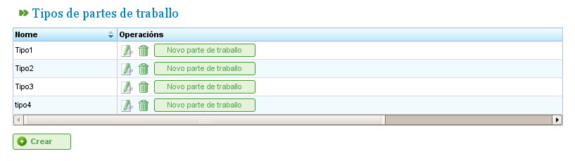

Arbetsrapporter
###############

.. contents::

Arbetsrapporter möjliggör övervakning av de timmar som resurser ägnar åt de uppgifter som de är tilldelade.

Programmet låter användare konfigurera nya formulär för att registrera ägnade timmar och ange de fält som de vill ska visas i dessa formulär. Detta möjliggör inkludering av rapporter från uppgifter utförda av arbetstagare och övervakning av arbetstagar­aktivitet.

Innan användare kan lägga till poster för resurser måste de definiera minst en typ av arbetsrapport. Denna typ definierar rapportens struktur, inklusive alla rader som läggs till i den. Användare kan skapa så många typer av arbetsrapporter som behövs i systemet.

Typer av arbetsrapporter
========================

En arbetsrapport består av en serie fält som är gemensamma för hela rapporten och en uppsättning arbetsrapportrader med specifika värden för de fält som definieras i varje rad. Till exempel är resurser och uppgifter gemensamma för alla rapporter. Det kan dock finnas andra nya fält, till exempel "incidenter," som inte krävs i alla rapporttyper.

Användare kan konfigurera olika typer av arbetsrapporter så att ett företag kan utforma sina rapporter för att möta sina specifika behov:

   Typer av arbetsrapporter

Administration av arbetsrapporttyper låter användare konfigurera dessa typer och lägga till nya textfält eller valfria taggar. På den första fliken för redigering av arbetsrapporttyper är det möjligt att konfigurera typen för de obligatoriska attributen (om de gäller hela rapporten eller anges på radnivå) och lägga till nya valfria fält.

De obligatoriska fält som måste finnas i alla arbetsrapporter är följande:

*   **Namn och kod:** Identifieringsfält för arbetsrapporttypens namn och dess kod.
*   **Datum:** Fält för rapportens datum.
*   **Resurs:** Arbetstagare eller maskin som visas i rapporten eller arbetsrapportraden.
*   **Projektelement:** Kod för det projektelement som det utförda arbetet hänförs till.
*   **Timhantering:** Fastställer vilken timpolitik som ska användas, vilken kan vara:

    *   **Enligt tilldelade timmar:** Timmar hänförs baserat på tilldelade timmar.
    *   **Enligt start- och sluttider:** Timmar beräknas baserat på start- och sluttider.
    *   **Enligt antalet timmar och start- och slutintervall:** Avvikelser tillåts och antalet timmar har prioritet.

Användare kan lägga till nya fält i rapporterna:

*   **Taggtyp:** Användare kan begära att systemet visar en tagg när arbetsrapporten fylls i. Till exempel taggtypen klient, om användaren vill ange klienten för vem arbetet utfördes i varje rapport.
*   **Fritextfält:** Fält där text kan anges fritt i arbetsrapporten.

.. figure:: images/work-report-type.png
   :scale: 50

   Skapar en arbetsrapporttyp med anpassade fält

Användare kan konfigurera datum-, resurs- och projektelementfält att visas i rapportens huvud, vilket innebär att de gäller för hela rapporten, eller så kan de läggas till i var och en av raderna.

Slutligen kan nya ytterligare textfält eller taggar läggas till de befintliga, i arbetsrapportens huvud eller i varje rad, med hjälp av fälten "Ytterligare text" respektive "Taggtyp". Användare kan konfigurera i vilken ordning dessa element ska anges på fliken "Hantering av ytterligare fält och taggar".

Lista över arbetsrapporter
==========================

När formatet för rapporterna som ska ingå i systemet har konfigurerats kan användare ange uppgifterna i det skapade formuläret enligt strukturen som definieras i motsvarande arbetsrapporttyp. För att göra detta måste användare följa dessa steg:

*   Klicka på knappen "Ny arbetsrapport" som är kopplad till önskad rapport från listan över arbetsrapporttyper.
*   Programmet visar sedan rapporten baserad på konfigurationerna för typen. Se följande bild.

.. figure:: images/work-report-type.png
   :scale: 50

   Arbetsrapportstruktur baserad på typ

*   Välj alla fält som visas för rapporten:

    *   **Resurs:** Om rubriken har valts visas resursen bara en gång. Annars är det nödvändigt att välja en resurs för varje rad i rapporten.
    *   **Uppgiftskod:** Kod för den uppgift som arbetsrapporten tilldelas. Precis som för övriga fält, om fältet finns i rubriken, anges värdet en gång eller så många gånger som behövs på rapportens rader.
    *   **Datum:** Rapportens datum eller varje rads datum, beroende på om rubriken eller raden är konfigurerad.
    *   **Antal timmar:** Antalet arbetstimmar i projektet.
    *   **Start- och sluttider:** Start- och sluttider för arbetet för att beräkna definitiva arbetstimmar. Det här fältet visas bara vid timpolitiken "Enligt start- och sluttider" och "Enligt antalet timmar och start- och slutintervall."
    *   **Typ av timmar:** Gör det möjligt för användare att välja typ av timme, t.ex. "Normal," "Extra," etc.

*   Klicka på "Spara" eller "Spara och fortsätt."
