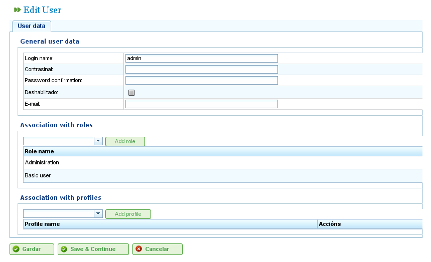

Användarhantering
#################

.. _tareas:
.. contents::

Hantera användare
=================

LibrePlans system låter administratörer hantera användarprofiler, behörigheter och användare. Användare tilldelas användarprofiler, som kan ha en serie fördefinierade roller som ger tillgång till programmets funktioner. Roller är definierade behörigheter inom LibrePlan. Exempel på roller:

*   **Administration:** En roll som måste tilldelas administratörer för att göra det möjligt för dem att utföra administrativa operationer.
*   **Webbtjänstläsare:** En roll som krävs för att användare ska kunna läsa programmets webbtjänster.
*   **Webbtjänskrivare:** En roll som krävs för att användare ska kunna skriva data via programmets webbtjänster.

Roller är fördefinierade i systemet. En användarprofil består av en eller flera roller. Användare måste ha specifika roller för att utföra vissa operationer.

Användare kan tilldelas en eller flera profiler, eller en eller flera roller direkt, vilket möjliggör specifik eller generell behörighet.

Följ dessa steg för att hantera användare:

*   Gå till "Hantera användare" i menyn "Administration".
*   Programmet visar ett formulär med en lista över användare.
*   Klicka på redigeringsknappen för önskad användare eller klicka på knappen "Skapa".
*   Ett formulär visas med följande fält:

    *   **Användarnamn:** Användarens inloggningsnamn.
    *   **Lösenord:** Användarens lösenord.
    *   **Auktoriserad/Ej auktoriserad:** En inställning för att aktivera eller inaktivera användarens konto.
    *   **E-post:** Användarens e-postadress.
    *   **Lista över associerade roller:** För att lägga till en ny roll måste användare söka efter en roll i urvalsllistan och klicka "Tilldela".
    *   **Lista över associerade profiler:** För att lägga till en ny profil måste användare söka efter en profil i urvalsllistan och klicka "Tilldela".

   Hantera användare

*   Klicka på "Spara" eller "Spara och fortsätt".

Hantera profiler
----------------

För att hantera programmets profiler måste användare följa dessa steg:

*   Gå till "Hantera användarprofiler" i menyn "Administration".
*   Programmet visar en lista över profiler.
*   Klicka på redigeringsknappen för önskad profil eller klicka "Skapa".
*   Ett formulär visas i programmet med följande fält:

    *   **Namn:** Namnet på användarprofilen.
    *   **Lista över roller (behörigheter):** För att lägga till en roll till profilen måste användare välja en roll från rollistan och klicka "Lägg till".

.. figure:: images/manage-user-profile.png
   :scale: 50

   Hantera användarprofiler

*   Klicka på "Spara" eller "Spara och fortsätt", så lagrar systemet den skapade eller ändrade profilen.
