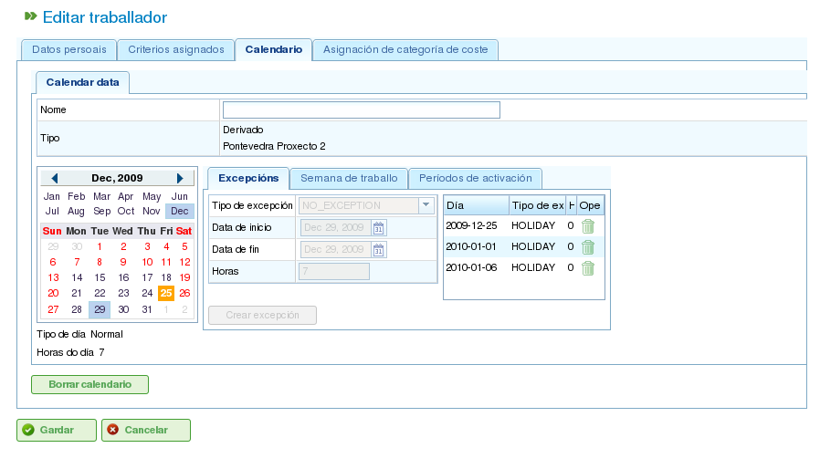

日历
####

.. contents::

日历是程序中定义资源工作能力的实体。日历由一年中的一系列天数组成，每天划分为可用的工作时数。

例如，公众假日可能有 0 个可用工作时数。相反，典型的工作日可能有 8 小时被指定为可用工作时间。

定义一天工作时数的主要方式有两种：

*   **按星期几：** 此方式为一周中的每一天设定标准工作时数。例如，星期一通常可能有 8 个工作时数。
*   **按例外：** 此方式允许偏离标准星期几排程的特定例外。例如，1 月 30 日（星期一）可能有 10 个工作时数，覆盖标准星期一排程。

日历管理
========

日历系统是层次结构的，允许您创建基本日历，然后从中派生新的日历，形成树状结构。从较高层级日历派生的日历将继承其每日排程和例外，除非明确修改。为了有效管理日历，理解以下概念非常重要：

*   **天数独立性：** 每天都是独立处理的，每年都有自己的一组天数。例如，如果 2009 年 12 月 8 日是公众假日，这并不自动意味着 2010 年 12 月 8 日也是公众假日。
*   **基于星期几的工作日：** 标准工作日基于星期几。例如，如果星期一通常有 8 个工作时数，那么所有年份所有周的所有星期一都将有 8 个可用时数，除非定义了例外。
*   **例外和例外期间：** 您可以定义例外或例外期间，以偏离标准星期几排程。例如，您可以指定单一天或一段时间内的可用工作时数与这些星期几的一般规则不同。

.. figure:: images/calendar-administration.png
   :scale: 50

   日历管理

可通过「管理」菜单访问日历管理。从那里，用户可以执行以下操作：

1.  从头创建新日历。
2.  创建从现有日历派生的日历。
3.  创建现有日历的副本日历。
4.  编辑现有日历。

创建新日历
----------

要创建新日历，请点击「创建」按钮。系统将显示一个表单，您可以在其中配置以下内容：

*   **选择选项卡：** 选择您要使用的选项卡：

    *   **标记例外：** 定义标准排程的例外。
    *   **每天工作时数：** 定义每个工作日的标准工作时数。

*   **标记例外：** 如果您选择「标记例外」选项，您可以：

    *   在日历上选择特定日期。
    *   选择例外类型。可用类型包括：假日、病假、罢工、公众假日和工作假日。
    *   选择例外期间的结束日期。（对于单日例外，此字段不需要更改。）
    *   定义例外期间各天的工作时数。
    *   删除之前定义的例外。

*   **每天工作时数：** 如果您选择「每天工作时数」选项，您可以：

    *   定义每个工作日（星期一、星期二、星期三、星期四、星期五、星期六和星期日）的可用工作时数。
    *   为未来期间定义不同的每周工时分配。
    *   删除之前定义的工时分配。

这些选项允许用户根据其特定需求完全自定义日历。点击「保存」按钮以保存对表单所做的任何更改。

.. figure:: images/calendar-edition.png
   :scale: 50

   编辑日历

.. figure:: images/calendar-exceptions.png
   :scale: 50

   添加日历例外

创建派生日历
------------

派生日历是基于现有日历创建的。它继承原始日历的所有功能，但您可以对其进行修改以包含不同的选项。

派生日历的一个常见使用案例是当您有一个国家（例如西班牙）的一般日历，而您需要创建派生日历以包含特定地区（例如加利西亚）的额外公众假日。

重要的是要注意，对原始日历所做的任何更改都将自动传播到派生日历，除非在派生日历中定义了特定例外。例如，西班牙的日历在 5 月 17 日可能有 8 小时工作日。但是，加利西亚的日历（派生日历）在同一天可能没有工作时数，因为那是地区公众假日。如果后来将西班牙日历更改为 5 月 17 日那周每天有 4 个可用工作时数，加利西亚日历也将更改为那周每天有 4 个可用工作时数，但 5 月 17 日除外，由于定义的例外，该天仍将是非工作日。

.. figure:: images/calendar-create-derived.png
   :scale: 50

   创建派生日历

要创建派生日历：

*   前往 *管理* 菜单。
*   点击 *日历管理* 选项。
*   选择您要用作派生日历基础的日历，然后点击「创建」按钮。
*   系统将显示一个编辑表单，其特性与从头创建日历的表单相同，但建议的例外和每个工作日的工作时数将基于原始日历。

通过复制创建日历
----------------

复制日历是现有日历的精确副本。它继承原始日历的所有功能，但您可以独立修改它。

复制日历和派生日历之间的关键区别在于原始日历的更改如何影响它们。如果原始日历被修改，复制日历保持不变。但是，派生日历会受到对原始日历所做更改的影响，除非定义了例外。

复制日历的一个常见使用案例是当您有一个地点（例如「蓬特韦德拉」）的日历，而您需要另一个地点（例如「拉科鲁尼亚」）的类似日历，其中大多数功能相同。但是，对一个日历的更改不应影响另一个日历。

要创建复制日历：

*   前往 *管理* 菜单。
*   点击 *日历管理* 选项。
*   选择您要复制的日历，然后点击「创建」按钮。
*   系统将显示一个编辑表单，其特性与从头创建日历的表单相同，但建议的例外和每个工作日的工作时数将基于原始日历。

默认日历
--------

其中一个现有日历可以被指定为默认日历。除非指定了不同的日历，否则此日历将自动分配给系统中使用日历管理的任何实体。

要设置默认日历：

*   前往 *管理* 菜单。
*   点击 *配置* 选项。
*   在 *默认日历* 字段中，选择您要用作程序默认日历的日历。
*   点击 *保存*。

.. figure:: images/default-calendar.png
   :scale: 50

   设置默认日历

为资源分配日历
--------------

资源只有在具有有效启用期间的分配日历时才能被启用（即有可用工作时数）。如果没有日历分配给资源，默认日历将自动分配，启用期间从开始日期开始且没有到期日。

   资源日历

但是，您可以删除之前分配给资源的日历，并基于现有日历创建新的日历。这允许对个别资源的日历进行完整自定义。

要为资源分配日历：

*   前往 *编辑资源* 选项。
*   选择一个资源并点击 *编辑*。
*   选择「日历」选项卡。
*   日历及其例外、每天工作时数和启用期间将会显示。
*   每个选项卡将有以下选项：

    *   **例外：** 定义例外及其适用期间，例如假日、公众假日或不同的工作日。
    *   **工作周：** 修改每个工作日（星期一、星期二等）的工作时数。
    *   **启用期间：** 创建新的启用期间，以反映与资源相关合同的开始和结束日期。见下图。

*   点击 *保存* 以保存信息。
*   如果您想更改分配给资源的日历，请点击 *删除*。

.. figure:: images/new-resource-calendar.png
   :scale: 50

   为资源分配新日历

为项目分配日历
--------------

项目可以有与默认日历不同的日历。要更改项目的日历：

*   在公司概览中访问项目列表。
*   编辑相关项目。
*   访问「一般信息」选项卡。
*   从下拉菜单中选择要分配的日历。
*   点击「保存」或「保存并继续」。

为任务分配日历
--------------

与资源和项目类似，您可以为个别任务分配特定的日历。这允许您为项目的特定阶段定义不同的日历。要为任务分配日历：

*   访问项目的规划视图。
*   右键点击您要分配日历的任务。
*   选择「分配日历」选项。
*   选择要分配给任务的日历。
*   点击 *接受*。
