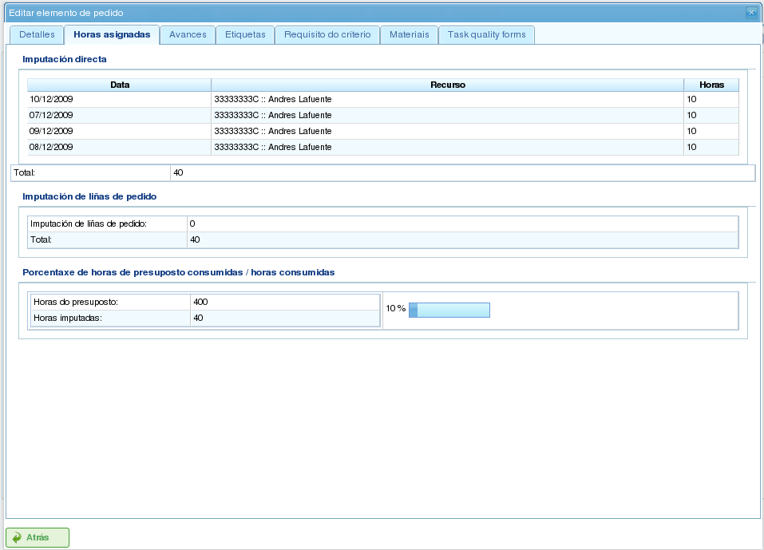

项目与项目元素
##############

.. contents::

项目代表程序用户要执行的工作。每个项目对应公司将提供给其客户的一个项目。

项目由一个或多个项目元素组成。每个项目元素代表要完成的工作的特定部分，并定义项目上的工作应如何规划和执行。项目元素按层次结构组织，对层次结构的深度没有限制。这种层次结构允许继承某些功能，例如标签。

以下各节描述用户可以对项目和项目元素执行的操作。

项目
====

项目代表客户向公司请求的项目或工作。项目在公司的规划中识别项目。与全面管理程序不同，LibrePlan 只需要项目的某些关键详细信息。这些详细信息包括：

*   **项目名称：** 项目的名称。
*   **项目代码：** 项目的唯一代码。
*   **项目总金额：** 项目的总财务价值。
*   **估计开始日期：** 项目的计划开始日期。
*   **结束日期：** 项目的计划完成日期。
*   **负责人：** 负责项目的个人。
*   **描述：** 项目的描述。
*   **分配的日历：** 与项目相关联的日历。
*   **自动生成代码：** 指示系统自动为项目元素和工时组生成代码的设置。
*   **依赖关系和限制之间的优先顺序：** 用户可以选择在发生冲突时依赖关系或限制哪个优先。

但是，完整的项目还包括其他相关实体：

*   **分配给项目的工时：** 分配给项目的总工时。
*   **归因于项目的进度：** 项目上取得的进度。
*   **标签：** 分配给项目的标签。
*   **分配给项目的标准：** 与项目相关联的标准。
*   **材料：** 项目所需的材料。
*   **质量表单：** 与项目相关联的质量表单。

创建或编辑项目可以从程序中的多个位置完成：

*   **从公司概览中的「项目列表」：**

    *   **编辑：** 在所需项目上点击编辑按钮。
    *   **创建：** 点击「新项目」。

*   **从甘特图中的项目：** 切换至项目详细信息视图。

编辑项目时，用户可以访问以下选项卡：

*   **编辑项目详细信息：** 此界面允许用户编辑基本项目详细信息：

    *   名称
    *   代码
    *   估计开始日期
    *   结束日期
    *   负责人
    *   客户
    *   描述

    .. figure:: images/order-edition.png
       :scale: 50

       编辑项目

*   **项目元素列表：** 此界面允许用户对项目元素执行多项操作：

    *   创建新的项目元素。
    *   在层次结构中将项目元素提升一个层级。
    *   在层次结构中将项目元素降低一个层级。
    *   缩进项目元素（在层次结构中向下移动）。
    *   取消缩进项目元素（在层次结构中向上移动）。
    *   筛选项目元素。
    *   删除项目元素。
    *   通过拖放在层次结构中移动元素。

    .. figure:: images/order-elements-list.png
       :scale: 40

       项目元素列表

*   **分配的工时：** 此界面显示归因于项目的总工时，将项目元素中输入的工时进行分组。

    .. figure:: images/order-assigned-hours.png
       :scale: 50

       按员工分配归因于项目的工时

*   **进度：** 此界面允许用户为项目分配进度类型并输入进度测量值。请参阅「进度」部分以了解更多详情。

*   **标签：** 此界面允许用户为项目分配标签，并查看之前分配的直接和间接标签。请参阅以下关于编辑项目元素的部分，以了解标签管理的详细说明。

    .. figure:: images/order-labels.png
       :scale: 35

       项目标签

*   **标准：** 此界面允许用户分配将适用于项目内所有任务的标准。这些标准将自动应用于所有项目元素，但已明确无效的那些元素除外。项目元素的工时组（按标准分组）也可以查看，让用户能够识别项目所需的标准。

    .. figure:: images/order-criterions.png
       :scale: 50

       项目标准

*   **材料：** 此界面允许用户为项目分配材料。材料可以从程序中的可用材料类别中选择。材料的管理方式如下：

    *   选择界面底部的「搜索材料」选项卡。
    *   输入文字以搜索材料，或选择您要查找材料的类别。
    *   系统筛选结果。
    *   选择所需材料（可以按住「Ctrl」键选择多个材料）。
    *   点击「指定」。
    *   系统显示已分配给项目的材料列表。
    *   选择要分配给项目的单位和状态。
    *   点击「保存」或「保存并继续」。
    *   要管理材料的收货情况，请点击「分割」以更改部分材料数量的状态。

    .. figure:: images/order-material.png
       :scale: 50

       与项目相关联的材料

*   **质量：** 用户可以为项目分配质量表单。然后完成此表单以确保执行与项目相关联的某些活动。请参阅以下关于编辑项目元素的部分，以了解管理质量表单的详情。

    .. figure:: images/order-quality.png
       :scale: 50

       与项目相关联的质量表单

编辑项目元素
============

项目元素通过点击编辑图标从「项目元素列表」选项卡进行编辑。这将打开一个新界面，用户可以在其中：

*   编辑项目元素的信息。
*   查看归因于项目元素的工时。
*   管理项目元素的进度。
*   管理项目标签。
*   管理项目元素所需的标准。
*   管理材料。
*   管理质量表单。

以下各节详细描述这些操作中的每一个。

编辑项目元素的信息
------------------

编辑项目元素的信息包括修改以下详细信息：

*   **项目元素名称：** 项目元素的名称。
*   **项目元素代码：** 项目元素的唯一代码。
*   **开始日期：** 项目元素的计划开始日期。
*   **估计结束日期：** 项目元素的计划完成日期。
*   **总工时：** 分配给项目元素的总工时。这些工时可以从添加的工时组计算，也可以直接输入。如果直接输入，工时必须在工时组之间分配，如果百分比与初始百分比不匹配，则需要创建新的工时组。
*   **工时组：** 可以向项目元素添加一个或多个工时组。**这些工时组的目的**是定义将被分配执行工作的资源要求。
*   **标准：** 可以添加必须满足的标准，以启用项目元素的通用分配。

.. figure:: images/order-element-edition.png
   :scale: 50

   编辑项目元素

查看归因于项目元素的工时
------------------------

「分配工时」选项卡允许用户查看与项目元素相关联的工作报告，并查看估计工时中已完成的数量。

   分配给项目元素的工时

界面分为两部分：

*   **工作报告列表：** 用户可以查看与项目元素相关联的工作报告列表，包括日期和时间、资源以及用于任务的工时数。
*   **估计工时的使用情况：** 系统计算用于任务的总工时，并将其与估计工时进行比较。

管理项目元素的进度
------------------

输入进度类型和管理项目元素进度在「进度」章节中描述。

管理项目标签
------------

如标签章节所述，标签允许用户对项目元素进行分类。这使用户能够根据这些标签对规划或项目信息进行分组。

用户可以直接将标签分配给项目元素，或分配给层次结构中较高层级的项目元素。使用任一方法分配标签后，项目元素和相关规划任务都会与标签相关联，并可用于后续筛选。

.. figure:: images/order-element-tags.png
   :scale: 50

   为项目元素分配标签

如图所示，用户可以从 **标签** 选项卡执行以下操作：

*   **查看继承的标签：** 查看与项目元素相关联的标签，这些标签是从较高层级的项目元素继承的。与每个项目元素相关联的规划任务具有相同的相关标签。
*   **查看直接分配的标签：** 查看使用较低层级标签的分配表单直接与项目元素相关联的标签。
*   **分配现有标签：** 在直接标签列表下方的表单中搜索可用标签来分配标签。要搜索标签，请点击放大镜图标，或在文字框中输入标签的前几个字母以显示可用选项。
*   **创建并分配新标签：** 从此表单创建与现有标签类型相关联的新标签。为此，选择一个标签类型并输入所选类型的标签值。点击「创建并分配」时，系统自动创建标签并将其分配给项目元素。

管理项目元素和工时组所需的标准
------------------------------

项目和项目元素都可以分配必须满足才能执行工作的标准。标准可以是直接的或间接的：

*   **直接标准：** 这些是直接分配给项目元素的标准。它们是项目元素上的工时组所需的标准。
*   **间接标准：** 这些是分配给层次结构中较高层级项目元素的标准，并由正在编辑的元素继承。

除了所需标准外，还可以定义作为项目元素一部分的一个或多个工时组。这取决于项目元素是否包含其他项目元素作为子节点，或者它是否是叶节点。在第一种情况下，只能查看工时和工时组的信息。但是，叶节点可以编辑。叶节点的工作方式如下：

*   系统创建一个与项目元素相关联的默认工时组。工时组可以修改的详细信息包括：

    *   **代码：** 工时组的代码（如果不是自动生成的）。
    *   **标准类型：** 用户可以选择分配机器或员工标准。
    *   **工时数：** 工时组中的工时数。
    *   **标准列表：** 要应用于工时组的标准。要添加新标准，请点击「添加标准」并从点击按钮后出现的搜索引擎中选择一个。

*   用户可以添加具有与之前工时组不同特性的新工时组。例如，一个项目元素可能需要焊接工（30 小时）和油漆工（40 小时）。

.. figure:: images/order-element-criterion.png
   :scale: 50

   为项目元素分配标准

管理材料
--------

材料在项目中以与每个项目元素或项目相关联的列表进行管理。材料列表包含以下字段：

*   **代码：** 材料代码。
*   **日期：** 与材料相关联的日期。
*   **单位：** 所需单位数。
*   **单位类型：** 用于衡量材料的单位类型。
*   **单位价格：** 每单位价格。
*   **总价格：** 总价格（通过将单位价格乘以单位数计算）。
*   **类别：** 材料所属的类别。
*   **状态：** 材料的状态（例如，已收到、已请求、待处理、处理中、已取消）。

使用材料的步骤如下：

*   在项目元素上选择「材料」选项卡。
*   系统显示两个子选项卡：「材料」和「搜索材料」。
*   如果项目元素没有分配材料，第一个选项卡将为空。
*   点击窗口左下部分的「搜索材料」。
*   系统显示可用类别和相关材料的列表。

.. figure:: images/order-element-material-search.png
   :scale: 50

   搜索材料

*   选择类别以细化材料搜索。
*   系统显示属于所选类别的材料。
*   从材料列表中，选择要分配给项目元素的材料。
*   点击「指定」。
*   系统在「材料」选项卡上显示选定的材料列表，并提供新的字段供完成。

.. figure:: images/order-element-material-assign.png
   :scale: 50

   为项目元素分配材料

*   选择分配材料的单位、状态和日期。

对于后续的材料监控，可以更改一组已收到材料单位的状态。操作如下：

*   点击材料列表中每行右侧的「分割」按钮。
*   选择将行分割成的单位数。
*   程序显示两行，材料已被分割。
*   更改包含材料的行的状态。

使用此分割工具的优点是能够接收材料的部分交货，而无需等待整个交货才能将其标记为已收到。

管理质量表单
------------

某些项目元素需要认证某些任务已完成，才能将其标记为完成。这就是程序具有质量表单的原因，质量表单由一份问题列表组成，如果答案为肯定则认为这些问题很重要。

重要的是要注意，质量表单必须事先创建才能分配给项目元素。

要管理质量表单：

*   前往「质量表单」选项卡。

    .. figure:: images/order-element-quality.png
       :scale: 50

       为项目元素分配质量表单

*   程序有一个质量表单搜索引擎。有两种类型的质量表单：按元素或按百分比。

    *   **元素：** 每个元素是独立的。
    *   **百分比：** 每个问题将项目元素的进度增加一个百分比。这些百分比必须能够加起来达到 100%。

*   选择在管理界面中创建的其中一个表单，然后点击「指定」。
*   程序从分配给项目元素的表单列表中分配所选表单。
*   点击项目元素上的「编辑」按钮。
*   程序在下方列表中显示质量表单的问题。
*   将已完成的问题标记为已达成。

    *   如果质量表单基于百分比，则问题按顺序回答。
    *   如果质量表单基于元素，则问题可以以任何顺序回答。
